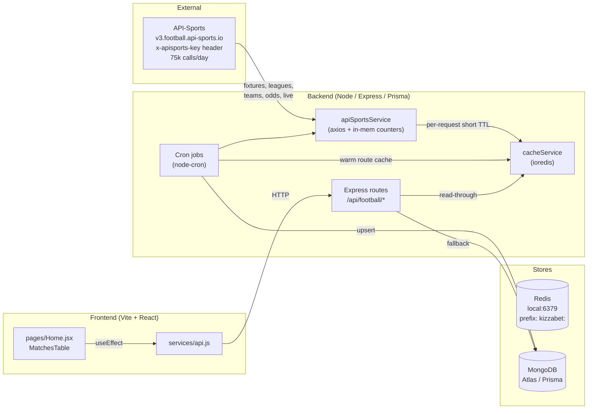
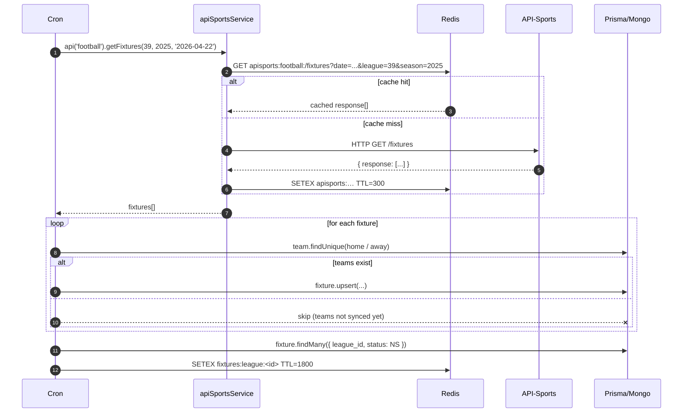
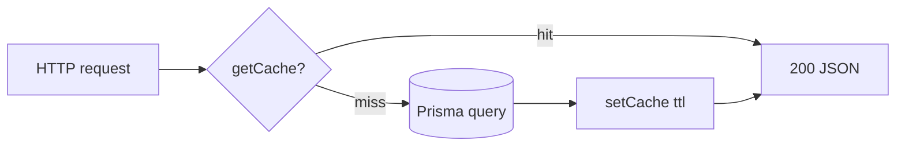
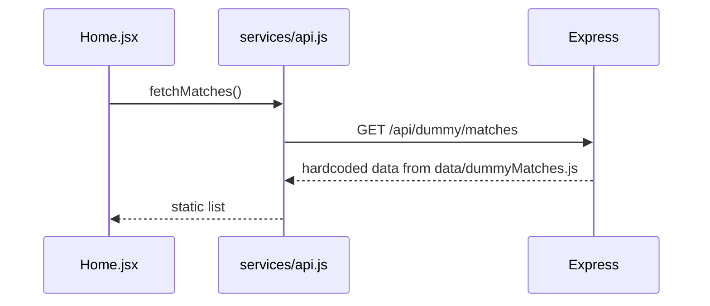
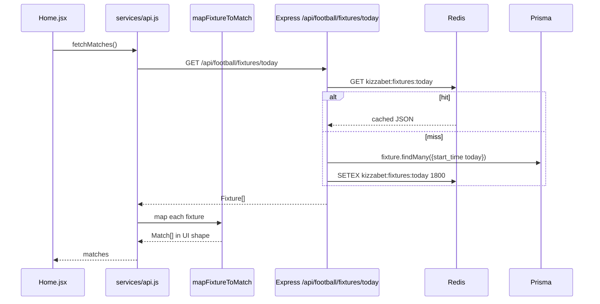

# Sports Data Integration Spec

End-to-end plan for how match/fixture/odds data flows from **API-Sports** → **Redis cache** → **MongoDB** → **Express backend** → **React frontend**.

This document is the single source of truth we'll build against. It captures:

1. Current state and root-cause diagnosis for "fetching not working".
2. Target architecture with sequence and component diagrams.
3. The exact data shapes at every boundary.
4. The cache key / TTL contract.
5. The concrete fix plan (in order).

---

## 1. Why fetching is not working (diagnosis)

Verified live against API-Sports on 2026-04-21:

- **API key is valid and active.**
  `GET https://v3.football.api-sports.io/status` returned:
  - plan: `Ultra`, active until `2026-05-20`
  - daily quota: 75,000 — currently only 21 used
- **Redis is up** (`redis-cli PING` → `PONG`, service installed via scoop).
- **Backend cache layer works** (smoke test: set/get/withCache roundtrip succeeds).

So the upstream integration is healthy. What's broken is the **wiring between layers**:

| # | Bug | Where | Effect |
|---|-----|-------|--------|
| 1 | Frontend calls `/api/dummy/matches` | `frontend/src/services/api.js:16` | UI shows **hardcoded static matches**, never reaches Redis or DB. |
| 2 | No cold-start sync | `backend/jobs/index.js` (only `cron.schedule`, nothing runs immediately) | Fresh DB has zero leagues → `syncFixtures` finds nothing → API endpoints return `[]`. |
| 3 | Shape mismatch | Backend `Fixture` (Prisma) ≠ Frontend `match` object | Even if frontend pointed at real endpoints, rendering would break. |
| 4 | Odds may be empty on upcoming fixtures | API-Sports publishes odds close to kickoff | UI must degrade gracefully (no odds → disabled cells). |
| 5 | No cache prefix on existing jobs | `syncFixtures` writes `fixtures:league:…` raw (prefix added in cacheService) | Works but worth standardizing. |

Item #1 is the blocker. Items #2 and #3 block the "fix" from actually working.

---

## 2. System architecture



### Why two caches?

1. **Upstream cache** (`apisports:*`) — dedupes identical API-Sports requests so dev reloads, cron overlaps, and accidental re-runs don't burn quota.
2. **Route cache** (`fixtures:today`, `odds:fixture:<id>`, etc.) — dedupes identical DB reads so repeated frontend polls are effectively free.

Both live in the same Redis instance but are namespaced by key prefix.

---

## 3. External API — API-Sports (v3.football)

Base URL: `https://v3.football.api-sports.io`
Auth: `x-apisports-key: <API_FOOTBALL_KEY>`

### Endpoints we consume

| Purpose | Endpoint | When | Cache TTL |
|---|---|---|---|
| Account status | `GET /status` | health/debug only | n/a |
| League list | `GET /leagues` | `syncLeagues` daily | 5 min upstream |
| Team list per league | `GET /teams?league=&season=` | `syncTeams` daily | 5 min upstream |
| Fixtures window | `GET /fixtures?league=&season=&date=YYYY-MM-DD` | `syncFixtures` every 30m | 5 min upstream |
| Odds per fixture | `GET /odds?fixture=<id>` | `syncOdds` every 2m | 5 min upstream |
| Live scores | `GET /fixtures?live=all` | `syncLiveFixtures` every 30s | **no cache** |

### Response envelope (every endpoint)

```json
{
  "get": "fixtures",
  "parameters": { "league": "39", "season": "2025", "date": "2026-04-21" },
  "errors": [],          // object or array; object with keys = failure
  "results": 10,
  "paging": { "current": 1, "total": 1 },
  "response": [ /* array of entities */ ]
}
```

Verified shapes (trimmed to fields we persist):

**Fixture** (`response[i]`):
```json
{
  "fixture": {
    "id": 1208045,
    "date": "2026-04-22T19:00:00+00:00",
    "status": { "long": "Not Started", "short": "NS", "elapsed": null }
  },
  "league": { "id": 39, "name": "Premier League", "country": "England",
              "logo": "...", "season": 2025, "round": "Regular Season - 34" },
  "teams": {
    "home": { "id": 51, "name": "Brighton", "logo": "...", "winner": null },
    "away": { "id": 49, "name": "Chelsea",  "logo": "...", "winner": null }
  },
  "goals": { "home": null, "away": null },
  "score": { "halftime": {...}, "fulltime": {...}, "extratime": {...}, "penalty": {...} }
}
```

**Odds** (`response[0]`):
```json
{
  "fixture": { "id": 1208045, "date": "..." },
  "league":  { ... },
  "bookmakers": [
    {
      "id": 8, "name": "Bet365",
      "bets": [
        { "id": 1,  "name": "Match Winner",
          "values": [ {"value":"Home","odd":"1.85"}, {"value":"Draw","odd":"3.50"}, {"value":"Away","odd":"4.10"} ] },
        { "id": 5,  "name": "Goals Over/Under", "values": [...] },
        { "id": 8,  "name": "Both Teams Score",  "values": [...] },
        { "id": 12, "name": "Double Chance",     "values": [...] }
      ]
    }
  ]
}
```

### Status code map (API → Prisma)

```js
NS → NS    1H → LIVE   HT → HT    2H → LIVE   ET → LIVE   P → PEN
FT → FT    AET → AET   PEN → PEN  PST → PST   CANC → CANC
ABD → ABD  AWD → AWD   WO → WO    LIVE → LIVE
```

### Error handling

| Condition | API behavior | Our behavior |
|---|---|---|
| Rate-limited | `errors: { rateLimit: "..." }` | `sleep(7s)` then retry, `opts` preserved |
| Quota exhausted (status.requests.current ≥ limit) | counted locally via `dailyCalls` | skip call, log, return `[]` |
| Invalid season / league | `errors: { ... }` object | log, return `[]` (don't poison cache) |
| Network retriable (`ECONNRESET`, `ETIMEDOUT`, …) | n/a | up to 2 retries with backoff |
| Empty `response: []` | valid | don't cache empty, caller treats as "no data yet" |

---

## 4. Database (Prisma / MongoDB)

Only the sports-relevant models are shown. Full schema in `backend/prisma/schema.prisma`.

```mermaid
erDiagram
    Sport  ||--o{ League   : "has"
    League ||--o{ Team     : "has"
    League ||--o{ Fixture  : "has"
    Team   ||--o{ Fixture  : "home_team / away_team"
    Fixture ||--o{ FixtureMarket : "has"
    FixtureMarket ||--o{ FixtureOddLine : "has"
    Bookmaker ||--o{ FixtureOddLine : "offers"

    Sport { string id PK; string name; string slug UK; string icon }
    League { string id PK; int api_league_id UK; string name; string country; string logo; int season; bool active }
    Team { string id PK; int api_team_id UK; string name; string logo; string league_id FK }
    Fixture { string id PK; int api_fixture_id UK; datetime start_time; string status; int home_score; int away_score; string league_id FK; string home_team_id FK; string away_team_id FK }
    Bookmaker { string id PK; int api_bookmaker_id UK; string name }
    FixtureMarket { string id PK; string name; string fixture_id FK }
    FixtureOddLine { string id PK; string value; float odd; string market_id FK; string bookmaker_id FK }
```

### Invariants

- Every `Fixture` row MUST have matching `home_team_id`/`away_team_id` that exist.
  `syncFixtures` already guards this and skips rows whose teams weren't synced.
- `League.active = false` hides a league from sync and from public endpoints.
- `Fixture.status` is stored as the short API code after mapping (see §3).

---

## 5. Redis cache contract

All keys are prefixed by `REDIS_KEY_PREFIX` from `.env` (default `kizzabet`), so the effective namespace in Redis is `kizzabet:<key>`.

### Key catalogue

| Key pattern | Writer | Reader | TTL | Notes |
|---|---|---|---|---|
| `apisports:<sport>:<endpoint>?<sorted-params>` | `apiSportsService.request` | same | `API_SPORTS_CACHE_TTL` (default 300s) | Raw upstream response.response[]. Skipped for live. |
| `leagues:all` | `syncLeagues`, route `/api/football/leagues` | route | 86400 | Flat list of active leagues with sport. |
| `teams:league:<apiLeagueId>` | (reserved, invalidated by `syncTeams`) | future route | — | Invalidated, not yet written. |
| `fixtures:today` | route `/api/football/fixtures/today` | route | 1800 | Day-scope UTC. |
| `fixtures:league:<apiLeagueId>` | `syncFixtures` | future "league page" route | 1800 | Warmed after each sync. |
| `odds:fixture:<apiFixtureId>` | `syncOdds`, `syncLive`, route `/api/football/odds/:id` | route | 300 | Parsed odds tree. |
| `live:fixtures` | `syncLiveFixtures`, route `/api/football/fixtures/live` | route | 30 | LIVE + HT only. |

### TTL policy (rationale)

- **Live (30 s):** must feel real-time; acceptable staleness < 1 rotation of the sync job.
- **Odds (5 min):** balance between freshness and quota.
- **Fixtures (30 min):** start times rarely move.
- **Leagues / teams (24 h):** near-static reference data.
- **Upstream (5 min):** dedupes accidental re-runs; long enough to absorb cron overlap, short enough to stay fresh.

### Eviction & memory

Local Redis is started with:

```
maxmemory 256mb
maxmemory-policy allkeys-lru
```

Cache is strictly non-critical — every reader must tolerate a miss and fall back to DB or upstream. `cacheService` swallows all connection / serialization errors; this is deliberate.

---

## 6. Backend internals

### Cron schedule (`backend/jobs/index.js`)

```mermaid
gantt
    title Cron schedule (24h view, compressed)
    dateFormat HH:mm
    axisFormat %H:%M

    section Daily
    syncLeagues : 03:00, 5m
    syncTeams   : 04:00, 15m

    section Frequent
    syncFixtures (every 30m)     :active, 00:00, 30m
    syncFixtures                 :active, 00:30, 30m
    syncOdds (every 2m)          :crit,   00:00, 2m
    syncLiveFixtures (every 30s) :         00:00, 1m
```



### Job responsibilities

| Job | Reads | Writes | Cache effect |
|---|---|---|---|
| `syncLeagues` | API `/leagues` | `Sport`, `League` upserts | refreshes `leagues:all` |
| `syncTeams` | `League` (DB), API `/teams` | `Team` upserts | invalidates `teams:league:*` |
| `syncFixtures` | `League`, `Team` (DB), API `/fixtures` | `Fixture` upserts | warms `fixtures:league:*` |
| `syncOdds` | `Fixture` (NS, ≤24h), API `/odds` | `Bookmaker`, `FixtureMarket`, `FixtureOddLine` | warms `odds:fixture:*` |
| `syncLiveFixtures` | API `/fixtures?live=all` | `Fixture.status / goals`; on score change pulls fresh odds | refreshes `live:fixtures` |

### End-to-end ingestion sequence



### Public routes (`backend/routes/footballPublic.js`)

```
GET /api/football/leagues          → list of active leagues (+ sport)
GET /api/football/fixtures/today   → today's fixtures (UTC), teams inlined
GET /api/football/fixtures/live    → currently LIVE or HT
GET /api/football/odds/:apiFixtureId → fixture with markets + odd_lines + bookmakers
```

All four use a read-through pattern:



### Backend response shape

`GET /api/football/fixtures/today` returns Prisma camelCase with relations inlined:

```json
[
  {
    "id": "…uuid…",
    "apiFixtureId": 1208045,
    "startTime": "2026-04-22T19:00:00.000Z",
    "status": "NS",
    "homeScore": null,
    "awayScore": null,
    "leagueId": "…",
    "homeTeamId": "…",
    "awayTeamId": "…",
    "home_team": { "id": "…", "apiTeamId": 51, "name": "Brighton", "logo": "…" },
    "away_team": { "id": "…", "apiTeamId": 49, "name": "Chelsea",  "logo": "…" },
    "league":    { "id": "…", "apiLeagueId": 39, "name": "Premier League", "country": "England", "logo": "…" }
  }
]
```

`GET /api/football/odds/:apiFixtureId` adds:

```json
{
  "…fixture fields…": "…",
  "markets": [
    { "id": "…", "name": "Match Winner",
      "odd_lines": [
        { "value": "Home", "odd": 1.85, "bookmaker": { "id": "…", "name": "Bet365" } },
        { "value": "Draw", "odd": 3.50, "bookmaker": { ... } },
        { "value": "Away", "odd": 4.10, "bookmaker": { ... } }
      ]
    }
  ]
}
```

---

## 7. Frontend contract

### Current (broken) flow



### Target flow



### UI shape (what `MatchesTable` expects)

```js
{
  id: "fx-1208045",
  league: "England - Premier League",
  match: "Brighton V Chelsea",
  date: "04/22 19:00 2026",
  markets: [
    { id: "1", value: "1.85" },
    { id: "x", value: "3.50" },
    { id: "2", value: "4.10" },
    { id: "1x", value: "1.22" },
    { id: "12", value: "1.29" },
    { id: "x2", value: "1.88" },
  ],
  sideBets: 12,              // how many extra markets exist
  detailedOdds: {            // populated lazily on expand
    main:  [{ category, odds: [{id,value}, …] }, …],
    extra: [{ category, odds: [{id,value}, …] }, …],
  }
}
```

### Backend → Frontend mapping table

| UI field | Source | Transform |
|---|---|---|
| `id` | `fixture.apiFixtureId` | `"fx-" + apiFixtureId` |
| `league` | `fixture.league.country + fixture.league.name` | `"England - Premier League"` |
| `match` | `home_team.name + " V " + away_team.name` | preserve casing |
| `date` | `fixture.startTime` | `dd/MM HH:mm yyyy` (UTC → local) |
| `markets[1,x,2]` | Odds "Match Winner" (bet id 1) values | `Home→1, Draw→x, Away→2`, first bookmaker wins (or averaged) |
| `markets[1x,12,x2]` | Odds "Double Chance" (bet id 12) values | literal `1X → 1x` etc. |
| `sideBets` | `fixture.markets.length - shown` | fallback `+0` |
| `detailedOdds.main` | markets `Match Winner`, `Double Chance`, `Both Teams Score` | group per `market.name` |
| `detailedOdds.extra` | all other markets | same grouping |

**Fallbacks:**
- Odds not yet published → `markets = []`, buttons render disabled "-".
- Live fixtures on `/fixtures/live` render with a "LIVE · HT / min" pill instead of a date.

### New frontend files

```
frontend/src/services/api.js         (extend)
  - fetchFixturesToday()
  - fetchFixturesLive()
  - fetchOddsForFixture(apiFixtureId)
frontend/src/services/fixtureMapper.js   (new)
  - mapFixtureToMatch(fixture, odds?)
frontend/src/hooks/useMatches.js      (new)
  - SWR-style polling: 30s for today, 10s for live
```

---

## 8. Environment variables

`backend/.env` (already populated or to add):

```bash
DATABASE_URL="mongodb://…/kizzabet?…"
REDIS_URL=redis://localhost:6379
REDIS_KEY_PREFIX="kizzabet"

ENABLED_SPORTS=football
API_FOOTBALL_KEY=<ultra-plan-key>
API_SPORTS_CACHE_TTL=300        # seconds, upstream dedupe TTL
API_SPORTS_DAILY_LIMIT=75000    # hard stop before burning quota
API_SPORTS_TIMEOUT_MS=30000
API_SPORTS_MAX_RETRIES=2

ENABLE_API_FOOTBALL_CRON=true
```

`frontend/.env`:

```
VITE_API_URL=http://localhost:3000
```

---

## 9. Fix plan (in execution order)

Each step is independently verifiable.

### Step 1 — Cold-start bootstrap
- On server start, if `ENABLE_API_FOOTBALL_CRON=true`, run `syncLeagues()` → `syncTeams()` → `syncFixtures()` sequentially (awaited) **before** registering cron.
- Guarded by a Redis lock (`kizzabet:lock:bootstrap`, TTL 10m) so multi-node deploys don't stampede.
- Emit clear logs: `[bootstrap] leagues=… teams=… fixtures=…`.

### Step 2 — Verify with cURL
```bash
curl -s http://localhost:3000/api/football/leagues | jq 'length'
curl -s http://localhost:3000/api/football/fixtures/today | jq 'length'
```
Must return non-zero once bootstrap completes.

### Step 3 — Frontend mapper
- Add `frontend/src/services/fixtureMapper.js` with `mapFixtureToMatch(fixture, oddsDoc?)`.
- Unit-test against the shape samples in §3.

### Step 4 — Frontend API calls
- Add `fetchFixturesToday`, `fetchFixturesLive`, `fetchOddsForFixture` to `services/api.js`.
- Keep `fetchMatches` as a thin wrapper that calls today + maps — this isolates the switch.

### Step 5 — Swap Home.jsx
- Replace `fetchMatches()` call so it pulls real fixtures.
- Expanding a match triggers `fetchOddsForFixture(apiFixtureId)` and merges into `detailedOdds`.

### Step 6 — Polling
- `useMatches({ live: true })` polls `/fixtures/live` every 10 s.
- `useMatches({ today: true })` revalidates `/fixtures/today` every 30 s.

### Step 7 — Observability
- `/health` already reports Redis up/down.
- Add `/api/football/_debug/cache` (admin-only) that `SCAN`s `kizzabet:*` and returns counts per prefix.
- Expose daily API usage: `apiSportsService.getDailyCallCount('football')` on a debug route.

### Step 8 — Hardening
- Move `TARGET_LEAGUES` out of code into a `Setting` row so admins can toggle leagues without redeploy.
- Add per-sport feature flag (`ENABLED_SPORTS`) already respected; surface it in admin UI.

---

## 10. Operational runbook

Start Redis locally (once):
```bash
redis-server --port 6379 --save "" --appendonly no \
  --maxmemory 256mb --maxmemory-policy allkeys-lru
```

Force a full resync (blows DB-sports data only, keeps users):
```bash
# Inside Node REPL / one-off script
await prisma.fixtureOddLine.deleteMany();
await prisma.fixtureMarket.deleteMany();
await prisma.fixture.deleteMany();
// then restart server with ENABLE_API_FOOTBALL_CRON=true
```

Clear only Redis (safe, code re-populates):
```bash
redis-cli --scan --pattern 'kizzabet:*' | xargs -r redis-cli del
```

Inspect cache contents:
```bash
redis-cli --scan --pattern 'kizzabet:apisports:*' | head
redis-cli get 'kizzabet:fixtures:today' | jq 'length'
```

Check upstream usage without leaving a server shell:
```bash
curl -s -H "x-apisports-key: $API_FOOTBALL_KEY" \
  https://v3.football.api-sports.io/status | jq '.response.requests'
```

---

## 11. Open questions / future work

- **Bookmaker selection:** right now we ingest every bookmaker's line; UI currently shows one value per market. Decide: take the best price, the median, or a configured primary bookmaker.
- **Odds latency vs quota:** `syncOdds` every 2m × up-to-24h-of-fixtures can be heavy. Consider: only fixtures starting in next 2h get 2-min cadence; the rest get 15-min.
- **Multi-sport:** schema is already multi-sport (`Sport.slug`). Basketball / tennis follow the same pattern with `/games` endpoint; plug them in via `sportsRegistry` only.
- **Websockets:** for live scores, push via SSE/WS instead of 30s polling once `/fixtures/live` pressure grows.
- **Audit:** wire `fixtures ingested`, `odds refreshed`, `cache hit rate` into the existing `AuditLog` / reports module for admin insight.

---

_Last updated 2026-04-21 after installing local Redis and hardening `cacheService.js` + `apiSportsService.js` with upstream caching._
