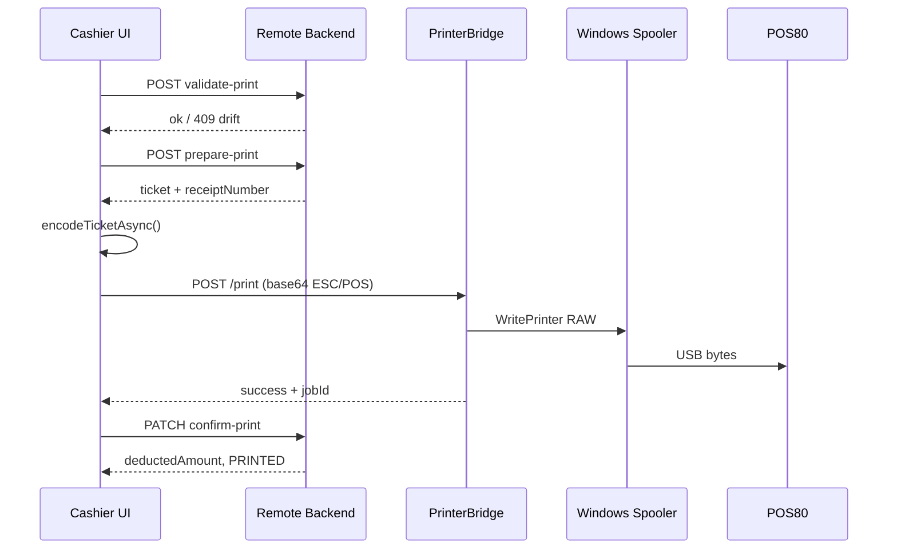

# Ticket Printing System — Complete Implementation Guide

> **Purpose:** Document the full end-to-end flow from the cashier Tickets page through the local PrinterBridge service to the physical thermal printer. Includes all source files needed to reimplement this on a similar system.
>
> **Last updated:** May 2026 · **Protocol version:** 1 · **Default bridge port:** 3005 (fallback 3006–3010)

---

## Table of contents

1. [Architecture overview](#1-architecture-overview)
2. [End-to-end print sequence (sell ticket)](#2-end-to-end-print-sequence-sell-ticket)
3. [Reprint flow](#3-reprint-flow)
4. [Cashier PC setup (PrinterBridge)](#4-cashier-pc-setup-printerbridge)
5. [Environment variables & configuration](#5-environment-variables--configuration)
6. [HTTP API reference](#6-http-api-reference)
7. [Backend API (remote server)](#7-backend-api-remote-server)
8. [Error codes & troubleshooting](#8-error-codes--troubleshooting)
9. [Porting checklist for another system](#9-porting-checklist-for-another-system)
10. [Admin frontend source files](#10-admin-frontend-source-files)
11. [Backend source files](#11-backend-source-files)
12. [Printer service source files](#12-printer-service-source-files)
13. [Build & deploy](#13-build--deploy)

---

## 1. Architecture overview

Physical printing is **split across three layers**. The remote backend never talks to the printer directly. ESC/POS bytes are built **in the browser** and sent to a **localhost-only** bridge on the cashier PC.

```
┌─────────────────────────────────────────────────────────────────────────────┐
│  Cashier browser (https://admin.sokasport.com)                              │
│  ┌─────────────────┐   ┌──────────────────┐   ┌─────────────────────────┐ │
│  │ TicketsPage.jsx │──▶│ escpos.js        │──▶│ Uint8Array ESC/POS bytes│ │
│  │ handlePrint()   │   │ encodeTicketAsync│   └───────────┬─────────────┘ │
│  └────────┬────────┘   └──────────────────┘               │ base64       │
│           │ validate / prepare / confirm                     ▼             │
│           │ (HTTPS)                              ┌───────────────────────┐ │
│           ▼                                      │ localPrinter.js       │ │
│  ┌─────────────────┐                             │ POST /print           │ │
│  │ api.sokasport   │                             └───────────┬───────────┘ │
│  │ .com backend    │                                         │             │
│  └─────────────────┘                                         │ localhost   │
└──────────────────────────────────────────────────────────────┼─────────────┘
                                                               ▼
┌─────────────────────────────────────────────────────────────────────────────┐
│  Cashier PC — PrinterBridge.exe (127.0.0.1:3005)                          │
│  index.js → printQueue.js → printerManager.js → windowsPrinters.js          │
│  PowerShell + Win32 WritePrinter (RAW) → Windows spooler queue "POS80"     │
└──────────────────────────────────────────────────────────────┬──────────────┘
                                                               │ USB
                                                               ▼
                                                    ┌─────────────────────┐
                                                    │ POS80 thermal printer│
                                                    └─────────────────────┘
```

### Design decisions (important for porting)

| Decision | Rationale |
|----------|-----------|
| ESC/POS encoded in browser | No server-side font/image deps; bridge stays dumb transport |
| Wallet debited **after** physical print | Cashier sees paper before stake is taken |
| `validate-print` → `prepare-print` → local print → `confirm-print` | Odds checked twice; receipt number reserved before print |
| Bridge binds `127.0.0.1` only | LAN cannot reach cashier printer |
| Windows spooler RAW, not COM serial | Driver handles USB; queue name `POS80` must match `config.json` |
| Native `node-printer` disabled in pkg exe | Falls back to PowerShell `WritePrinter` (reliable on packaged build) |
| Strict queue match | Never auto-print to wrong device (e.g. phone PDF printer) |
| Idempotent `confirm-print` | Safe retries if network blips after successful print |

---

## 2. End-to-end print sequence (sell ticket)

### Phase A — User actions (Tickets page)

1. Cashier enters coupon on **Sell Ticket** tab → ticket loads (`OPEN` status).
2. Cashier sets stake and clicks **Confirm** → `handleConfirmSell()` → `sellConfirmed = true`.
3. Cashier clicks **Print Ticket** → `handlePrint()` runs (guarded by `printInFlightRef`).

### Phase B — Backend validation (remote API, HTTPS)

| Step | HTTP | Purpose |
|------|------|---------|
| 1 | `POST /api/tickets/:id/validate-print` | Dry-run odds/market validation. **No wallet debit.** Returns `409` if odds/market drifted. |
| 2 | `POST /api/tickets/:id/prepare-print` | Reserves unique `receipt_number` on OPEN ticket. **No wallet debit.** Returns full ticket for encoding. |

If step 1 returns `odds_changed` or `market_version_changed`, UI shows `window.confirm()`. On OK, retries with `acceptOddsChanges: true` and updated `selections`.

### Phase C — Local printer check

4. `useTicketPrint` polls `GET http://localhost:3005/status` every 7s (debounced: 3 failures before "offline").
5. If `printerConnected === false`, abort with user message.

### Phase D — ESC/POS encode + local print

6. `encodeTicketAsync(ticket, { width: '80mm', platformWinningsTax })` → `Uint8Array`:
   - INIT, centered logo raster (GS v 0), Code128 barcode raster, ticket body, partial cut.
7. `printViaLocalService(escposData)` → `POST /print` with `{ "data": "<base64>" }` and header `X-Printer-Key`.
8. Bridge decodes base64 → FIFO queue → `PrinterManager.write()` → PowerShell RAW to `POS80`.

### Phase E — Confirm sale (wallet debit)

9. `PATCH /api/tickets/:id/confirm-print` — inside DB transaction:
   - Re-validates odds (same drift handling).
   - Debits cashier wallet (`BET` transaction, reference `ticket-print:{id}`).
   - Sets ticket status `OPEN` → `PRINTED`.
10. UI refreshes slips + wallet; shows success. `alreadyPrinted: true` if idempotent retry.

### Sequence diagram



---

## 3. Reprint flow

**Reprint does not hit the backend wallet APIs.** It only:

1. Loads ticket by ID (`GET /api/tickets/:id`).
2. Checks `printerConnected`.
3. `encodeTicketAsync` + `printViaLocalService`.

Used from the slips table **Reprint** button for already-PRINTED tickets.

---

## 4. Cashier PC setup (PrinterBridge)

### Prerequisites

1. Install POS80 thermal driver (`POS80Setup_20200118.exe`).
2. Connect printer USB-A → USB-B.
3. Verify Windows queue name is exactly **POS80** (Settings → Printers).

### Install bridge (no Node.js on cashier PC)

1. Copy entire `printer-service/dist/` folder to cashier PC.
2. Run `Install-PrinterBridge.bat`.
3. Installer copies to `C:\Sokasport\PrinterBridge\`, writes `config.json`, adds Startup shortcut, starts exe.

### Verify

```powershell
curl.exe http://127.0.0.1:3005/health
curl.exe -H "X-Printer-Key: sokasport-local-print-v1" http://127.0.0.1:3005/status
```

Open admin Tickets page → green **Printer Connected (POS80)** → **Test Print**.

---

## 5. Environment variables & configuration

### Admin app (Vite build)

| Variable | Default | Purpose |
|----------|---------|---------|
| `VITE_PRINT_SERVICE_URL` | (auto-probe) | Fixed bridge URL e.g. `http://localhost:3005` |
| `VITE_PRINTER_API_KEY` | `sokasport-local-print-v1` | Must match bridge `config.json` |

### PrinterBridge (`config.json` + env)

| Key / Env | Default | Purpose |
|-----------|---------|---------|
| `printerName` / `PRINTER_NAME` | `POS80` | Windows queue name (strict match) |
| `apiKey` / `PRINTER_API_KEY` | `sokasport-local-print-v1` | Auth header |
| `PORT` | `3005` | Listen port |
| `PORT_FALLBACK_ATTEMPTS` | `6` | Try 3005–3010 |
| `CASHIER_ORIGINS` | — | Extra CORS origins (comma-separated) |
| `WRITE_TIMEOUT_MS` | `60000` | Per-job timeout |

---

## 6. HTTP API reference

### PrinterBridge (localhost)

| Method | Path | Auth | Body / Response |
|--------|------|------|-----------------|
| GET | `/health` | No | `{ ok, listenPort, uptimeSec, connected, queueLength }` |
| GET | `/version` | No | `{ version, protocolVersion: "1" }` |
| GET | `/status` | `X-Printer-Key` | `{ connected, port, message, queueLength, processing, ... }` |
| GET | `/printers` | Yes | Lists Windows queues |
| POST | `/config` | Yes | Update `printerName`, etc. |
| POST | `/print` | Yes | `{ "data": "<base64 ESC/POS>" }` → `{ success, jobId }` |

---

## 7. Backend API (remote server)

All require auth + `tickets:create` permission. Rate limited as `cashier_confirm_print`.

| Method | Path | Side effects |
|--------|------|--------------|
| POST | `/api/tickets/:id/validate-print` | None |
| POST | `/api/tickets/:id/prepare-print` | Assigns `receipt_number` |
| PATCH | `/api/tickets/:id/confirm-print` | Wallet debit + status PRINTED |

---

## 8. Error codes & troubleshooting

| Symptom | Code | Fix |
|---------|------|-----|
| Printer Offline in UI | `service_unreachable` | Start PrinterBridge; check port 3005–3010 |
| Auth failed | `unauthorized` | Match API keys |
| Queue not found | `com_unavailable` | Install driver; set `printerName: "POS80"` |
| 409 on confirm after print | — | Idempotency returns `alreadyPrinted: true` |
| WritePrinter -1 | — | Ensure `SOKA_PRINTER_NAME` env passed to PowerShell |
| Wrong printer used | — | Strict queue name; remove stray COM/virtual queues |
| Offline during long print | — | Status poll debounced (3 failures) |

---

## 9. Porting checklist for another system

- [ ] Replicate 3-step backend: validate → prepare → confirm (wallet after print)
- [ ] Browser ESC/POS encoder or equivalent byte generator
- [ ] Local HTTP bridge on `127.0.0.1` with API key + CORS for your admin origin
- [ ] RAW spooler write (Windows) or platform equivalent (CUPS raw on Linux)
- [ ] Status polling + debounce so long prints do not flash offline
- [ ] Port fallback (3005–3010) on bridge and client
- [ ] Idempotent confirm-print (check existing BET transaction)
- [ ] Windows queue name in config — **no silent fallback to first printer**
- [ ] Package as exe for cashiers without Node.js

---


## 10. Admin frontend source files

### `admin/src/services/localPrinter.js`

```javascript
/**
 * Local print bridge client — sends pre-encoded ESC/POS bytes to the
 * localhost Node printer-service (Windows spooler / POS80 queue).
 */

const DEFAULT_BASE_PORT = 3005;
const PORT_FALLBACK_ATTEMPTS = 6;
const BRIDGE_URL_STORAGE_KEY = "sokasport.printBridgeUrl";

const PRINTER_API_KEY =
  import.meta.env.VITE_PRINTER_API_KEY || "sokasport-local-print-v1";

export const EXPECTED_PROTOCOL_VERSION = "1";

const STATUS_POLL_MS = 7000;

export { STATUS_POLL_MS };

/** @type {string | null} */
let cachedBaseUrl = null;
let lastFailedProbeAt = 0;
const PROBE_COOLDOWN_MS = STATUS_POLL_MS;

function candidatePorts() {
  return Array.from(
    { length: PORT_FALLBACK_ATTEMPTS },
    (_, index) => DEFAULT_BASE_PORT + index,
  );
}

function normalizeBaseUrl(url) {
  return String(url || "").trim().replace(/\/+$/, "");
}

function buildLocalUrl(port) {
  return `http://localhost:${port}`;
}

async function pingBridge(baseUrl) {
  try {
    const res = await fetch(`${baseUrl}/health`, {
      method: "GET",
      signal: AbortSignal.timeout(1500),
    });
    const data = await res.json().catch(() => ({}));
    return res.ok && data.ok === true;
  } catch {
    return false;
  }
}

/**
 * Resolve bridge base URL: env override → session cache → probe 3005..3010.
 * @returns {Promise<string>}
 */
export async function resolvePrintServiceUrl() {
  if (cachedBaseUrl) return cachedBaseUrl;

  if (Date.now() - lastFailedProbeAt < PROBE_COOLDOWN_MS) {
    return buildLocalUrl(DEFAULT_BASE_PORT);
  }

  const fromEnv = normalizeBaseUrl(import.meta.env.VITE_PRINT_SERVICE_URL);
  if (fromEnv) {
    cachedBaseUrl = fromEnv;
    return cachedBaseUrl;
  }

  try {
    const stored = normalizeBaseUrl(sessionStorage.getItem(BRIDGE_URL_STORAGE_KEY));
    if (stored && (await pingBridge(stored))) {
      cachedBaseUrl = stored;
      lastFailedProbeAt = 0;
      return cachedBaseUrl;
    }
  } catch {
    // sessionStorage unavailable — continue probing
  }

  for (const port of candidatePorts()) {
    const candidate = buildLocalUrl(port);
    if (await pingBridge(candidate)) {
      cachedBaseUrl = candidate;
      lastFailedProbeAt = 0;
      try {
        sessionStorage.setItem(BRIDGE_URL_STORAGE_KEY, candidate);
      } catch {
        // ignore
      }
      return cachedBaseUrl;
    }
  }

  lastFailedProbeAt = Date.now();
  return buildLocalUrl(DEFAULT_BASE_PORT);
}

function authHeaders(extra = {}) {
  return {
    "X-Printer-Key": PRINTER_API_KEY,
    ...extra,
  };
}

function bytesToBase64(bytes) {
  const view = bytes instanceof Uint8Array ? bytes : new Uint8Array(bytes);
  let binary = "";
  const chunkSize = 0x8000;
  for (let i = 0; i < view.length; i += chunkSize) {
    binary += String.fromCharCode(...view.subarray(i, i + chunkSize));
  }
  return btoa(binary);
}

function normalizeStatus(data, ok = true) {
  return {
    success: ok,
    connected: Boolean(data.connected),
    port: data.port || "",
    message: data.message || "",
    code: data.code,
    queueLength: Number(data.queueLength) || 0,
    processing: Boolean(data.processing),
    lastError: data.lastError || null,
    reconnectAttempts: Number(data.reconnectAttempts) || 0,
    lastSuccessfulPrintAt: data.lastSuccessfulPrintAt || null,
  };
}

/**
 * @returns {Promise<{ success: boolean, version?: string, protocolVersion?: string, code?: string }>}
 */
export async function getVersion() {
  try {
    const baseUrl = await resolvePrintServiceUrl();
    const res = await fetch(`${baseUrl}/version`, {
      method: "GET",
      signal: AbortSignal.timeout(3000),
    });
    const data = await res.json().catch(() => ({}));
    if (!res.ok) {
      return { success: false, code: "version_failed" };
    }
    return {
      success: true,
      version: data.version,
      protocolVersion: data.protocolVersion,
    };
  } catch {
    cachedBaseUrl = null;
    return { success: false, code: "service_unreachable" };
  }
}

/**
 * @returns {Promise<{ compatible: boolean, warning?: string, code?: string }>}
 */
export async function checkBridgeCompatibility() {
  const versionInfo = await getVersion();
  if (!versionInfo.success) {
    return { compatible: false, code: versionInfo.code || "service_unreachable" };
  }
  if (versionInfo.protocolVersion !== EXPECTED_PROTOCOL_VERSION) {
    return {
      compatible: false,
      warning:
        "Printer bridge outdated — contact support to update PrinterBridge.exe",
      code: "protocol_mismatch",
    };
  }
  return { compatible: true };
}

/**
 * @returns {Promise<ReturnType<typeof normalizeStatus>>}
 */
export async function getStatus() {
  try {
    const baseUrl = await resolvePrintServiceUrl();
    const res = await fetch(`${baseUrl}/status`, {
      method: "GET",
      headers: authHeaders(),
      signal: AbortSignal.timeout(3000),
    });
    const data = await res.json().catch(() => ({}));
    if (res.status === 401) {
      return {
        success: false,
        connected: false,
        port: "",
        message: "Printer bridge auth failed — check API key",
        code: "unauthorized",
        queueLength: 0,
        processing: false,
        lastError: null,
        reconnectAttempts: 0,
        lastSuccessfulPrintAt: null,
      };
    }
    if (!res.ok) {
      return normalizeStatus(data, false);
    }
    return normalizeStatus(data, true);
  } catch {
    cachedBaseUrl = null;
    return {
      success: false,
      connected: false,
      port: "",
      message: "Local print service unreachable",
      code: "service_unreachable",
      queueLength: 0,
      processing: false,
      lastError: null,
      reconnectAttempts: 0,
      lastSuccessfulPrintAt: null,
    };
  }
}

/**
 * @returns {Promise<{ success: boolean, printers?: Array<{ path: string, manufacturer: string, serialNumber: string, vendorId: string, productId: string }>, code?: string, message?: string }>}
 */
export async function listPrinters() {
  try {
    const baseUrl = await resolvePrintServiceUrl();
    const res = await fetch(`${baseUrl}/printers`, {
      method: "GET",
      headers: authHeaders(),
      signal: AbortSignal.timeout(5000),
    });
    const data = await res.json().catch(() => ({}));
    if (!res.ok) {
      return {
        success: false,
        printers: [],
        code: data.code || "list_failed",
        message: data.message || "Failed to list printers",
      };
    }
    return {
      success: true,
      printers: Array.isArray(data.printers) ? data.printers : [],
    };
  } catch {
    cachedBaseUrl = null;
    return {
      success: false,
      printers: [],
      code: "service_unreachable",
      message: "Local print service unreachable",
    };
  }
}

/**
 * @param {{ comPort?: string, baudRate?: number, printerName?: string }} payload
 */
export async function updateConfig(payload) {
  try {
    const baseUrl = await resolvePrintServiceUrl();
    const res = await fetch(`${baseUrl}/config`, {
      method: "POST",
      headers: authHeaders({ "Content-Type": "application/json" }),
      body: JSON.stringify(payload),
      signal: AbortSignal.timeout(5000),
    });
    const data = await res.json().catch(() => ({}));
    if (!res.ok) {
      return {
        success: false,
        message: data.message || "Failed to update printer config",
      };
    }
    return { success: true, config: data.config, status: normalizeStatus(data, true) };
  } catch (err) {
    cachedBaseUrl = null;
    return {
      success: false,
      message: err?.message || "Local print service unreachable",
    };
  }
}

/**
 * @param {Uint8Array} bytes - ESC/POS command bytes from encodeTicketAsync()
 * @returns {Promise<{ success: boolean, code?: string, jobId?: string, error?: { message: string } }>}
 */
export async function print(bytes) {
  try {
    const baseUrl = await resolvePrintServiceUrl();
    const base64 = bytesToBase64(bytes);
    const res = await fetch(`${baseUrl}/print`, {
      method: "POST",
      headers: authHeaders({ "Content-Type": "application/json" }),
      body: JSON.stringify({ data: base64 }),
      signal: AbortSignal.timeout(60000),
    });
    const data = await res.json().catch(() => ({}));

    if (res.status === 401) {
      return {
        success: false,
        code: "unauthorized",
        error: { message: "Printer bridge auth failed — check API key" },
      };
    }

    if (res.ok && data.success) {
      return { success: true, jobId: data.jobId };
    }

    return {
      success: false,
      code: data.code || "print_failed",
      jobId: data.jobId,
      error: {
        message: data.message || data.error || "Print failed",
      },
    };
  } catch (err) {
    cachedBaseUrl = null;
    return {
      success: false,
      code: "service_unreachable",
      error: {
        message: err?.message || "Local print service unreachable",
      },
    };
  }
}
```
### `admin/src/components/ticket/escpos.js`

```javascript
/**
 * ESC/POS command encoder for thermal receipt printers.
 *
 * ESC/POS is the de-facto standard for POS thermal printers (Epson, Star,
 * SNBC, Bixolon, etc.). Commands are escape sequences; text is raw bytes.
 *
 * This encoder produces a Uint8Array of ESC/POS commands that render the
 * ticket content on an 80mm (48 chars) or 58mm (32 chars) printer.
 */

import {
  formatTaxLineLabel,
  slipGrossTaxNetForTicket,
} from "../../utils/winningsTax.js";
import { formatCashierReceiptLine } from "./receiptFormat.js";
import {
  createBarcodeCanvasForPrint,
  getBarcodePayload,
} from "./ticketBarcode.js";
import receiptLogoUrl from "../../assets/image.png";

const ESC = 0x1b;
const GS = 0x1d;
const LF = 0x0a;

const CMD = {
  INIT: [ESC, 0x40],
  ALIGN_LEFT: [ESC, 0x61, 0x00],
  ALIGN_CENTER: [ESC, 0x61, 0x01],
  ALIGN_RIGHT: [ESC, 0x61, 0x02],
  BOLD_ON: [ESC, 0x45, 0x01],
  BOLD_OFF: [ESC, 0x45, 0x00],
  DOUBLE_HEIGHT_ON: [ESC, 0x21, 0x10],
  DOUBLE_WIDTH_ON: [ESC, 0x21, 0x20],
  DOUBLE_ON: [ESC, 0x21, 0x30],
  NORMAL: [ESC, 0x21, 0x00],
  CUT_PARTIAL: [GS, 0x56, 0x01],
  CUT_FULL: [GS, 0x56, 0x00],
  FEED_LINES: (n) => [ESC, 0x64, n],
  /** Restore default line spacing after ESC * bit images */
  DEFAULT_LINE_SPACING: [ESC, 0x32],
};

const CHARS_80MM = 48;
const CHARS_58MM = 32;

/** Target raster width in dots (~203 dpi layouts) */
const LOGO_DOTS = {
  "58mm": 384,
  "80mm": 576,
};

/** @type {Record<string, Promise<Uint8Array>>} */
const logoEscPosCache = {};

/** @type {Map<string, Promise<Uint8Array>>} */
const barcodeEscPosCache = new Map();

function textEncoder() {
  return new TextEncoder();
}

function toBytes(text) {
  return textEncoder().encode(text);
}

function sanitizeEscPosText(text) {
  return String(text ?? "")
    .normalize("NFKD")
    .replace(/[\u0300-\u036f]/g, "")
    .replace(/[–—]/g, "-")
    .replace(/·/g, "|")
    .replace(/[^\x20-\x7E]/g, " ");
}

function concat(...arrays) {
  const totalLength = arrays.reduce((sum, arr) => sum + arr.length, 0);
  const result = new Uint8Array(totalLength);
  let offset = 0;
  for (const arr of arrays) {
    result.set(arr instanceof Uint8Array ? arr : new Uint8Array(arr), offset);
    offset += arr.length;
  }
  return result;
}

function line(text = "") {
  return concat(toBytes(sanitizeEscPosText(text)), [LF]);
}

function center(text, width) {
  const trimmed = text.slice(0, width);
  const pad = Math.max(0, Math.floor((width - trimmed.length) / 2));
  return " ".repeat(pad) + trimmed;
}

function leftRight(left, right, width) {
  const maxLeft = width - right.length - 1;
  const trimmedLeft = left.slice(0, maxLeft);
  const gap = width - trimmedLeft.length - right.length;
  return trimmedLeft + " ".repeat(Math.max(1, gap)) + right;
}

function divider(width, char = "-") {
  return char.repeat(width);
}

function wrapText(text, width) {
  const words = text.split(/\s+/);
  const lines = [];
  let current = "";
  for (const word of words) {
    if (!word) continue;
    if (word.length > width) {
      if (current) {
        lines.push(current);
        current = "";
      }
      for (let i = 0; i < word.length; i += width) {
        lines.push(word.slice(i, i + width));
      }
      continue;
    }
    if (current.length + word.length + (current ? 1 : 0) <= width) {
      current += (current ? " " : "") + word;
    } else {
      if (current) lines.push(current);
      current = word;
    }
  }
  if (current) lines.push(current);
  return lines;
}

function formatCurrency(value) {
  const num = Number(value);
  if (!Number.isFinite(num)) return "0.00 ETB";
  return `${num.toLocaleString(undefined, { minimumFractionDigits: 2, maximumFractionDigits: 2 })} ETB`;
}

function formatOdds(value) {
  const num = Number(value);
  return Number.isFinite(num) ? num.toFixed(2) : "0.00";
}

function formatDate(value) {
  const date = value ? new Date(value) : new Date();
  if (Number.isNaN(date.getTime())) return "";
  const pad = (n) => String(n).padStart(2, "0");
  return `${date.getFullYear()}-${pad(date.getMonth() + 1)}-${pad(date.getDate())} ${pad(date.getHours())}:${pad(date.getMinutes())}`;
}

function formatKickoff(value) {
  if (!value) return "";
  const date = new Date(value);
  if (Number.isNaN(date.getTime())) return "";
  const pad = (n) => String(n).padStart(2, "0");
  return `${pad(date.getDate())}/${pad(date.getMonth() + 1)} ${pad(date.getHours())}:${pad(date.getMinutes())}`;
}

/**
 * RGBA ImageData -> GS v 0 raster bit image (1-bit threshold).
 *
 * Many thermal printers are more reliable with GS v 0 raster mode than ESC *
 * row mode when receiving bytes over serial/COM transport.
 */
function imageDataToGsV0(imageData, w, h) {
  const data = imageData;
  const rowByteCount = Math.ceil(w / 8);

  // Some printers reject very tall single raster commands.
  const MAX_ROWS_PER_CHUNK = 96;
  const chunks = [];

  for (let yStart = 0; yStart < h; yStart += MAX_ROWS_PER_CHUNK) {
    const chunkRows = Math.min(MAX_ROWS_PER_CHUNK, h - yStart);
    const raster = new Uint8Array(rowByteCount * chunkRows);

    for (let y = 0; y < chunkRows; y++) {
      const srcY = yStart + y;
      for (let xb = 0; xb < rowByteCount; xb++) {
        let bits = 0;
        for (let bit = 0; bit < 8; bit++) {
          const x = xb * 8 + bit;
          if (x < w) {
            const i = 4 * (srcY * w + x);
            const lum = (data[i] + data[i + 1] + data[i + 2]) / 3;
            if (lum < 180) bits |= 0x80 >> bit;
          }
        }
        raster[y * rowByteCount + xb] = bits;
      }
    }

    const xL = rowByteCount & 0xff;
    const xH = (rowByteCount >> 8) & 0xff;
    const yL = chunkRows & 0xff;
    const yH = (chunkRows >> 8) & 0xff;

    // GS v 0 m xL xH yL yH d1...dk (m=0 normal density)
    chunks.push(
      concat(new Uint8Array([GS, 0x76, 0x30, 0x00, xL, xH, yL, yH]), raster),
    );
  }

  return concat(...chunks);
}

/**
 * Rasterize logo PNG to ESC/POS ESC * rows (browser only).
 */
async function rasterLogoToEscPos(src, targetWidthDots) {
  if (typeof Image === "undefined" || typeof document === "undefined" || !src) {
    return new Uint8Array(0);
  }

  const img = new Image();
  img.decoding = "async";
  img.crossOrigin = "anonymous";
  img.src = src;

  try {
    await img.decode();
  } catch {
    await new Promise((resolve, reject) => {
      img.onload = () => resolve();
      img.onerror = () => reject(new Error("logo load failed"));
    });
  }

  const iw = img.naturalWidth || img.width;
  const ih = img.naturalHeight || img.height;
  if (!iw || !ih) return new Uint8Array(0);

  const w = targetWidthDots;
  const h = Math.max(1, Math.round((ih * w) / iw));

  const canvas = document.createElement("canvas");
  canvas.width = w;
  canvas.height = h;
  const ctx = canvas.getContext("2d");
  if (!ctx) return new Uint8Array(0);

  ctx.fillStyle = "#ffffff";
  ctx.fillRect(0, 0, w, h);
  ctx.drawImage(img, 0, 0, w, h);

  const imageData = ctx.getImageData(0, 0, w, h).data;
  return imageDataToGsV0(imageData, w, h);
}

/**
 * Code 128 barcode → ESC * rows (browser only).
 */
function rasterBarcodeToEscPos(text, targetWidthDots) {
  if (!text || typeof document === "undefined") {
    return Promise.resolve(new Uint8Array(0));
  }
  try {
    const canvas = createBarcodeCanvasForPrint(text, targetWidthDots);
    if (!canvas) return Promise.resolve(new Uint8Array(0));
    const w = canvas.width;
    const h = canvas.height;
    const ctx = canvas.getContext("2d");
    if (!ctx) return Promise.resolve(new Uint8Array(0));
    const { data } = ctx.getImageData(0, 0, w, h);
    return Promise.resolve(imageDataToGsV0(data, w, h));
  } catch {
    return Promise.resolve(new Uint8Array(0));
  }
}

function getLogoEscPosPromise(width) {
  const key = width === "58mm" ? "58mm" : "80mm";
  if (!logoEscPosCache[key]) {
    logoEscPosCache[key] = rasterLogoToEscPos(
      receiptLogoUrl,
      LOGO_DOTS[key],
    ).catch(() => new Uint8Array(0));
  }
  return logoEscPosCache[key];
}

function getBarcodeEscPosPromise(width, payload) {
  const paper = width === "58mm" ? "58mm" : "80mm";
  const key = `${paper}:${payload}`;
  if (!barcodeEscPosCache.has(key)) {
    barcodeEscPosCache.set(
      key,
      rasterBarcodeToEscPos(payload, LOGO_DOTS[paper]).catch(
        () => new Uint8Array(0),
      ),
    );
  }
  return barcodeEscPosCache.get(key);
}

function ticketDateForEscpos(ticket) {
  return formatDate(ticket?.printedAt || ticket?.createdAt);
}

function pushCashierLines(parts, ticket, chars) {
  const full = formatCashierReceiptLine(ticket);
  const valueWidth = Math.max(8, chars - 9);
  const wrapped = wrapText(full, valueWidth);
  if (wrapped.length === 0) {
    parts.push(line(leftRight("Cashier:", "-", chars)));
    return;
  }
  parts.push(line(leftRight("Cashier:", wrapped[0], chars)));
  const indent = " ".repeat(9);
  for (let i = 1; i < wrapped.length; i++) {
    parts.push(line(indent + wrapped[i]));
  }
}

/**
 * Ticket body after optional logo: metadata, legs, totals, footer. No INIT.
 */
function buildTicketEscPosParts(ticket, opts) {
  const { width = "80mm", platformWinningsTax = null } = opts;

  const chars = width === "58mm" ? CHARS_58MM : CHARS_80MM;
  const selections = Array.isArray(ticket?.selections) ? ticket.selections : [];

  const { tax, net, gross } = slipGrossTaxNetForTicket(
    ticket?.potentialWin,
    ticket,
  );
  const showTax = tax != null && tax > 0;
  const taxLabel = formatTaxLineLabel(ticket, platformWinningsTax);

  const parts = [];

  parts.push(new Uint8Array(CMD.ALIGN_LEFT));
  parts.push(line(divider(chars)));
  parts.push(new Uint8Array(CMD.BOLD_ON));

  parts.push(line(leftRight("Coupon:", ticket.couponNumber || "-", chars)));
  pushCashierLines(parts, ticket, chars);
  parts.push(line(leftRight("Date:", ticketDateForEscpos(ticket), chars)));

  parts.push(line(divider(chars)));

  if (selections.length === 0) {
    parts.push(new Uint8Array(CMD.ALIGN_CENTER));
    parts.push(line(center("(no selections)", chars)));
    parts.push(new Uint8Array(CMD.ALIGN_LEFT));
  } else {
    for (let i = 0; i < selections.length; i++) {
      const sel = selections[i];
      const home = sel?.match?.homeTeam || "";
      const away = sel?.match?.awayTeam || "";
      const matchName = away ? `${home} vs ${away}` : home || "Match";
      const kickoff = formatKickoff(sel?.match?.startTime);
      const pick = sel?.selection || sel?.pick || "-";
      const market = sel?.marketLabel || "";
      const odds = formatOdds(sel?.odds);

      const matchLines = wrapText(`${i + 1}. ${matchName}`, chars);
      for (const ml of matchLines) {
        parts.push(line(ml));
      }

      if (kickoff) {
        parts.push(line(`   ${kickoff}`));
      }

      const pickLabel = market ? `${market}: ${pick}` : pick;
      const pickLines = wrapText(pickLabel, chars - 8);
      for (let j = 0; j < pickLines.length; j++) {
        if (j === pickLines.length - 1) {
          parts.push(line(leftRight(`   ${pickLines[j]}`, odds, chars)));
        } else {
          parts.push(line(`   ${pickLines[j]}`));
        }
      }

      if (i < selections.length - 1) {
        parts.push(line(divider(chars)));
      }
    }
  }

  parts.push(line(divider(chars)));

  parts.push(line(leftRight("Bets:", String(selections.length), chars)));
  parts.push(line(leftRight("Stake:", formatCurrency(ticket.stake), chars)));
  parts.push(
    line(leftRight("Total Odds:", formatOdds(ticket.totalOdds), chars)),
  );
  if (showTax) {
    parts.push(line(leftRight("Gross win:", formatCurrency(gross), chars)));
    parts.push(line(leftRight(`${taxLabel}:`, formatCurrency(tax), chars)));
    parts.push(line(leftRight("Net payout:", formatCurrency(net), chars)));
  } else {
    parts.push(
      line(
        leftRight("Possible Win:", formatCurrency(ticket.potentialWin), chars),
      ),
    );
  }

  parts.push(line(divider(chars)));

  parts.push(new Uint8Array(CMD.ALIGN_CENTER));
  parts.push(
    line(center(ticket.receiptNumber || ticket.couponNumber || "", chars)),
  );

  parts.push(new Uint8Array(CMD.BOLD_OFF));
  parts.push(new Uint8Array(CMD.FEED_LINES(2)));
  parts.push(new Uint8Array(CMD.CUT_PARTIAL));

  return parts;
}

/**
 * Encode a ticket (text body only, no raster logo). For tests / non-browser.
 *
 * @param {Object} ticket
 * @param {Object} [opts]
 * @returns {Uint8Array}
 */
export function encodeTicket(ticket, opts = {}) {
  const parts = [new Uint8Array(CMD.INIT)];
  parts.push(...buildTicketEscPosParts(ticket, opts));
  return concat(...parts);
}

/**
 * Encode a ticket with proportional raster logo (browser canvas rasterization).
 *
 * @param {Object} ticket
 * @param {Object} [opts]
 * @returns {Promise<Uint8Array>}
 */
export async function encodeTicketAsync(ticket, opts = {}) {
  const { width = "80mm" } = opts;
  const logoBytes = await getLogoEscPosPromise(width);
  const barcodePayload = getBarcodePayload(ticket);

  const parts = [new Uint8Array(CMD.INIT)];

  if (logoBytes.length > 0) {
    parts.push(new Uint8Array(CMD.ALIGN_CENTER));
    parts.push(logoBytes);
  }

  if (barcodePayload) {
    const barcodeBytes = await getBarcodeEscPosPromise(width, barcodePayload);
    if (barcodeBytes.length > 0) {
      parts.push(new Uint8Array(CMD.ALIGN_CENTER));
      parts.push(barcodeBytes);
    }
  }

  parts.push(...buildTicketEscPosParts(ticket, opts));
  return concat(...parts);
}
```
### `admin/src/components/ticket/ticketBarcode.js`

```javascript
import JsBarcode from "jsbarcode";

const OPTIONS_DATAURL = {
  format: "CODE128",
  width: 2,
  height: 56,
  margin: 4,
  displayValue: true,
  fontSize: 12,
  textMargin: 3,
  background: "#ffffff",
  lineColor: "#000000",
};

/** Receipt / coupon id for barcode (same as former QR payload). */
export function getBarcodePayload(ticket) {
  return String(ticket?.receiptNumber || ticket?.couponNumber || "").trim();
}

/**
 * PNG data URL for on-screen / PDF ticket (browser only).
 * @param {string} text
 * @returns {string} data URL or "" on failure / empty
 */
export function renderBarcodeToDataURL(text) {
  const t = String(text || "").trim();
  if (!t || typeof document === "undefined") return "";
  try {
    const canvas = document.createElement("canvas");
    JsBarcode(canvas, t, OPTIONS_DATAURL);
    return canvas.toDataURL("image/png");
  } catch {
    return "";
  }
}

/**
 * Canvas scaled to `targetWidthDots` px width for ESC/POS raster (browser only).
 * @param {string} text
 * @param {number} targetWidthDots
 * @returns {HTMLCanvasElement | null}
 */
export function createBarcodeCanvasForPrint(text, targetWidthDots) {
  const t = String(text || "").trim();
  if (!t || typeof document === "undefined") return null;
  try {
    const srcCanvas = document.createElement("canvas");
    JsBarcode(srcCanvas, t, OPTIONS_DATAURL);
    const srcW = srcCanvas.width;
    const srcH = srcCanvas.height;
    if (!srcW || !srcH) return null;

    const outW = Math.max(1, targetWidthDots);
    const outH = Math.max(1, Math.round((srcH * outW) / srcW));

    const out = document.createElement("canvas");
    out.width = outW;
    out.height = outH;
    const ctx = out.getContext("2d");
    if (!ctx) return null;
    ctx.imageSmoothingEnabled = true;
    ctx.fillStyle = "#ffffff";
    ctx.fillRect(0, 0, outW, outH);
    ctx.drawImage(srcCanvas, 0, 0, outW, outH);
    return out;
  } catch {
    return null;
  }
}
```
### `admin/src/components/ticket/useTicketPrint.js`

```javascript
import { useCallback, useEffect, useRef, useState } from "react";
import { buildTicketPdfFilename, downloadTicketPdf } from "./pdfGenerator";
import { encodeTicketAsync } from "./escpos";
import {
  getBarcodePayload,
  renderBarcodeToDataURL,
} from "./ticketBarcode";
import {
  checkBridgeCompatibility,
  getStatus as getLocalPrinterStatus,
  print as printViaLocalService,
  STATUS_POLL_MS,
} from "../../services/localPrinter";

/**
 * Orchestrates the cashier print flow:
 *
 *   1. Generates a Code 128 barcode data URL (receipt or coupon) for
 *      <TicketTemplate> under the logo.
 *   2. Returns a `ticketRef` to attach to the off-screen <TicketTemplate>.
 *   3. Exposes `print()` which:
 *        a. tries local print bridge direct printing (silent, no dialog),
 *        b. returns reason codes for UI handling when it cannot print.
 *   4. Exposes `downloadPdf()` for manual backup export.
 *   5. Exposes printer status and test print helpers.
 *
 * Print priority: local bridge only (silent).
 */
export function useTicketPrint(
  ticket,
  { width = "80mm", preferLocalService = true, platformWinningsTax = null } = {},
) {
  const MAX_STATUS_FAILURES = 3;
  const ticketRef = useRef(null);
  const statusFailuresRef = useRef(0);
  const [barcodeDataUrl, setBarcodeDataUrl] = useState("");
  const [pdfBusy, setPdfBusy] = useState(false);
  const [lastError, setLastError] = useState("");
  const [printerStatus, setPrinterStatus] = useState({
    connected: false,
    port: "",
    message: "",
    queueLength: 0,
    processing: false,
    lastError: null,
    reconnectAttempts: 0,
    lastSuccessfulPrintAt: null,
  });

  const applyStatus = useCallback((status) => {
    if (status.success) {
      statusFailuresRef.current = 0;
      setPrinterStatus({
        connected: status.connected,
        port: status.port || "",
        message: status.message || "",
        queueLength: status.queueLength ?? 0,
        processing: Boolean(status.processing),
        lastError: status.lastError || null,
        reconnectAttempts: status.reconnectAttempts ?? 0,
        lastSuccessfulPrintAt: status.lastSuccessfulPrintAt || null,
      });
      return;
    }
    statusFailuresRef.current += 1;
    if (statusFailuresRef.current < MAX_STATUS_FAILURES) {
      return;
    }
    setPrinterStatus((prev) => ({
      connected: false,
      port: "",
      message: status.message || "",
      queueLength: 0,
      processing: false,
      lastError: status.code === "service_unreachable" ? null : prev.lastError,
      reconnectAttempts: 0,
      lastSuccessfulPrintAt: prev.lastSuccessfulPrintAt,
    }));
  }, [MAX_STATUS_FAILURES]);

  const barcodePayload = getBarcodePayload(ticket);

  useEffect(() => {
    let alive = true;
    if (!barcodePayload) {
      setBarcodeDataUrl("");
      return () => {
        alive = false;
      };
    }
    const url = renderBarcodeToDataURL(barcodePayload);
    if (alive) setBarcodeDataUrl(url);
    return () => {
      alive = false;
    };
  }, [barcodePayload]);

  const refreshPrinterStatus = useCallback(async () => {
    const status = await getLocalPrinterStatus();
    applyStatus(status);
    return status;
  }, [applyStatus]);

  useEffect(() => {
    let active = true;

    void (async () => {
      const compatibility = await checkBridgeCompatibility();
      if (!active) return;
      if (compatibility.warning) {
        setPrinterStatus((prev) => ({
          ...prev,
          message: compatibility.warning,
        }));
      }
    })();

    return () => {
      active = false;
    };
  }, []);

  useEffect(() => {
    let active = true;
    let timer = null;

    const run = async () => {
      const status = await getLocalPrinterStatus();
      if (!active) return;
      applyStatus(status);
      timer = window.setTimeout(run, STATUS_POLL_MS);
    };

    void run();

    return () => {
      active = false;
      if (timer) window.clearTimeout(timer);
    };
  }, [applyStatus]);

  const downloadPdf = useCallback(async () => {
    if (!ticketRef.current) {
      setLastError("Ticket not ready");
      return false;
    }
    setPdfBusy(true);
    setLastError("");
    try {
      await downloadTicketPdf({
        node: ticketRef.current,
        filename: buildTicketPdfFilename(ticket),
        width,
      });
      return true;
    } catch (error) {
      setLastError(error?.message || "Failed to generate PDF");
      return false;
    } finally {
      setPdfBusy(false);
    }
  }, [ticket, width]);

  const print = useCallback(async () => {
    if (!ticket) return { printed: false, method: "none", fellBackToPdf: false };
    setLastError("");

    if (preferLocalService) {
      try {
        const escposData = await encodeTicketAsync(ticket, {
          width,
          platformWinningsTax,
        });
        const result = await printViaLocalService(escposData);

        if (result.success) {
          return { printed: true, method: "local_service", reason: "success" };
        }

        if (result.code === "service_unreachable") {
          setLastError(
            "Local print service unreachable. Start PrinterBridge.exe on this PC.",
          );
          return {
            printed: false,
            method: "local_service",
            reason: "service_unreachable",
          };
        }

        if (result.code === "unauthorized") {
          setLastError(
            "Printer bridge auth failed. Ensure PrinterBridge.exe and cashier app use the same API key.",
          );
          return {
            printed: false,
            method: "local_service",
            reason: "unauthorized",
          };
        }

        if (result.code === "com_unavailable") {
          setLastError(
            "Printer queue unavailable. Check POS80 is installed in Windows Print queues.",
          );
          return {
            printed: false,
            method: "local_service",
            reason: "com_unavailable",
          };
        }

        if (result.code === "write_timeout") {
          setLastError("Print timed out. Check printer connection and try again.");
          return {
            printed: false,
            method: "local_service",
            reason: "write_timeout",
          };
        }

        const errorMessage = String(result.error?.message || "");
        if (/printer disconnected|offline/i.test(errorMessage)) {
          setLastError("Printer disconnected. Check POS80 queue and USB connection.");
          return {
            printed: false,
            method: "local_service",
            reason: "printer_disconnected",
          };
        }

        setLastError(errorMessage || "Local printing failed");
        return { printed: false, method: "local_service", reason: "other_error" };
      } catch (error) {
        setLastError(error?.message || "Failed to prepare print data");
        return { printed: false, method: "local_service", reason: "other_error" };
      }
    }

    setLastError("Local printer service is disabled.");
    return { printed: false, method: "none", reason: "local_service_disabled" };
  }, [ticket, width, preferLocalService, platformWinningsTax]);

  const retryPrint = useCallback(async () => {
    return print();
  }, [print]);

  const testPrint = useCallback(async () => {
    const testData = await encodeTicketAsync(
      {
        couponNumber: "ab000000",
        receiptNumber: "99999-88888",
        cashierId: "TEST",
        cashierName: "Test Cashier",
        branchName: "Test Branch",
        branchLocation: "HQ",
        status: "TEST",
        createdAt: new Date().toISOString(),
        stake: 100,
        totalOdds: 2.5,
        potentialWin: 250,
        selections: [
          {
            match: { homeTeam: "Team A", awayTeam: "Team B", startTime: new Date().toISOString() },
            selection: "Team A Win",
            marketLabel: "1X2",
            odds: 2.5,
          },
        ],
      },
      { width, platformWinningsTax: null },
    );

    const result = await printViaLocalService(testData);
    if (!result.success) {
      setLastError(result.error?.message || "Test print failed. Check printer service.");
      return false;
    }
    return true;
  }, [width]);

  return {
    ticketRef,
    barcodeDataUrl,
    print,
    retryPrint,
    downloadPdf,
    pdfBusy,
    lastError,
    printerStatus,
    refreshPrinterStatus,
    testPrint,
  };
}
```
### `admin/src/pages/cashier/TicketsPage.jsx`

```javascript
import { useEffect, useRef, useState } from "react";
import AdminShell from "../../components/layout/AdminShell";
import PanelCard from "../../components/ui/PanelCard";
import PrimaryButton from "../../components/ui/PrimaryButton";
import Modal from "../../components/ui/Modal";
import TicketTemplate from "../../components/ticket/TicketTemplate";
import { useTicketPrint } from "../../components/ticket/useTicketPrint";
import { encodeTicketAsync } from "../../components/ticket/escpos";
import { print as printViaLocalService } from "../../services/localPrinter";
import { useAuth } from "../../context/AuthContext";
import { API_URL } from "../../../constants.js";
import {
  useCashoutQuoteMutation,
  mapTicketDetail,
  useCancelTicketMutation,
  useConfirmPrintedTicketMutation,
  usePreparePrintTicketMutation,
  useValidatePrintTicketMutation,
  useCouponLookupMutation,
  useExecuteCashoutMutation,
  usePayoutTicketMutation,
  useReceiptLookupMutation,
  useTicketByIdLookupMutation,
  useTodayTicketsQuery,
  useUpdateTicketStakeMutation,
} from "../../hook/useCashierTickets";
import { useCashierHistoryQuery } from "../../hook/useCashierWallet";
import { useNotificationUnreadCountQuery } from "../../hook/useNotifications";
import CashierInboxList from "../../components/notifications/CashierInboxList";
import { capGrossPotentialWin } from "../../utils/bettingStakeLimits";
import {
  formatTaxLineLabel,
  slipGrossTaxNetForTicket,
} from "../../utils/winningsTax";

const LEFT_TABS = [
  { id: "sell", label: "Sell Ticket" },
  { id: "payout", label: "Payout and Cancel" },
];

const RIGHT_TABS = [
  { id: "inbox", label: "Inbox" },
  { id: "canceled", label: "Canceled Slips" },
  { id: "all", label: "All Slips" },
];

const PRINTED_STORAGE_KEY = "cashier:printedTicketIds";

function toNumber(value) {
  const parsed = Number(value);
  return Number.isFinite(parsed) ? parsed : 0;
}

function formatCurrency(value) {
  return `${toNumber(value).toLocaleString()} ETB`;
}

const PRINT_DRIFT_CODES = new Set(["odds_changed", "market_version_changed"]);

function buildAcceptDriftSelections(changedRows, ticket) {
  const snapshotSelections = Array.isArray(ticket?.selections)
    ? ticket.selections
    : [];
  return changedRows.map((row) => {
    const idx = Number(row.index);
    const fromTicket = snapshotSelections[idx];
    const acceptedOdds = Number.isFinite(Number(row.serverOdds))
      ? Number(row.serverOdds)
      : Number(fromTicket?.odds);
    return {
      index: idx,
      acceptedOdds,
      acceptedMarketVersion:
        row.serverMarketVersion ??
        row.submittedMarketVersion ??
        fromTicket?.marketVersion ??
        null,
    };
  });
}

function printDriftConfirmMessage(code) {
  if (code === "market_version_changed") {
    return "Market data was refreshed. Click OK to accept the latest market and continue printing.";
  }
  return "Ticket odds changed. Click OK to accept the latest odds and continue printing.";
}

function printDriftCancelMessage(code) {
  if (code === "market_version_changed") {
    return "Printing canceled. Review updated market and try again.";
  }
  return "Printing canceled. Review updated odds and try again.";
}

function formatTime(value) {
  if (!value) return "-";
  return new Date(value).toLocaleTimeString([], {
    hour: "numeric",
    minute: "2-digit",
  });
}

function readPrintedCache() {
  try {
    const raw = localStorage.getItem(PRINTED_STORAGE_KEY);
    const parsed = JSON.parse(raw || "[]");
    return new Set(Array.isArray(parsed) ? parsed : []);
  } catch {
    return new Set();
  }
}

function writePrintedCache(setValue) {
  localStorage.setItem(PRINTED_STORAGE_KEY, JSON.stringify([...setValue]));
}

function TicketDetail({ ticket, platformWinningsTax = null }) {
  if (!ticket) return null;

  const { tax, net, gross } = slipGrossTaxNetForTicket(
    ticket.potentialWin,
    ticket,
  );
  const showTax = tax != null && tax > 0;
  const taxLabel = formatTaxLineLabel(ticket, platformWinningsTax);

  return (
    <div className="mt-4 overflow-hidden rounded-sm border border-[var(--border)]">
      <div className="border-b border-[var(--border)] bg-[var(--surfaceMuted)] px-3 py-2 text-xs font-semibold uppercase tracking-wide text-[var(--muted)]">
        <span className="block font-mono">
          Receipt{" "}
          {ticket.receiptNumber && ticket.receiptNumber.trim()
            ? ticket.receiptNumber
            : "—"}
        </span>
        <span className="mt-1 block text-[10px] font-normal normal-case text-[var(--muted)]">
          Coupon {ticket.couponNumber}
        </span>
      </div>

      <div className="overflow-x-auto">
        <table className="w-full text-left text-sm">
          <thead>
            <tr className="border-b border-[var(--border)] text-xs uppercase tracking-wide text-[var(--muted)]">
              <th className="px-3 py-2">Schedule</th>
              <th className="px-3 py-2">Match</th>
              <th className="px-3 py-2">Market</th>
              <th className="px-3 py-2">Selection</th>
              <th className="px-3 py-2">Odd</th>
            </tr>
          </thead>
          <tbody>
            {(ticket.selections || []).map((selection) => {
              const home = selection.match?.homeTeam ?? "";
              const away = selection.match?.awayTeam ?? "";
              const matchLabel =
                selection.match && String(away).trim()
                  ? `${home} vs ${away}`
                  : selection.match
                    ? home || "-"
                    : "-";
              const marketText = String(selection.marketLabel ?? "").trim();
              return (
                <tr
                  key={selection.id}
                  className="border-b border-[var(--border)] last:border-0"
                >
                  <td className="px-3 py-2 text-xs text-[var(--muted)]">
                    {selection.match?.startTime
                      ? new Date(selection.match.startTime).toLocaleString()
                      : "-"}
                  </td>
                  <td className="px-3 py-2 text-xs">{matchLabel}</td>
                  <td className="px-3 py-2 text-xs text-[var(--muted)]">
                    {marketText || "-"}
                  </td>
                  <td className="px-3 py-2 text-xs">{selection.selection}</td>
                  <td className="px-3 py-2 text-xs font-mono">
                    {toNumber(selection.odds).toFixed(2)}
                  </td>
                </tr>
              );
            })}
          </tbody>
        </table>
      </div>

      <div className="space-y-1 border-t border-[var(--border)] px-3 py-3 text-sm">
        <p>
          <span className="font-semibold">Stake:</span>{" "}
          {formatCurrency(ticket.stake)}
        </p>
        <p>
          <span className="font-semibold">Total Odds:</span>{" "}
          {toNumber(ticket.totalOdds).toFixed(2)}
        </p>
        {showTax ? (
          <>
            <p>
              <span className="font-semibold">Gross win:</span>{" "}
              {formatCurrency(gross)}
            </p>
            <p>
              <span className="font-semibold">{taxLabel}:</span>{" "}
              {formatCurrency(tax)}
            </p>
            <p>
              <span className="font-semibold">Net payout:</span>{" "}
              {formatCurrency(net)}
            </p>
          </>
        ) : (
          <p>
            <span className="font-semibold">Possible Win:</span>{" "}
            {formatCurrency(ticket.potentialWin)}
          </p>
        )}
        <p>
          <span className="font-semibold">Status:</span>{" "}
          <span className="font-mono">{ticket.status}</span>
        </p>
      </div>
    </div>
  );
}

function SlipsTable({
  items,
  page,
  totalPages,
  onPageChange,
  onReprint,
  onUseCoupon,
}) {
  return (
    <PanelCard className="p-0">
      <div className="overflow-x-auto">
        <table className="w-full text-left text-sm">
          <thead>
            <tr className="border-b border-[var(--border)] text-xs uppercase tracking-wide text-[var(--muted)]">
              <th className="px-3 py-3">Time</th>
              <th className="px-3 py-3">Receipt</th>
              <th className="px-3 py-3">Coupon</th>
              <th className="px-3 py-3">Amount</th>
              <th className="px-3 py-3">Possible Win</th>
              <th className="px-3 py-3">Printed</th>
            </tr>
          </thead>
          <tbody>
            {items.length === 0 ? (
              <tr>
                <td
                  colSpan={6}
                  className="px-3 py-8 text-center text-xs text-[var(--muted)]"
                >
                  No slips found for today.
                </td>
              </tr>
            ) : (
              items.map((ticket) => (
                <tr
                  key={ticket.id}
                  className="border-b border-[var(--border)] last:border-0"
                >
                  <td className="px-3 py-3 text-xs">
                    {formatTime(ticket.createdAt)}
                  </td>
                  <td className="px-3 py-3 text-xs font-mono">
                    {ticket.receiptNumber ? (
                      <button
                        type="button"
                        onClick={() => onUseCoupon(ticket)}
                        className="text-[var(--accent)] underline-offset-2 hover:underline"
                      >
                        {ticket.receiptNumber}
                      </button>
                    ) : (
                      <span className="text-[var(--muted)]">—</span>
                    )}
                  </td>
                  <td className="px-3 py-3 text-xs font-mono">
                    <button
                      type="button"
                      onClick={() => onUseCoupon(ticket)}
                      className="text-[var(--accent)] underline-offset-2 hover:underline"
                    >
                      {ticket.couponNumber}
                    </button>
                  </td>
                  <td className="px-3 py-3 text-xs">
                    {toNumber(ticket.stake).toLocaleString()}
                  </td>
                  <td className="px-3 py-3 text-xs">
                    {formatCurrency(ticket.potentialWin)}
                  </td>
                  <td className="px-3 py-3 text-xs">
                    {ticket.printed ? (
                      <button
                        type="button"
                        className="rounded-sm border border-[var(--border)] bg-[var(--surfaceMuted)] px-2 py-1 text-[11px] font-semibold"
                        onClick={() => onReprint(ticket)}
                      >
                        Reprint
                      </button>
                    ) : (
                      <span className="text-[var(--muted)]">No</span>
                    )}
                  </td>
                </tr>
              ))
            )}
          </tbody>
        </table>
      </div>

      {totalPages > 1 && (
        <div className="flex items-center justify-end gap-2 border-t border-[var(--border)] px-3 py-2 text-xs">
          <button
            type="button"
            disabled={page <= 1}
            className="rounded-sm border border-[var(--border)] px-2 py-1 disabled:opacity-50"
            onClick={() => onPageChange(page - 1)}
          >
            Prev
          </button>
          <span className="text-[var(--muted)]">
            {page} / {totalPages}
          </span>
          <button
            type="button"
            disabled={page >= totalPages}
            className="rounded-sm border border-[var(--border)] px-2 py-1 disabled:opacity-50"
            onClick={() => onPageChange(page + 1)}
          >
            Next
          </button>
        </div>
      )}
    </PanelCard>
  );
}

export default function CashierTicketsPage() {
  const { user, logout } = useAuth();
  const [leftTab, setLeftTab] = useState("sell");
  const [rightTab, setRightTab] = useState("inbox");
  const [slipsPage, setSlipsPage] = useState(1);

  const [sellCouponInput, setSellCouponInput] = useState("");
  const [payoutReceiptInput, setPayoutReceiptInput] = useState("");
  const [sellTicket, setSellTicket] = useState(null);
  const [sellStakeInput, setSellStakeInput] = useState("");
  const [payoutTicket, setPayoutTicket] = useState(null);
  const [payoutQuote, setPayoutQuote] = useState(null);
  const [payoutAction, setPayoutAction] = useState("payout");
  const [sellError, setSellError] = useState("");
  const [payoutError, setPayoutError] = useState("");
  const [sellConfirmed, setSellConfirmed] = useState(false);
  const [ticketPreviewOpen, setTicketPreviewOpen] = useState(false);
  const [actionSuccess, setActionSuccess] = useState("");
  const [printedCache, setPrintedCache] = useState(() => readPrintedCache());
  const [platformWinningsTax, setPlatformWinningsTax] = useState(null);
  const [bettingLimits, setBettingLimits] = useState(null);

  useEffect(() => {
    let cancelled = false;
    (async () => {
      try {
        const res = await fetch(`${API_URL}/cms/platform-config`);
        const data = await res.json().catch(() => ({}));
        if (!cancelled) {
          if (data?.winningsTax) {
            setPlatformWinningsTax(data.winningsTax);
          }
          if (data?.limits != null) {
            setBettingLimits(data.limits);
          }
        }
      } catch {
        if (!cancelled) {
          setPlatformWinningsTax(null);
          setBettingLimits(null);
        }
      }
    })();
    return () => {
      cancelled = true;
    };
  }, []);

  const lookupCoupon = useCouponLookupMutation();
  const lookupReceipt = useReceiptLookupMutation();
  const loadTicketById = useTicketByIdLookupMutation();
  const cancelTicket = useCancelTicketMutation();
  const payoutTicketMutation = usePayoutTicketMutation();
  const cashoutQuoteMutation = useCashoutQuoteMutation();
  const executeCashoutMutation = useExecuteCashoutMutation();
  const confirmPrint = useConfirmPrintedTicketMutation();
  const validatePrint = useValidatePrintTicketMutation();
  const preparePrint = usePreparePrintTicketMutation();
  const updateStake = useUpdateTicketStakeMutation();
  const printInFlightRef = useRef(false);

  const sellStakeNum = Number(sellStakeInput);
  const sellAccPct = toNumber(sellTicket?.accumulatorBonusPercent);
  const sellRawGrossPotential =
    sellTicket &&
    Number.isFinite(sellStakeNum) &&
    sellStakeNum > 0 &&
    Number.isFinite(toNumber(sellTicket.totalOdds))
      ? sellStakeNum * toNumber(sellTicket.totalOdds) * (1 + sellAccPct / 100)
      : 0;
  const sellCappedPossibleWin = capGrossPotentialWin(
    bettingLimits,
    sellRawGrossPotential,
  );
  const sellTaxBreakdown = slipGrossTaxNetForTicket(
    sellCappedPossibleWin,
    sellTicket,
  );
  const sellShowTax = sellTaxBreakdown.tax != null && sellTaxBreakdown.tax > 0;

  const ticketForPrint = sellTicket
    ? {
        ...sellTicket,
        cashierId: sellTicket.cashierId || user?.cashierId || user?.id || "",
        cashierName:
          String(sellTicket.cashierName || "").trim() || user?.name || "",
      }
    : null;
  const {
    ticketRef,
    barcodeDataUrl,
    downloadPdf,
    pdfBusy,
    printerStatus,
    refreshPrinterStatus,
    testPrint,
    lastError: printError,
  } = useTicketPrint(ticketForPrint, {
    width: "80mm",
    platformWinningsTax,
  });

  const slipsStatus = rightTab === "canceled" ? "CANCELED" : "";
  const slipsEnabled = rightTab !== "inbox";
  const walletQuery = useCashierHistoryQuery({ page: 1 });
  const cashierBalance = walletQuery.data?.balance;
  const slipsQuery = useTodayTicketsQuery({
    status: slipsStatus,
    page: slipsPage,
    limit: 10,
    enabled: slipsEnabled,
  });
  const unreadQuery = useNotificationUnreadCountQuery();
  const inboxUnread = unreadQuery.data?.count ?? 0;

  const slipsItems = Array.isArray(slipsQuery.data?.items)
    ? slipsQuery.data.items
    : [];
  const slipsData = slipsItems.map((ticket) => ({
    ...ticket,
    printed: ticket.printed || printedCache.has(ticket.id),
  }));

  const totalPages = slipsQuery.data?.totalPages || 1;
  const isBusy =
    lookupCoupon.isPending ||
    lookupReceipt.isPending ||
    loadTicketById.isPending ||
    cancelTicket.isPending ||
    payoutTicketMutation.isPending ||
    cashoutQuoteMutation.isPending ||
    executeCashoutMutation.isPending ||
    confirmPrint.isPending ||
    validatePrint.isPending ||
    preparePrint.isPending ||
    updateStake.isPending;
  const printerConnected = Boolean(printerStatus?.connected);
  const printerPort = printerStatus?.port || "";
  const printerQueueLength = Number(printerStatus?.queueLength) || 0;
  const printerProcessing = Boolean(printerStatus?.processing);
  const printerLastError = printerStatus?.lastError || "";
  const printerQueueActive = printerProcessing || printerQueueLength > 0;

  const setPrintedTicket = (ticketId) => {
    setPrintedCache((prev) => {
      const next = new Set(prev);
      next.add(ticketId);
      writePrintedCache(next);
      return next;
    });
  };

  const loadCouponTicket = async ({
    type,
    couponNumber,
    receiptNumber,
    payoutMode = "payout",
  }) => {
    const isSell = type === "sell";
    const trimmedCoupon = String(couponNumber || "").trim();
    const trimmedReceipt = String(receiptNumber || "").trim();
    if (isSell && !trimmedCoupon) return;
    if (!isSell && !trimmedReceipt) return;

    setActionSuccess("");
    if (isSell) {
      setSellError("");
      setSellConfirmed(false);
      setTicketPreviewOpen(false);
    } else {
      setPayoutError("");
      setPayoutQuote(null);
    }

    try {
      if (isSell) {
        const ticket = await lookupCoupon.mutateAsync(trimmedCoupon);
        setSellTicket(ticket);
        setSellStakeInput(String(toNumber(ticket?.stake)));
      } else {
        const ticket = await lookupReceipt.mutateAsync(trimmedReceipt);
        setPayoutTicket(ticket);
        if (payoutMode === "cashout") {
          const quotePayload = await cashoutQuoteMutation.mutateAsync(
            ticket.id,
          );
          setPayoutQuote(quotePayload?.quote || null);
        }
      }
    } catch (error) {
      if (isSell) {
        setSellTicket(null);
        setSellStakeInput("");
        setSellError(error?.message || "Failed to load ticket");
      } else {
        setPayoutTicket(null);
        setPayoutQuote(null);
        setPayoutError(error?.message || "Failed to load ticket");
      }
    }
  };

  const handleCouponLookup = async (type) => {
    if (type === "sell") {
      await loadCouponTicket({
        type: "sell",
        couponNumber: sellCouponInput,
        payoutMode: payoutAction,
      });
    } else {
      await loadCouponTicket({
        type: "payout",
        receiptNumber: payoutReceiptInput,
        payoutMode: payoutAction,
      });
    }
  };

  const handleSellConfirm = async () => {
    if (!sellTicket) return;
    setSellError("");

    const parsedStake = Number(sellStakeInput);
    if (!Number.isFinite(parsedStake) || parsedStake <= 0) {
      setSellError("Stake must be a positive number");
      return;
    }

    const currentStake = toNumber(sellTicket.stake);
    if (parsedStake !== currentStake) {
      try {
        const updated = await updateStake.mutateAsync({
          ticketId: sellTicket.id,
          stake: parsedStake,
        });
        setSellTicket(updated);
      } catch (error) {
        setSellError(error?.message || "Failed to update stake");
        return;
      }
    }

    setSellConfirmed(true);
    setActionSuccess("Ticket confirmed. You can print now.");
  };

  const handlePrint = async () => {
    if (!sellTicket || printInFlightRef.current) return;
    printInFlightRef.current = true;
    setSellError("");
    const ticketForWalletAndPrint = sellTicket;
    setActionSuccess("Validating ticket before print...");

    const runWithDriftRetry = async (mutateAsync, basePayload) => {
      try {
        return await mutateAsync(basePayload);
      } catch (error) {
        const driftCode = String(error?.code || "");
        if (PRINT_DRIFT_CODES.has(driftCode) && error?.details) {
          const changedRows = Array.isArray(error.details.selections)
            ? error.details.selections
            : [];
          const shouldAccept = window.confirm(printDriftConfirmMessage(driftCode));
          if (!shouldAccept) {
            throw Object.assign(new Error(printDriftCancelMessage(driftCode)), {
              handled: true,
            });
          }
          return mutateAsync({
            ...basePayload,
            acceptOddsChanges: true,
            selections: buildAcceptDriftSelections(
              changedRows,
              ticketForWalletAndPrint,
            ),
          });
        }
        throw error;
      }
    };

    try {
      await runWithDriftRetry(validatePrint.mutateAsync, {
        ticketId: ticketForWalletAndPrint.id,
      });

      setActionSuccess("Preparing receipt...");
      const prepareResult = await preparePrint.mutateAsync({
        ticketId: ticketForWalletAndPrint.id,
      });
      const ticketToPrint = prepareResult?.ticket
        ? mapTicketDetail(prepareResult.ticket)
        : ticketForWalletAndPrint;

      if (!printerConnected) {
        setActionSuccess("");
        setSellError(
          "Printer offline. Ensure local print service is running and POS80 printer is connected.",
        );
        setTicketPreviewOpen(false);
        return;
      }

      setActionSuccess("Sending ticket to printer...");
      const escposData = await encodeTicketAsync(ticketToPrint, {
        width: "80mm",
        platformWinningsTax,
      });
      const localPrintResult = await printViaLocalService(escposData);
      if (!localPrintResult.success) {
        const localError = String(
          localPrintResult.error?.message ||
            "Failed to send ticket to local printer service.",
        );
        setActionSuccess("");
        if (localPrintResult.code === "service_unreachable") {
          setSellError(
            "Local print service unreachable. Start PrinterBridge.exe on this PC.",
          );
        } else if (localPrintResult.code === "com_unavailable") {
          setSellError(
            "Printer queue unavailable. Check POS80 is installed in Windows Print queues.",
          );
        } else {
          setSellError(localError);
        }
        setTicketPreviewOpen(false);
        return;
      }

      setActionSuccess("Print sent. Confirming sale...");
      let confirmResult;
      try {
        confirmResult = await runWithDriftRetry(confirmPrint.mutateAsync, {
          ticketId: ticketForWalletAndPrint.id,
        });
      } catch (error) {
        if (error?.code === "status_conflict") {
          const existing = await loadTicketById.mutateAsync(
            ticketForWalletAndPrint.id,
          );
          if (existing?.status === "PRINTED") {
            confirmResult = { alreadyPrinted: true, deductedAmount: 0, ticket: existing };
          } else {
            throw error;
          }
        } else {
          throw error;
        }
      }

      setPrintedTicket(ticketForWalletAndPrint.id);

      let updatedTicket;
      if (confirmResult?.ticket) {
        updatedTicket = mapTicketDetail(confirmResult.ticket);
      } else {
        updatedTicket = await loadTicketById.mutateAsync(
          ticketForWalletAndPrint.id,
        );
      }
      setSellTicket(updatedTicket);

      await Promise.all([slipsQuery.refetch(), walletQuery.refetch()]);

      const walletMessage = confirmResult.alreadyPrinted
        ? "Ticket already confirmed; wallet was not deducted again."
        : `Wallet deducted by ${formatCurrency(confirmResult.deductedAmount)}.`;

      setTicketPreviewOpen(false);
      setActionSuccess(`${walletMessage} Ticket printed successfully.`);
    } catch (error) {
      if (error?.handled) {
        setSellError(error.message);
      } else {
        setSellError(error?.message || "Failed to print ticket");
      }
      setActionSuccess("");
      setTicketPreviewOpen(false);
    } finally {
      printInFlightRef.current = false;
    }
  };

  const refreshPayoutTicket = async (ticket) => {
    const r = String(ticket?.receiptNumber || "").trim();
    if (!r) throw new Error("Receipt number missing on ticket");
    return lookupReceipt.mutateAsync(r);
  };

  const handleCancelTicket = async () => {
    if (!payoutTicket) return;
    setPayoutError("");
    try {
      const response = await cancelTicket.mutateAsync(payoutTicket.id);
      setActionSuccess(response?.message || "Ticket canceled");
      const refreshed = await refreshPayoutTicket(payoutTicket);
      setPayoutTicket(refreshed);
      await slipsQuery.refetch();
    } catch (error) {
      setPayoutError(error?.message || "Failed to cancel ticket");
    }
  };

  const handlePayoutTicket = async () => {
    if (!payoutTicket) return;
    setPayoutError("");
    try {
      const response = await payoutTicketMutation.mutateAsync({
        ticketId: payoutTicket.id,
      });
      setActionSuccess(response?.message || "Ticket payout completed");
      const refreshed = await refreshPayoutTicket(payoutTicket);
      setPayoutTicket(refreshed);
      await slipsQuery.refetch();
    } catch (error) {
      setPayoutError(error?.message || "Failed to payout ticket");
    }
  };

  const handleCashoutTicket = async () => {
    if (!payoutTicket) return;
    setPayoutError("");
    try {
      const response = await executeCashoutMutation.mutateAsync(
        payoutTicket.id,
      );
      setActionSuccess(response?.message || "Ticket cashout completed");
      const refreshed = await refreshPayoutTicket(payoutTicket);
      setPayoutTicket(refreshed);
      setPayoutQuote(response?.quote || null);
      await slipsQuery.refetch();
    } catch (error) {
      setPayoutError(error?.message || "Failed to cash out ticket");
    }
  };

  const handleUseCouponFromTable = (ticket) => {
    if (!ticket?.id) return;
    setSellCouponInput(ticket.couponNumber || "");
    setPayoutReceiptInput(ticket.receiptNumber || "");
    if (leftTab === "sell") {
      void (async () => {
        setSellError("");
        try {
          const detail = await loadTicketById.mutateAsync(ticket.id);
          setSellTicket(detail);
          setSellStakeInput(String(toNumber(detail?.stake)));
        } catch (e) {
          setSellError(e?.message || "Failed to load ticket");
        }
      })();
    } else {
      if (!String(ticket.receiptNumber || "").trim()) {
        setPayoutError(
          "This slip has no receipt yet. Print or complete payment first.",
        );
        return;
      }
      void loadCouponTicket({
        type: "payout",
        receiptNumber: ticket.receiptNumber,
        payoutMode: payoutAction,
      });
    }
  };

  const handleReprint = async (ticket) => {
    if (!ticket?.id) return;
    setSellError("");
    try {
      const detail = await loadTicketById.mutateAsync(ticket.id);

      if (!printerConnected) {
        setSellError(
          "Printer offline. Ensure local print service is running and POS80 printer is connected.",
        );
        setActionSuccess("");
        return;
      }

      const escposData = await encodeTicketAsync(detail, {
        width: "80mm",
        platformWinningsTax,
      });
      const localPrintResult = await printViaLocalService(escposData);
      if (localPrintResult.success) {
        setActionSuccess("Ticket reprinted.");
        window.setTimeout(() => setActionSuccess(""), 2500);
        return;
      }

      const localError = String(
        localPrintResult.error?.message ||
          "Failed to send ticket to local printer service.",
      );
      if (localPrintResult.code === "service_unreachable") {
        setSellError(
          "Local print service unreachable. Start PrinterBridge.exe on this PC.",
        );
      } else if (localPrintResult.code === "com_unavailable") {
        setSellError(
          "Printer queue unavailable. Check POS80 is installed in Windows Print queues.",
        );
      } else {
        setSellError(localError);
      }
      setTicketPreviewOpen(false);
      setActionSuccess("");
    } catch (e) {
      setSellError(e?.message || "Failed to reprint");
    }
  };

  useEffect(() => {
    let cancelled = false;
    async function loadQuote() {
      if (payoutAction !== "cashout" || !payoutTicket?.id) return;
      try {
        const payload = await cashoutQuoteMutation.mutateAsync(payoutTicket.id);
        if (!cancelled) {
          setPayoutQuote(payload?.quote || null);
        }
      } catch (error) {
        if (!cancelled) {
          setPayoutQuote(null);
          setPayoutError(error?.message || "Failed to load cashout quote");
        }
      }
    }
    void loadQuote();
    return () => {
      cancelled = true;
    };
  }, [payoutAction, payoutTicket?.id]);

  return (
    <AdminShell user={user} onLogout={logout}>
      <div className="mb-6">
        <h2 className="text-xl font-semibold">Cashier Tickets</h2>
        <p className="mt-1 text-sm text-[var(--muted)]">
          Sell tickets, process payout/cancel, and monitor today slips.
        </p>
      </div>

      <PanelCard className="mb-4 px-4 py-3">
        <p className="text-xs font-semibold uppercase tracking-wide text-[var(--muted)]">
          Current Cashier Balance
        </p>
        <p className="mt-1 text-2xl font-bold">
          {cashierBalance == null ? (
            <span className="text-sm font-normal text-[var(--muted)]">
              Loading balance...
            </span>
          ) : (
            <>
              {toNumber(cashierBalance).toLocaleString()}{" "}
              <span className="text-sm font-normal text-[var(--muted)]">
                ETB
              </span>
            </>
          )}
        </p>
      </PanelCard>

      <div className="mb-4 flex flex-wrap items-center gap-3 rounded-sm border border-[var(--border)] bg-[var(--surfaceMuted)] px-3 py-2 text-sm">
        <span className="font-semibold text-[var(--muted)]">Printer:</span>
        {printerConnected ? (
          <>
            <span className="flex items-center gap-1.5">
              <span className="inline-block h-2 w-2 rounded-full bg-green-500" />
              Printer Connected
              {printerPort ? (
                <span className="text-xs text-[var(--muted)]">({printerPort})</span>
              ) : null}
            </span>
            {printerQueueActive ? (
              <span className="text-xs text-[var(--muted)]">
                Printing…
                {printerQueueLength > 0
                  ? ` (${printerQueueLength} queued)`
                  : ""}
              </span>
            ) : null}
            <button
              type="button"
              onClick={() => void testPrint()}
              className="rounded-sm border border-[var(--border)] px-2 py-1 text-xs font-semibold hover:bg-[var(--surface)]"
            >
              Test Print
            </button>
          </>
        ) : (
          <>
            <span className="flex items-center gap-1.5 text-[var(--muted)]">
              <span className="inline-block h-2 w-2 rounded-full bg-red-500" />
              Printer Offline
              {printerPort ? (
                <span className="text-xs">({printerPort})</span>
              ) : null}
            </span>
            {printerLastError ? (
              <span className="text-xs text-[var(--muted)]">{printerLastError}</span>
            ) : null}
          </>
        )}
        <button
          type="button"
          onClick={() => void refreshPrinterStatus()}
          className="rounded-sm border border-[var(--border)] px-2 py-1 text-xs text-[var(--muted)] hover:bg-[var(--surface)]"
        >
          Refresh
        </button>
        {printError && (
          <span className="text-xs text-[var(--danger)]">{printError}</span>
        )}
      </div>

      {actionSuccess && (
        <div className="mb-4 rounded-sm border border-green-500/30 bg-green-500/10 px-3 py-2 text-sm text-green-700">
          {actionSuccess}
        </div>
      )}

      <div className="grid gap-6 lg:grid-cols-[1.6fr_1fr]">
        <div className="space-y-4">
          <PanelCard className="p-0">
            <div className="flex border-b border-[var(--border)]">
              {LEFT_TABS.map((tab) => (
                <button
                  key={tab.id}
                  type="button"
                  onClick={() => setLeftTab(tab.id)}
                  className={`px-4 py-2.5 text-sm font-semibold ${
                    leftTab === tab.id
                      ? "border-b-2 border-[var(--accent)] text-[var(--accent)]"
                      : "text-[var(--muted)]"
                  }`}
                >
                  {tab.label}
                </button>
              ))}
            </div>

            {leftTab === "sell" ? (
              <div className="p-4">
                <form
                  className="flex gap-2"
                  onSubmit={(event) => {
                    event.preventDefault();
                    if (!isBusy) void handleCouponLookup("sell");
                  }}
                >
                  <input
                    type="text"
                    value={sellCouponInput}
                    onChange={(event) => setSellCouponInput(event.target.value)}
                    placeholder="Enter Coupon ID"
                    className="w-full rounded-sm border border-[var(--border)] bg-[var(--surface)] px-3 py-2.5 text-sm outline-none focus:border-[var(--accent)]"
                  />
                  <button
                    type="submit"
                    className="rounded-sm border border-[var(--border)] px-3 py-2 text-sm"
                    disabled={isBusy}
                  >
                    Search
                  </button>
                </form>

                {sellError && (
                  <p className="mt-3 text-xs text-[var(--danger)]">
                    {sellError}
                  </p>
                )}

                {!sellTicket ? (
                  <div className="mt-4 rounded-sm border border-dashed border-[var(--border)] px-4 py-12 text-center text-sm text-[var(--muted)]">
                    Please provide valid ticket number.
                  </div>
                ) : (
                  <>
                    <TicketDetail
                      ticket={sellTicket}
                      platformWinningsTax={platformWinningsTax}
                    />

                    <div className="mt-4 rounded-sm border border-[var(--border)] bg-[var(--surfaceMuted)] px-3 py-3">
                      <label className="mb-1 block text-xs font-semibold uppercase tracking-wide text-[var(--muted)]">
                        Edit Stake (ETB)
                      </label>
                      <div className="flex flex-wrap items-center gap-3">
                        <input
                          type="number"
                          min="1"
                          step="1"
                          value={sellStakeInput}
                          onChange={(event) =>
                            setSellStakeInput(event.target.value)
                          }
                          disabled={sellConfirmed || isBusy}
                          className="w-40 rounded-sm border border-[var(--border)] bg-[var(--surface)] px-3 py-2 text-sm outline-none focus:border-[var(--accent)] disabled:opacity-60"
                        />
                        {sellShowTax ? (
                          <div className="min-w-0 flex-1 space-y-1 text-xs">
                            <div className="flex justify-between gap-4">
                              <span className="text-[var(--muted)]">
                                Gross win
                              </span>
                              <span className="font-semibold text-[var(--foreground)]">
                                {formatCurrency(sellTaxBreakdown.gross)}
                              </span>
                            </div>
                            <div className="flex justify-between gap-4">
                              <span className="text-[var(--muted)]">
                                {sellTicket
                                  ? formatTaxLineLabel(
                                      sellTicket,
                                      platformWinningsTax,
                                    )
                                  : "Tax"}
                              </span>
                              <span className="font-semibold text-[var(--foreground)]">
                                {formatCurrency(sellTaxBreakdown.tax)}
                              </span>
                            </div>
                            <div className="flex justify-between gap-4 border-t border-[var(--border)] pt-1">
                              <span className="font-semibold text-[var(--muted)]">
                                Net payout
                              </span>
                              <span className="font-semibold text-[var(--foreground)]">
                                {formatCurrency(sellTaxBreakdown.net)}
                              </span>
                            </div>
                          </div>
                        ) : (
                          <span className="text-xs text-[var(--muted)]">
                            Possible Win:{" "}
                            <span className="font-semibold text-[var(--foreground)]">
                              {formatCurrency(sellCappedPossibleWin)}
                            </span>
                          </span>
                        )}
                      </div>
                      {sellConfirmed && (
                        <p className="mt-2 text-[11px] text-[var(--muted)]">
                          Stake is locked once the ticket is confirmed.
                        </p>
                      )}
                    </div>

                    <div className="mt-4 flex flex-wrap gap-2">
                      <button
                        type="button"
                        onClick={handleSellConfirm}
                        disabled={isBusy || sellConfirmed}
                        className="rounded-sm bg-[var(--accent)] px-4 py-2 text-sm font-semibold text-white disabled:opacity-60"
                      >
                        {updateStake.isPending ? "Saving..." : "Confirm"}
                      </button>
                      <button
                        type="button"
                        onClick={() => {
                          setSellTicket(null);
                          setSellStakeInput("");
                          setSellConfirmed(false);
                          setTicketPreviewOpen(false);
                        }}
                        className="rounded-sm border border-[var(--border)] px-4 py-2 text-sm font-semibold text-[var(--muted)]"
                      >
                        Reject
                      </button>
                    </div>

                    {sellConfirmed && (
                      <div className="mt-3 space-y-2">
                        <PrimaryButton
                          className="max-w-xs"
                          onClick={handlePrint}
                          disabled={isBusy}
                        >
                          Print Ticket
                        </PrimaryButton>
                      </div>
                    )}
                  </>
                )}
              </div>
            ) : (
              <div className="p-4">
                <form
                  className="flex gap-2"
                  onSubmit={(event) => {
                    event.preventDefault();
                    if (!isBusy) void handleCouponLookup("payout");
                  }}
                >
                  <select
                    value={payoutAction}
                    onChange={(event) => {
                      setPayoutAction(event.target.value);
                      setPayoutQuote(null);
                    }}
                    disabled={isBusy}
                    className="min-w-[8.5rem] rounded-sm border border-slate-700 bg-slate-900 px-3 py-2.5 text-sm font-semibold text-white outline-none focus:border-[var(--accent)] disabled:opacity-60"
                  >
                    <option value="payout" className="bg-slate-900 text-white">
                      Payout
                    </option>
                    <option value="cancel" className="bg-slate-900 text-white">
                      Cancel
                    </option>
                    <option value="cashout" className="bg-slate-900 text-white">
                      Cash Out
                    </option>
                  </select>
                  <input
                    type="text"
                    value={payoutReceiptInput}
                    onChange={(event) =>
                      setPayoutReceiptInput(event.target.value)
                    }
                    placeholder="Receipt #####-#####"
                    className="w-full rounded-sm border border-[var(--border)] bg-[var(--surface)] px-3 py-2.5 text-sm outline-none focus:border-[var(--accent)]"
                  />
                  <button
                    type="submit"
                    className="rounded-sm border border-[var(--border)] px-3 py-2 text-sm"
                    disabled={isBusy}
                  >
                    Search
                  </button>
                </form>

                {payoutError && (
                  <p className="mt-3 text-xs text-[var(--danger)]">
                    {payoutError}
                  </p>
                )}

                {!payoutTicket ? (
                  <div className="mt-4 rounded-sm border border-dashed border-[var(--border)] px-4 py-12 text-center text-sm text-[var(--muted)]">
                    Please provide valid receipt number.
                  </div>
                ) : (
                  <>
                    <TicketDetail
                      ticket={payoutTicket}
                      platformWinningsTax={platformWinningsTax}
                    />

                    <div className="mt-4 flex flex-wrap items-end gap-3">
                      <button
                        type="button"
                        onClick={() => {
                          if (payoutAction === "payout") {
                            void handlePayoutTicket();
                          } else if (payoutAction === "cancel") {
                            void handleCancelTicket();
                          } else if (payoutAction === "cashout") {
                            void handleCashoutTicket();
                          }
                        }}
                        disabled={
                          isBusy ||
                          (payoutAction === "cashout" &&
                            payoutQuote &&
                            !payoutQuote.allowed)
                        }
                        className={`rounded-sm px-4 py-2 text-sm font-semibold text-white disabled:opacity-60 ${
                          payoutAction === "cancel"
                            ? "bg-red-500"
                            : "bg-[var(--accent)]"
                        }`}
                      >
                        {payoutAction === "cancel"
                          ? "Cancel Ticket"
                          : payoutAction === "cashout"
                            ? "Execute Cash Out"
                            : "Pay Winner"}
                      </button>
                    </div>

                    {payoutAction === "cashout" && payoutQuote && (
                      <div className="mt-3 rounded-sm border border-[var(--border)] bg-[var(--surfaceMuted)] p-3 text-xs">
                        <p>
                          Cashout amount:{" "}
                          <span className="font-semibold">
                            {formatCurrency(payoutQuote.amount)}
                          </span>
                        </p>
                        <p className="mt-1 text-[var(--muted)]">
                          Won odds:{" "}
                          {toNumber(payoutQuote.breakdown?.currentOdds).toFixed(
                            2,
                          )}{" "}
                          | Margin:{" "}
                          {toNumber(payoutQuote.breakdown?.margin).toFixed(3)}
                        </p>
                        {!payoutQuote.allowed && (
                          <p className="mt-1 text-[var(--danger)]">
                            Not eligible (
                            {payoutQuote.reasonCode || "unavailable"}).
                          </p>
                        )}
                      </div>
                    )}

                    <p className="mt-2 text-[11px] text-[var(--muted)]">
                      Current status:{" "}
                      <span className="font-mono">{payoutTicket.status}</span>
                      {payoutAction === "payout" &&
                        payoutTicket.status !== "WON" && (
                          <>
                            {" "}
                            &middot; Payout is only available for WON tickets.
                          </>
                        )}
                      {payoutAction === "cancel" &&
                        payoutTicket.status !== "OPEN" &&
                        payoutTicket.status !== "PRINTED" && (
                          <>
                            {" "}
                            &middot; Cancel is only available for OPEN or
                            PRINTED (sold) tickets.
                          </>
                        )}
                      {payoutAction === "cashout" && (
                        <>
                          {" "}
                          &middot; Cashout value is calculated by the server and
                          cannot be edited.
                        </>
                      )}
                    </p>
                  </>
                )}
              </div>
            )}
          </PanelCard>
        </div>

        <div className="space-y-4">
          <PanelCard className="p-0">
            <div className="bg-[#04113d] px-3 py-3 text-xs font-semibold text-white">
              Click the button below to launch the game fixtures
              <div className="mt-2">
                <button
                  type="button"
                  className="rounded-sm border border-blue-400 bg-blue-600 px-3 py-1.5 text-xs font-semibold text-white"
                >
                  Launch Fixtures
                </button>
              </div>
            </div>
            <div className="border-t border-[var(--border)] px-3 py-3">
              <h3 className="text-2xl font-semibold">Today Slips</h3>
              <div className="mt-2 flex border-b border-[var(--border)]">
                {RIGHT_TABS.map((tab) => (
                  <button
                    key={tab.id}
                    type="button"
                    onClick={() => {
                      setRightTab(tab.id);
                      setSlipsPage(1);
                    }}
                    className={`relative px-3 py-2 text-xs font-semibold ${
                      rightTab === tab.id
                        ? "border-b-2 border-[var(--accent)] text-[var(--accent)]"
                        : "text-[var(--muted)]"
                    }`}
                  >
                    {tab.label}
                    {tab.id === "inbox" && inboxUnread > 0 ? (
                      <span className="ml-1.5 inline-flex min-w-[18px] items-center justify-center rounded-full bg-[var(--accent)] px-1 py-0.5 text-[10px] font-bold text-white">
                        {inboxUnread > 99 ? "99+" : inboxUnread}
                      </span>
                    ) : null}
                  </button>
                ))}
              </div>

              {rightTab === "inbox" ? (
                <CashierInboxList />
              ) : (
                <div className="mt-3">
                  {!slipsEnabled ||
                  !slipsQuery.isFetching ||
                  slipsData.length > 0 ? null : (
                    <p className="mb-2 text-xs text-[var(--muted)]">
                      Loading slips...
                    </p>
                  )}
                  <SlipsTable
                    items={slipsData}
                    page={slipsPage}
                    totalPages={totalPages}
                    onPageChange={setSlipsPage}
                    onReprint={handleReprint}
                    onUseCoupon={handleUseCouponFromTable}
                  />
                </div>
              )}
            </div>
          </PanelCard>
        </div>
      </div>

      <Modal
        open={ticketPreviewOpen}
        onClose={() => setTicketPreviewOpen(false)}
        title="Ticket Preview"
      >
        <div className="space-y-4">
          <p className="text-xs text-[var(--muted)]">
            Confirm the ticket layout below, then download the PDF for printing.
          </p>
          <div className="max-h-[60vh] overflow-y-auto rounded-sm border border-[var(--border)] bg-[#f2f2f2] p-3">
            {ticketForPrint ? (
              <TicketTemplate
                ticket={ticketForPrint}
                barcodeDataUrl={barcodeDataUrl}
                width="80mm"
                platformWinningsTax={platformWinningsTax}
              />
            ) : (
              <p className="text-sm text-[var(--muted)]">
                No ticket available for preview.
              </p>
            )}
          </div>
          <div className="flex flex-wrap justify-end gap-2">
            <button
              type="button"
              onClick={() => setTicketPreviewOpen(false)}
              className="rounded-sm border border-[var(--border)] px-4 py-2 text-sm font-semibold text-[var(--muted)]"
            >
              Close
            </button>
            <button
              type="button"
              disabled={pdfBusy || !ticketForPrint}
              onClick={async () => {
                const ok = await downloadPdf();
                if (ok) {
                  setActionSuccess("Ticket PDF downloaded. Print it directly.");
                } else {
                  setSellError("Failed to generate ticket PDF");
                }
              }}
              className="rounded-sm bg-[var(--accent)] px-4 py-2 text-sm font-semibold text-white disabled:opacity-60"
            >
              {pdfBusy ? "Generating PDF..." : "Download PDF"}
            </button>
          </div>
        </div>
      </Modal>

      <div className="thermal-print-area" aria-hidden>
        {ticketForPrint && (
          <TicketTemplate
            ref={ticketRef}
            ticket={ticketForPrint}
            barcodeDataUrl={barcodeDataUrl}
            width="80mm"
            platformWinningsTax={platformWinningsTax}
          />
        )}
      </div>
    </AdminShell>
  );
}
```

### `admin/src/hook/useCashierTickets.js` (print mutations)

```javascript
export function usePreparePrintTicketMutation() {
  const qc = useQueryClient();
  return useMutation({
    mutationFn: ({ ticketId }) =>
      apiRequest(`/tickets/${ticketId}/prepare-print`, {
        method: "POST",
        body: JSON.stringify({}),
      }),
    onSuccess: () => {
      qc.invalidateQueries({ queryKey: TICKETS_KEY });
    },
  });
}

export function useValidatePrintTicketMutation() {
  return useMutation({
    mutationFn: ({ ticketId, acceptOddsChanges = false, selections = [] }) =>
      apiRequest(`/tickets/${ticketId}/validate-print`, {
        method: "POST",
        body: JSON.stringify({
          acceptOddsChanges,
          selections,
        }),
      }),
  });
}

export function useConfirmPrintedTicketMutation() {
  const qc = useQueryClient();
  return useMutation({
    mutationFn: ({ ticketId, acceptOddsChanges = false, selections = [] }) =>
      apiRequest(`/tickets/${ticketId}/confirm-print`, {
        method: "PATCH",
        body: JSON.stringify({
          acceptOddsChanges,
          selections,
        }),
      }),
    onSuccess: () => {
      qc.invalidateQueries({ queryKey: TICKETS_KEY });
    },
  });
}

```

## 11. Backend source files

### `backend/routes/tickets.js`

```javascript
import express from "express";
import {
  cancelTicket,
  confirmPrintTicket,
  preparePrintTicket,
  validatePrintTicket,
  createTicket,
  getTicketById,
  getTicketByReceipt,
  listTickets,
  payoutTicket,
  updateTicketStake,
  voidTicket,
} from "../controllers/ticketsController.js";
import {
  executeTicketCashout,
  quoteTicketCashout,
} from "../controllers/cashoutController.js";
import { authorizePermission } from "../middleware/auth.js";
import { createSportsbookRateLimiter } from "../middleware/rateLimit.js";

const router = express.Router();

router.get("/", authorizePermission("tickets:read"), listTickets);
router.get(
  "/by-receipt",
  authorizePermission("tickets:read"),
  getTicketByReceipt,
);
router.get("/:id", authorizePermission("tickets:read"), getTicketById);

router.post("/", authorizePermission("tickets:create"), createTicket);
router.patch(
  "/:id/stake",
  authorizePermission("tickets:create"),
  updateTicketStake,
);
router.post(
  "/:id/prepare-print",
  authorizePermission("tickets:create"),
  createSportsbookRateLimiter("cashier_confirm_print"),
  preparePrintTicket,
);
router.post(
  "/:id/validate-print",
  authorizePermission("tickets:create"),
  createSportsbookRateLimiter("cashier_confirm_print"),
  validatePrintTicket,
);
router.patch(
  "/:id/confirm-print",
  authorizePermission("tickets:create"),
  createSportsbookRateLimiter("cashier_confirm_print"),
  confirmPrintTicket,
);
router.patch(
  "/:id/cancel",
  authorizePermission("tickets:cancel"),
  cancelTicket,
);
router.patch("/:id/void", authorizePermission("tickets:void"), voidTicket);
router.patch(
  "/:id/payout",
  authorizePermission("tickets:payout"),
  payoutTicket,
);
router.get(
  "/:id/cashout-quote",
  authorizePermission("cashout:execute"),
  quoteTicketCashout,
);
router.post(
  "/:id/cashout",
  authorizePermission("cashout:execute"),
  executeTicketCashout,
);

export default router;
```
### `backend/services/ticketPrintValidation.js`

```javascript
import { validatePlacementSelections } from "./odds-engine/validateSelections.js";

/**
 * Build normalized selection rows from ticket snapshot for print validation.
 */
export function normalizeSnapshotForPrintValidation(
  snapshotSelections = [],
  requestBody = {},
) {
  const acceptedOddsByIndex = new Map();
  const acceptedVersionsByIndex = new Map();
  if (Array.isArray(requestBody.selections)) {
    for (const row of requestBody.selections) {
      const idx = Number.parseInt(row?.index, 10);
      const accepted = Number(row?.acceptedOdds);
      const acceptedVersion = Number(
        row?.acceptedMarketVersion ?? row?.marketVersion,
      );
      if (Number.isFinite(idx) && Number.isFinite(accepted)) {
        acceptedOddsByIndex.set(idx, accepted);
      }
      if (Number.isFinite(idx) && Number.isFinite(acceptedVersion)) {
        acceptedVersionsByIndex.set(idx, acceptedVersion);
      }
    }
  }

  const normalized = snapshotSelections.map((entry, index) => ({
    apiFixtureId: Number.parseInt(entry?.apiFixtureId, 10),
    marketLabel: String(entry?.marketLabel || "").trim(),
    marketCode: entry?.marketCode ? String(entry.marketCode).trim() : null,
    marketParams:
      entry?.marketParams && typeof entry.marketParams === "object"
        ? entry.marketParams
        : null,
    label: String(entry?.label || "").trim(),
    odds: Number.isFinite(acceptedOddsByIndex.get(index))
      ? acceptedOddsByIndex.get(index)
      : Number(entry?.odds),
    marketVersion: Number.isFinite(acceptedVersionsByIndex.get(index))
      ? acceptedVersionsByIndex.get(index)
      : Number(entry?.marketVersion),
    fromLive: false,
  }));

  const fullyStructured = normalized.every(
    (row) =>
      Number.isFinite(Number(row.apiFixtureId)) &&
      row.marketLabel &&
      row.label &&
      Number.isFinite(Number(row.odds)),
  );

  return { normalized, fullyStructured };
}

/**
 * Dry-run validation for OPEN ticket print (no wallet debit).
 *
 * @returns {Promise<{ ok: true, validated: object, normalized: object[] } | { ok: false, statusCode: number, body: object, logCode: string, logMeta?: object }>}
 */
export async function validateOpenTicketForPrint({
  prismaClient,
  ticket,
  cashierId,
  requestBody = {},
  acceptOddsChanges = false,
}) {
  const snapshotSelections = Array.isArray(ticket?.selection_snapshot)
    ? ticket.selection_snapshot
    : [];

  if (snapshotSelections.length === 0) {
    return { ok: true, validated: null, normalized: [] };
  }

  const { normalized, fullyStructured } = normalizeSnapshotForPrintValidation(
    snapshotSelections,
    requestBody,
  );

  if (!fullyStructured) {
    return { ok: true, validated: null, normalized };
  }

  const validated = await validatePlacementSelections({
    prismaClient,
    rawSelections: normalized,
    live: false,
    actorId: `cashier:${cashierId}`,
    writeFreeze: false,
    now: new Date(),
  });

  if (!validated.ok && validated.code === "odds_changed") {
    return {
      ok: false,
      statusCode: 409,
      logCode: "odds_changed",
      logMeta: { ticketId: ticket.id, selections: validated.drift },
      body: {
        ok: false,
        code: "odds_changed",
        requiresConfirmation: true,
        message: "Odds changed. Review and confirm latest odds before print.",
        selections: validated.drift,
        newTotalOdds: Number(validated.totalOdds || 0),
        acceptOddsChanges,
      },
    };
  }

  if (!validated.ok && validated.code === "market_version_changed") {
    return {
      ok: false,
      statusCode: 409,
      logCode: "market_version_changed",
      logMeta: {
        ticketId: ticket.id,
        selections: validated.versionDrift || [],
      },
      body: {
        ok: false,
        code: "market_version_changed",
        requiresConfirmation: true,
        message: "Market version changed. Confirm latest market before print.",
        selections: validated.versionDrift || [],
        newTotalOdds: Number(validated.totalOdds || 0),
      },
    };
  }

  if (!validated.ok && validated.code === "market_locked") {
    return {
      ok: false,
      statusCode: 409,
      logCode: "market_locked",
      logMeta: { ticketId: ticket.id },
      body: {
        ok: false,
        code: "market_locked",
        selections: validated.selections || [],
      },
    };
  }

  if (!validated.ok) {
    return {
      ok: false,
      statusCode: 409,
      logCode: validated.code || "validation_failed",
      logMeta: { ticketId: ticket.id },
      body: {
        ok: false,
        code: validated.code || "validation_failed",
        selections: validated.selections || [],
      },
    };
  }

  return { ok: true, validated, normalized };
}
```
### `backend/controllers/ticketsController.js` (lines 2322-2835)

```javascript
/**
 * POST /api/tickets/:id/validate-print
 * Dry-run odds/market validation before physical print (no wallet debit).
 */
export async function validatePrintTicket(req, res) {
  try {
    const requestBody = req.body ?? {};
    const acceptOddsChanges = parseAcceptOddsChanges(
      requestBody.acceptOddsChanges,
    );
    const ticket = await prisma.ticket.findUnique({
      where: { id: req.params.id },
      include: { selections: true },
    });
    if (!ticket) {
      return res.status(404).json({ message: "Ticket not found" });
    }

    const cashier = await resolveCashierByUserId(req.user.sub);
    if (!cashier) {
      return res.status(404).json({ message: CASHIER_PROFILE_MISSING_MESSAGE });
    }
    if (ticket.cashier_id && ticket.cashier_id !== cashier.id) {
      return res.status(403).json({ message: "Access denied" });
    }
    if (ticket.status !== "OPEN") {
      return res.status(400).json({
        message: "Only OPEN tickets can be validated for print",
      });
    }

    const validation = await validateOpenTicketForPrint({
      prismaClient: prisma,
      ticket,
      cashierId: cashier.id,
      requestBody,
      acceptOddsChanges,
    });

    if (!validation.ok) {
      await logValidationFailure({
        action: "TICKET_VALIDATE_PRINT_FAILED",
        req,
        code: validation.logCode,
        meta: validation.logMeta || {},
      });
      return res.status(validation.statusCode).json(validation.body);
    }

    return res.json({
      ok: true,
      message: "Ticket is valid for print",
      acceptOddsChanges,
    });
  } catch (error) {
    console.error("validatePrintTicket error:", error);
    return res.status(500).json({ message: "Failed to validate ticket print" });
  }
}

/**
 * POST /api/tickets/:id/prepare-print
 * Reserves receipt number for an OPEN ticket before physical print (no wallet debit).
 */
export async function preparePrintTicket(req, res) {
  try {
    const ticket = await prisma.ticket.findUnique({
      where: { id: req.params.id },
    });
    if (!ticket) {
      return res.status(404).json({ message: "Ticket not found" });
    }

    const cashier = await resolveCashierByUserId(req.user.sub);
    if (!cashier) {
      return res.status(404).json({ message: CASHIER_PROFILE_MISSING_MESSAGE });
    }
    if (ticket.cashier_id && ticket.cashier_id !== cashier.id) {
      return res.status(403).json({ message: "Access denied" });
    }
    if (ticket.status !== "OPEN") {
      return res.status(400).json({
        message: "Only OPEN tickets can be prepared for print",
      });
    }

    let receiptNumber = ticket.receipt_number;
    if (!receiptNumber) {
      receiptNumber = await reserveUniqueReceiptNumber(prisma);
      await prisma.ticket.update({
        where: { id: ticket.id },
        data: {
          receipt_number: receiptNumber,
          cashier_id: ticket.cashier_id || cashier.id,
          branch_name: ticket.branch_name || cashier.branch_name,
          branch_location: ticket.branch_location || cashier.branch_location,
        },
      });
    }

    const preparedTicket = await prisma.ticket.findUnique({
      where: { id: ticket.id },
      include: ticketDetailInclude,
    });
    const printedSet = preparedTicket?.cashier_id
      ? await getPrintedTicketIdSet({
          cashierId: preparedTicket.cashier_id,
          ticketIds: [ticket.id],
        })
      : new Set();

    return res.json({
      message: "Ticket prepared for print",
      ticket: preparedTicket
        ? mapTicket(preparedTicket, { printed: printedSet.has(ticket.id) })
        : undefined,
    });
  } catch (error) {
    console.error("preparePrintTicket error:", error);
    return res.status(500).json({ message: "Failed to prepare ticket print" });
  }
}

/**
 * PATCH /api/tickets/:id/confirm-print
 * Deducts cashier stake only after print confirmation.
 */
export async function confirmPrintTicket(req, res) {
  try {
    const requestBody = req.body ?? {};
    const acceptOddsChanges = parseAcceptOddsChanges(
      requestBody.acceptOddsChanges,
    );
    const ticket = await prisma.ticket.findUnique({
      where: { id: req.params.id },
      include: { selections: true },
    });
    if (!ticket) {
      return res.status(404).json({ message: "Ticket not found" });
    }

    const cashier = await resolveCashierByUserId(req.user.sub);
    if (!cashier) {
      return res.status(404).json({ message: CASHIER_PROFILE_MISSING_MESSAGE });
    }
    if (ticket.cashier_id && ticket.cashier_id !== cashier.id) {
      return res.status(403).json({ message: "Access denied" });
    }
    const printReference = `ticket-print:${ticket.id}`;
    const existingPrint = await prisma.transaction.findFirst({
      where: {
        type: "BET",
        reference: printReference,
      },
      select: { id: true, wallet_id: true },
    });
    if (existingPrint || ticket.status === "PRINTED") {
      if (!ticket.receipt_number) {
        try {
          const rn = await reserveUniqueReceiptNumber(prisma);
          await prisma.ticket.update({
            where: { id: ticket.id },
            data: { receipt_number: rn },
          });
        } catch (e) {
          console.error("confirmPrint assign receipt (alreadyPrinted)", e);
        }
      }
      if (ticket.status === "OPEN") {
        await prisma.ticket.update({
          where: { id: ticket.id },
          data: { status: "PRINTED" },
        });
      }
      const wallet = await prisma.wallet.findUnique({
        where: { id: existingPrint?.wallet_id || cashier.wallet_id },
        select: { balance: true },
      });
      const printedTicket = await prisma.ticket.findUnique({
        where: { id: ticket.id },
        include: ticketDetailInclude,
      });
      const printedSet = printedTicket?.cashier_id
        ? await getPrintedTicketIdSet({
            cashierId: printedTicket.cashier_id,
            ticketIds: [ticket.id],
          })
        : new Set();
      return res.json({
        message: "Ticket was already print-confirmed",
        alreadyPrinted: true,
        deductedAmount: 0,
        cashierWalletBalance: Number(wallet?.balance || 0),
        ticket: printedTicket
          ? mapTicket(printedTicket, { printed: printedSet.has(ticket.id) })
          : undefined,
      });
    }
    if (ticket.status !== "OPEN") {
      return res.status(400).json({
        message: "Only OPEN tickets can be print-confirmed",
      });
    }

    const snapshotSelections = Array.isArray(ticket.selection_snapshot)
      ? ticket.selection_snapshot
      : [];
    let normalizedForValidation = [];
    if (snapshotSelections.length > 0) {
      const acceptedOddsByIndex = new Map();
      const acceptedVersionsByIndex = new Map();
      if (Array.isArray(requestBody.selections)) {
        for (const row of requestBody.selections) {
          const idx = Number.parseInt(row?.index, 10);
          const accepted = Number(row?.acceptedOdds);
          const acceptedVersion = Number(
            row?.acceptedMarketVersion ?? row?.marketVersion,
          );
          if (Number.isFinite(idx) && Number.isFinite(accepted)) {
            acceptedOddsByIndex.set(idx, accepted);
          }
          if (Number.isFinite(idx) && Number.isFinite(acceptedVersion)) {
            acceptedVersionsByIndex.set(idx, acceptedVersion);
          }
        }
      }
      normalizedForValidation = snapshotSelections.map((entry, index) => ({
        apiFixtureId: Number.parseInt(entry?.apiFixtureId, 10),
        marketLabel: String(entry?.marketLabel || "").trim(),
        marketCode: entry?.marketCode ? String(entry.marketCode).trim() : null,
        marketParams:
          entry?.marketParams && typeof entry.marketParams === "object"
            ? entry.marketParams
            : null,
        label: String(entry?.label || "").trim(),
        odds: Number.isFinite(acceptedOddsByIndex.get(index))
          ? acceptedOddsByIndex.get(index)
          : Number(entry?.odds),
        marketVersion: Number.isFinite(acceptedVersionsByIndex.get(index))
          ? acceptedVersionsByIndex.get(index)
          : Number(entry?.marketVersion),
        fromLive: false,
      }));
      const fullyStructuredSnapshot = normalizedForValidation.every(
        (row) =>
          Number.isFinite(Number(row.apiFixtureId)) &&
          row.marketLabel &&
          row.label &&
          Number.isFinite(Number(row.odds)),
      );
      if (fullyStructuredSnapshot) {
        const validated = await validatePlacementSelections({
          prismaClient: prisma,
          rawSelections: normalizedForValidation,
          live: false,
          actorId: `cashier:${cashier.id}`,
          writeFreeze: false,
          now: new Date(),
        });
        if (!validated.ok && validated.code === "odds_changed") {
          await logValidationFailure({
            action: "TICKET_CONFIRM_PRINT_VALIDATION_FAILED",
            req,
            code: "odds_changed",
            meta: { ticketId: ticket.id, selections: validated.drift },
          });
          return res.status(409).json({
            code: "odds_changed",
            requiresConfirmation: true,
            message:
              "Odds changed. Review and confirm latest odds before print.",
            selections: validated.drift,
            newTotalOdds: Number(validated.totalOdds || 0),
            acceptOddsChanges,
          });
        }
        if (!validated.ok && validated.code === "market_version_changed") {
          await logValidationFailure({
            action: "TICKET_CONFIRM_PRINT_VALIDATION_FAILED",
            req,
            code: "market_version_changed",
            meta: {
              ticketId: ticket.id,
              selections: validated.versionDrift || [],
            },
          });
          return res.status(409).json({
            code: "market_version_changed",
            requiresConfirmation: true,
            message:
              "Market version changed. Confirm latest market before print.",
            selections: validated.versionDrift || [],
            newTotalOdds: Number(validated.totalOdds || 0),
          });
        }
        if (!validated.ok && validated.code === "market_locked") {
          await logValidationFailure({
            action: "TICKET_CONFIRM_PRINT_VALIDATION_FAILED",
            req,
            code: "market_locked",
            meta: { ticketId: ticket.id },
          });
          return res.status(409).json({
            code: "market_locked",
            selections: validated.selections || [],
          });
        }
        if (!validated.ok) {
          await logValidationFailure({
            action: "TICKET_CONFIRM_PRINT_VALIDATION_FAILED",
            req,
            code: validated.code || "validation_failed",
            meta: { ticketId: ticket.id },
          });
          return res.status(409).json({
            code: validated.code || "validation_failed",
            selections: validated.selections || [],
          });
        }
        // If cashier submitted explicit acceptance with updated odds, refresh
        // ticket snapshots/rows before wallet debit so printed data stays aligned.
        if (acceptOddsChanges) {
          const resolvedByIndex = new Map(
            (validated.resolved || []).map((row) => [row.index, row]),
          );
          const nextSnapshot = snapshotSelections.map((entry, index) => {
            const row = resolvedByIndex.get(index);
            return row && Number.isFinite(row.serverOdds)
              ? {
                  ...entry,
                  odds: Number(row.serverOdds),
                  marketVersion: Number(
                    row.serverMarketVersion || entry.marketVersion || 0,
                  ),
                  serverMarketVersion: Number(row.serverMarketVersion || 0),
                  marketState: row.marketState || "OPEN",
                }
              : entry;
          });
          const limits = await resolveBettingLimits(prisma);
          const accPct = Number(ticket.accumulator_bonus_percent) || 0;
          const nextTotalOdds = Number(
            validated.totalOdds || ticket.total_odds || 0,
          );
          const nextPotentialWin = capGrossPotentialWin(
            limits,
            Number(
              (
                Number(ticket.stake) *
                nextTotalOdds *
                (1 + accPct / 100)
              ).toFixed(2),
            ),
          );
          await prisma.ticket.update({
            where: { id: ticket.id },
            data: {
              total_odds: nextTotalOdds,
              potential_win: nextPotentialWin,
              selection_snapshot: nextSnapshot,
            },
          });
          for (
            let index = 0;
            index < (ticket.selections || []).length;
            index++
          ) {
            const row = ticket.selections[index];
            const resolved = resolvedByIndex.get(index);
            if (!resolved || !Number.isFinite(resolved.serverOdds)) continue;
            await prisma.ticketSelection.update({
              where: { id: row.id },
              data: {
                odds: Number(resolved.serverOdds),
                server_odds: Number(resolved.serverOdds),
                server_odds_at: new Date(),
                market_state: resolved.marketState || "OPEN",
                market_version: Number(resolved.serverMarketVersion || 0),
                server_market_version: Number(
                  resolved.serverMarketVersion || 0,
                ),
              },
            });
          }
        }
      }
    }

    const result = await withWalletLock(cashier.wallet_id, {}, async () =>
      prisma.$transaction(async (tx) => {
        let effectiveTicket = ticket;
        if (!ticket.cashier_id) {
          effectiveTicket = await tx.ticket.update({
            where: { id: ticket.id },
            data: {
              cashier_id: cashier.id,
              branch_name: cashier.branch_name,
              branch_location: cashier.branch_location,
            },
          });
        }

        const wallet = await tx.wallet.findUnique({
          where: { id: cashier.wallet_id },
        });
        if (!wallet) throw new Error("CASHIER_WALLET_NOT_FOUND");

        const stakeAmount = toMoney(effectiveTicket.stake);
        const balanceBefore = toMoney(wallet.balance);
        if (balanceBefore < stakeAmount)
          throw new Error("INSUFFICIENT_BALANCE");

        const balanceAfter = toMoney(sub(balanceBefore, stakeAmount));
        await tx.wallet.update({
          where: { id: wallet.id },
          data: { balance: balanceAfter },
        });
        await tx.transaction.create({
          data: {
            wallet_id: wallet.id,
            type: "BET",
            amount: stakeAmount,
            balance_before: balanceBefore,
            balance_after: balanceAfter,
            reference: printReference,
          },
        });

        let receiptNumber = effectiveTicket.receipt_number;
        if (!receiptNumber) {
          receiptNumber = await reserveUniqueReceiptNumber(tx);
        }

        const { count } = await tx.ticket.updateMany({
          where: { id: effectiveTicket.id, status: "OPEN" },
          data: { status: "PRINTED", receipt_number: receiptNumber },
        });
        if (count === 0) {
          throw Object.assign(new Error("STATUS_CONFLICT"), {
            statusCode: 409,
          });
        }
        return { stakeAmount, balanceAfter, ticketId: effectiveTicket.id };
      }),
    );

    await logAuditEvent({
      req,
      action: "TICKET_PRINT_CONFIRMED",
      module: "TICKETS",
      entityType: "TICKET",
      entityId: ticket.id,
      meta: {
        cashierId: cashier.id,
        ticketClaimed: !ticket.cashier_id,
        deductedAmount: result.stakeAmount,
        walletBalance: result.balanceAfter,
      },
    });

    const printedTicket = await prisma.ticket.findUnique({
      where: { id: ticket.id },
      include: ticketDetailInclude,
    });
    const printedSet = printedTicket?.cashier_id
      ? await getPrintedTicketIdSet({
          cashierId: printedTicket.cashier_id,
          ticketIds: [ticket.id],
        })
      : new Set();

    return res.json({
      message: "Print confirmed and cashier wallet deducted",
      alreadyPrinted: false,
      deductedAmount: result.stakeAmount,
      cashierWalletBalance: result.balanceAfter,
      ticket: printedTicket
        ? mapTicket(printedTicket, { printed: printedSet.has(ticket.id) })
        : undefined,
    });
  } catch (error) {
    if (error?.code === "wallet_busy" || error?.message === "WALLET_BUSY") {
      await logPlacementValidation({
        actorUserId: req.user?.sub || null,
        actorRole: req.user?.role || "CASHIER",
        flowChannel: "CASHIER",
        rejectionReason: "wallet_busy",
        status: "REJECTED",
      });
      return res.status(409).json({
        code: "wallet_busy",
        message: "Cashier wallet is busy. Retry shortly.",
      });
    }
    if (error?.message === "INSUFFICIENT_BALANCE") {
      await logPlacementValidation({
        actorUserId: req.user?.sub || null,
        actorRole: req.user?.role || "CASHIER",
        flowChannel: "CASHIER",
        rejectionReason: "insufficient_balance",
        status: "REJECTED",
      });
      return res.status(400).json({ message: "Insufficient cashier balance" });
    }
    if (error?.statusCode === 409) {
      return res.status(409).json({
        message: "Ticket status changed concurrently; print rejected",
        code: "status_conflict",
      });
    }
    console.error("confirmPrintTicket error:", error);
    return res.status(500).json({ message: "Failed to confirm ticket print" });
  }
}
```

## 12. Printer service source files

### `printer-service/index.js`

```javascript
/**
 * Local print bridge — receives Base64 ESC/POS bytes from the cashier UI
 * and writes them sequentially to a Windows spooler printer queue.
 *
 * Env:
 *   PORT              — HTTP listen port (default 3005; falls back to +1..+5 if busy)
 *   PORT_FALLBACK_ATTEMPTS — consecutive ports to try (default 6)
 *   PRINTER_NAME      — printer queue name override (e.g. POS80)
 *   PRINTER_COM       — COM port override (e.g. COM3)
 *   BAUD_RATE         — Serial baud rate override
 *   PRINTER_API_KEY   — API key override (default in config.json)
 *   CASHIER_ORIGINS   — Comma-separated allowed CORS origins
 *   WRITE_TIMEOUT_MS  — Per-job write timeout (default 20000)
 */

import cors from "cors";
import express from "express";
import { createAuthMiddleware } from "./auth.js";
import { ensureConfigFile, getEffectiveConfig, loadConfigFile, updateConfig } from "./config.js";
import { log } from "./logger.js";
import { PrintQueue } from "./printQueue.js";
import { classifySerialError, PrinterManager } from "./printerManager.js";
import { listenWithPortFallback } from "./listenPort.js";
import { PROTOCOL_VERSION, VERSION } from "./version.js";

const HOST = "127.0.0.1";
const startedAt = Date.now();
/** @type {number} */
let listenPort = Number(process.env.PORT) || 3005;

if (HOST !== "127.0.0.1") {
  log("error", "security_warning", {
    message: "Printer bridge must bind to 127.0.0.1 only",
    host: HOST,
  });
  process.exit(1);
}

const DEFAULT_CORS_ORIGINS = [
  /^https?:\/\/(localhost|127\.0\.0\.1)(:\d+)?$/,
  /^https:\/\/admin\.sokasport\.com$/,
];

function buildCorsOriginChecker() {
  const extra = String(process.env.CASHIER_ORIGINS || "")
    .split(",")
    .map((s) => s.trim())
    .filter(Boolean);

  return (origin, callback) => {
    if (!origin) {
      callback(null, true);
      return;
    }
    if (extra.includes(origin)) {
      callback(null, true);
      return;
    }
    const allowed = DEFAULT_CORS_ORIGINS.some((pattern) => pattern.test(origin));
    callback(null, allowed);
  };
}

const printerManager = new PrinterManager();
const printQueue = new PrintQueue(printerManager);

function buildStatusPayload(probeResult) {
  const managerState = printerManager.getState();
  const queueStats = printQueue.getStats();
  return {
    success: true,
    connected: probeResult.connected,
    port: probeResult.port || managerState.port,
    message: probeResult.message,
    code: probeResult.code,
    queueLength: queueStats.queueLength,
    processing: queueStats.processing,
    lastError: managerState.lastError,
    reconnectAttempts: managerState.reconnectAttempts,
    lastSuccessfulPrintAt: managerState.lastSuccessfulPrintAt,
    lastJobId: queueStats.lastJobId,
    lastJobStatus: queueStats.lastJobStatus,
  };
}

const app = express();
app.use(cors({ origin: buildCorsOriginChecker() }));
app.use(express.json({ limit: "4mb" }));
app.use(createAuthMiddleware());

app.get("/health", (_req, res) => {
  const managerState = printerManager.getState();
  const queueStats = printQueue.getStats();
  res.json({
    ok: true,
    listenPort,
    uptimeSec: Math.floor((Date.now() - startedAt) / 1000),
    connected: managerState.connected,
    queueLength: queueStats.queueLength,
    processing: queueStats.processing,
  });
});

app.get("/version", (_req, res) => {
  res.json({
    version: VERSION,
    protocolVersion: PROTOCOL_VERSION,
  });
});

app.get("/status", async (_req, res) => {
  try {
    const probeResult = await printerManager.probe();
    res.json(buildStatusPayload(probeResult));
  } catch (error) {
    const classified = classifySerialError(error);
    const managerState = printerManager.getState();
    const queueStats = printQueue.getStats();
    res.status(503).json({
      success: false,
      connected: false,
      port: managerState.port || getEffectiveConfig().printerName || "",
      message: classified.message,
      code: classified.code,
      queueLength: queueStats.queueLength,
      processing: queueStats.processing,
      lastError: managerState.lastError,
      reconnectAttempts: managerState.reconnectAttempts,
      lastSuccessfulPrintAt: managerState.lastSuccessfulPrintAt,
    });
  }
});

app.get("/printers", async (_req, res) => {
  try {
    const printers = await printerManager.listPrinters();
    res.json({ success: true, printers });
  } catch (error) {
    const classified = classifySerialError(error);
    res.status(503).json({
      success: false,
      message: classified.message,
      code: classified.code,
      printers: [],
    });
  }
});

app.post("/config", async (req, res) => {
  try {
    const body = req.body || {};
    const config = updateConfig({
      comPort: body.comPort,
      baudRate: body.baudRate,
      printerName: body.printerName,
    });
    await printerManager.applyConfig();
    const probeResult = await printerManager.probe();
    res.json({
      success: true,
      config,
      ...buildStatusPayload(probeResult),
    });
  } catch (error) {
    res.status(400).json({
      success: false,
      message: error?.message || "Invalid config",
    });
  }
});

app.post("/print", async (req, res) => {
  const base64 = String(req.body?.data || "").trim();
  if (!base64) {
    res.status(400).json({
      success: false,
      code: "invalid_payload",
      message: "Missing Base64 ESC/POS data",
    });
    return;
  }

  let buffer;
  try {
    buffer = Buffer.from(base64, "base64");
    if (buffer.length === 0) {
      throw new Error("Empty print payload");
    }
  } catch {
    res.status(400).json({
      success: false,
      code: "invalid_payload",
      message: "Invalid Base64 ESC/POS data",
    });
    return;
  }

  const result = await printQueue.enqueue(buffer);

  if (result.success) {
    res.json({
      success: true,
      port: result.port,
      jobId: result.jobId,
    });
    return;
  }

  res.status(503).json({
    success: false,
    code: result.code || "print_failed",
    message: result.message || "Print failed",
    port: result.port || "",
    jobId: result.jobId,
  });
});

async function start() {
  ensureConfigFile();
  const fileConfig = loadConfigFile();
  const effective = getEffectiveConfig();
  log("info", "config_loaded", {
    fileConfig: {
      comPort: fileConfig.comPort,
      baudRate: fileConfig.baudRate,
      printerName: fileConfig.printerName,
    },
    effective: {
      comPort: effective.comPort,
      baudRate: effective.baudRate,
      printerName: effective.printerName,
    },
  });

  printerManager.startReconnectLoop();
  await printerManager.connect();

  const { port } = await listenWithPortFallback(app, HOST);
  listenPort = port;
  log("info", "service_start", {
    host: HOST,
    port: listenPort,
    version: VERSION,
    protocolVersion: PROTOCOL_VERSION,
    printerName: effective.printerName || "auto-detect",
  });
}

void start();
```
### `printer-service/printerManager.js`

```javascript
import path from "path";
import { createRequire } from "module";
import { getEffectiveConfig } from "./config.js";
import { log } from "./logger.js";
import {
  listWindowsPrintersViaPowerShell,
  printRawViaPowerShell,
} from "./windowsPrinters.js";

export const RECONNECT_INTERVAL_MS = 5000;
export const WRITE_TIMEOUT_MS = Number(process.env.WRITE_TIMEOUT_MS) || 60_000;
const PRINTER_LIST_TTL_MS = 5000;
const DEFAULT_PRINTER_NAME = "POS80";

let printerApiPromise = null;
let nativePrinterDisabled = false;

function sleep(ms) {
  return new Promise((resolve) => setTimeout(resolve, ms));
}

async function getPrinterApi() {
  if (nativePrinterDisabled) return null;
  if (printerApiPromise) return printerApiPromise;
  printerApiPromise = (async () => {
    try {
      if (process.pkg) {
        const base = path.dirname(process.execPath);
        const requireFromDisk = createRequire(
          path.join(base, "node_modules", "printer", "package.json"),
        );
        return requireFromDisk("printer");
      }
      const mod = await import("printer");
      return mod.default ?? mod;
    } catch (error) {
      nativePrinterDisabled = true;
      log("warn", "native_printer_disabled", {
        message: "Falling back to PowerShell printing",
        error: error?.message || "native module load failed",
      });
      return null;
    }
  })();
  return printerApiPromise;
}

function printerNameOf(entry) {
  return String(entry?.name || entry?.printer || entry?.deviceId || "").trim();
}

function equalsIgnoreCase(a, b) {
  return String(a || "").toLowerCase() === String(b || "").toLowerCase();
}

function normalizePrinterInfo(entry) {
  const name = printerNameOf(entry);
  return {
    path: name,
    manufacturer: String(entry?.driverName || entry?.manufacturer || "").trim(),
    serialNumber: "",
    vendorId: "",
    productId: "",
    friendlyName: String(entry?.portName || "").trim(),
    isDefault: Boolean(entry?.isDefault),
    status: String(entry?.status || "").trim(),
  };
}

export function classifySerialError(error) {
  const code = error?.code;
  if (code === "write_timeout") {
    return { code: "write_timeout", message: "Print write timed out" };
  }
  const msg = String(error?.message || error || "").toLowerCase();
  if (
    msg.includes("com port unavailable") ||
    msg.includes("no com port detected") ||
    msg.includes("no printer queue detected") ||
    msg.includes("invalid printer") ||
    msg.includes("printer queue unavailable") ||
    msg.includes("the printer name is invalid") ||
    msg.includes("printer not found")
  ) {
    return { code: "com_unavailable", message: "Printer queue unavailable" };
  }
  if (
    msg.includes("offline") ||
    msg.includes("disconnected") ||
    msg.includes("not connected") ||
    msg.includes("device not found")
  ) {
    return { code: "printer_disconnected", message: "Printer disconnected" };
  }
  return { code: "print_failed", message: error?.message || "Print failed" };
}

export class PrinterManager {
  constructor() {
    this.printerName = "";
    /** @type {"connected"|"disconnected"|"reconnecting"} */
    this.connectionState = "disconnected";
    this.reconnectAttempts = 0;
    this.lastError = null;
    this.lastSuccessfulPrintAt = null;
    /** @type {ReturnType<typeof setInterval> | null} */
    this.reconnectTimer = null;
    /** @type {Array<any> | null} */
    this.cachedPrinters = null;
    this.cachedPrintersAt = 0;
  }

  async listQueues() {
    const now = Date.now();
    if (this.cachedPrinters && now - this.cachedPrintersAt < PRINTER_LIST_TTL_MS) {
      return this.cachedPrinters;
    }

    /** @type {Array<any>} */
    let printers = [];

    if (!nativePrinterDisabled) {
      try {
        const printerApi = await getPrinterApi();
        if (printerApi) {
          const native = await Promise.resolve(printerApi.getPrinters?.() || []);
          if (Array.isArray(native) && native.length > 0) {
            printers = native;
          }
        }
      } catch (error) {
        nativePrinterDisabled = true;
        log("warn", "native_printer_disabled", {
          error: error?.message || "Native printer enumeration failed",
        });
      }
    }

    if (printers.length === 0) {
      const fallback = await listWindowsPrintersViaPowerShell();
      if (fallback.length > 0) {
        printers = fallback;
      }
    }

    this.cachedPrinters = printers;
    this.cachedPrintersAt = now;
    return this.cachedPrinters;
  }

  async resolveQueueName() {
    const config = getEffectiveConfig();
    const preferred = String(
      process.env.PRINTER_NAME || config.printerName || DEFAULT_PRINTER_NAME,
    ).trim();
    const printers = await this.listQueues();
    if (printers.length === 0) return "";

    const exact = printers.find((entry) =>
      equalsIgnoreCase(printerNameOf(entry), preferred),
    );
    if (exact) return printerNameOf(exact);

    // Strict mode: do NOT silently fall back to a different printer.
    // If the configured queue name does not exist, report disconnected.
    return "";
  }

  async forceDisconnect(error) {
    const message = error?.message || "Disconnected";
    this.connectionState = "disconnected";
    this.lastError = message;
    log("warn", "disconnect", { printer: this.printerName, error: message });
  }

  async connect() {
    const config = getEffectiveConfig();
    const expected = String(
      process.env.PRINTER_NAME || config.printerName || DEFAULT_PRINTER_NAME,
    ).trim();
    const queueName = await this.resolveQueueName();
    if (!queueName) {
      this.connectionState = "disconnected";
      this.lastError = `Printer queue "${expected}" not found in Windows. Check Settings → Printers & scanners.`;
      return false;
    }

    const printers = await this.listQueues();
    const exists = printers.some((entry) =>
      equalsIgnoreCase(printerNameOf(entry), queueName),
    );
    if (!exists) {
      this.connectionState = "disconnected";
      this.lastError = `Printer queue unavailable: ${queueName}`;
      return false;
    }

    this.printerName = queueName;
    this.connectionState = "connected";
    this.reconnectAttempts = 0;
    this.lastError = null;
    log("info", "connect", { printer: queueName });
    return true;
  }

  async sendRawWithNative(buffer, queueName) {
    const printerApi = await getPrinterApi();
    if (!printerApi) {
      throw Object.assign(new Error("native_unavailable"), {
        code: "native_unavailable",
      });
    }
    return new Promise((resolve, reject) => {
      try {
        printerApi.printDirect({
          data: buffer,
          printer: queueName,
          type: "RAW",
          docname: "Sokasport Ticket",
          success: () => resolve(),
          error: (err) => reject(err),
        });
      } catch (err) {
        reject(err);
      }
    });
  }

  async sendRawWithPowerShell(buffer, queueName) {
    const result = await printRawViaPowerShell(buffer, queueName);
    if (!result.ok) {
      throw new Error(result.error || "PowerShell raw print failed");
    }
  }

  async sendRaw(buffer, queueName) {
    if (!nativePrinterDisabled) {
      try {
        await this.sendRawWithNative(buffer, queueName);
        return;
      } catch (err) {
        nativePrinterDisabled = true;
        log("warn", "native_print_disabled", {
          error: err?.message || "native print failed; falling back to PowerShell",
        });
      }
    }
    await this.sendRawWithPowerShell(buffer, queueName);
  }

  async write(buffer, timeoutMs = WRITE_TIMEOUT_MS, jobId = "") {
    const connected = await this.connect();
    if (!connected) {
      const err = new Error(this.lastError || "Printer not connected");
      throw err;
    }

    const start = Date.now();
    try {
      await Promise.race([
        this.sendRaw(buffer, this.printerName),
        sleep(timeoutMs).then(() => {
          const timeoutErr = new Error("Write timeout");
          timeoutErr.code = "write_timeout";
          throw timeoutErr;
        }),
      ]);
      this.lastSuccessfulPrintAt = new Date().toISOString();
      this.lastError = null;
      log("info", "print_success", {
        jobId,
        port: this.printerName,
        bytes: buffer.length,
        durationMs: Date.now() - start,
      });
    } catch (error) {
      if (error?.code === "write_timeout") {
        log("error", "print_timeout", {
          jobId,
          printer: this.printerName,
          timeoutMs,
        });
      } else {
        log("error", "print_failure", {
          jobId,
          printer: this.printerName,
          error: error?.message || "Print failed",
        });
      }
      await this.forceDisconnect(error);
      throw error;
    }
  }

  startReconnectLoop() {
    if (this.reconnectTimer) return;
    this.reconnectTimer = setInterval(async () => {
      if (this.connectionState === "connected") return;
      this.reconnectAttempts += 1;
      log("info", "reconnect_attempt", { attempts: this.reconnectAttempts });
      const ok = await this.connect();
      if (ok) {
        log("info", "reconnect_success", {
          printer: this.printerName,
          attempts: this.reconnectAttempts,
        });
      }
    }, RECONNECT_INTERVAL_MS);
  }

  stopReconnectLoop() {
    if (this.reconnectTimer) {
      clearInterval(this.reconnectTimer);
      this.reconnectTimer = null;
    }
  }

  getState() {
    return {
      connected: this.connectionState === "connected",
      port: this.printerName,
      connectionState: this.connectionState,
      lastError: this.lastError,
      reconnectAttempts: this.reconnectAttempts,
      lastSuccessfulPrintAt: this.lastSuccessfulPrintAt,
    };
  }

  async probe() {
    const resolvedQueue = await this.resolveQueueName();
    if (!resolvedQueue) {
      return {
        connected: false,
        port: "",
        message:
          "No printer queue detected. Install POS80 printer and verify Windows queue name.",
      };
    }

    const ok = await this.connect();
    if (ok) {
      return {
        connected: true,
        port: this.printerName || resolvedQueue,
        message: "Printer ready",
      };
    }

    const classified = classifySerialError(new Error(this.lastError || "Probe failed"));
    return {
      connected: false,
      port: resolvedQueue,
      message: this.lastError || classified.message,
      code: classified.code,
    };
  }

  async applyConfig() {
    this.cachedPrinters = null;
    this.cachedPrintersAt = 0;
    await this.forceDisconnect(new Error("Config updated"));
    return this.connect();
  }

  async listPrinters() {
    const printers = await this.listQueues();
    return printers.map(normalizePrinterInfo);
  }
}
```
### `printer-service/windowsPrinters.js`

```javascript
import { execFile, spawn } from "child_process";
import { promisify } from "util";
import { log } from "./logger.js";

const execFileAsync = promisify(execFile);

const RAW_PRINT_SCRIPT = `$ErrorActionPreference = "Stop"
$PrinterName = $env:SOKA_PRINTER_NAME
if ([string]::IsNullOrWhiteSpace($PrinterName)) {
    Write-Error "Missing SOKA_PRINTER_NAME"
    exit 2
}
Add-Type -TypeDefinition @"
using System;
using System.IO;
using System.Runtime.InteropServices;

public class RawPrinterHelper {
    [StructLayout(LayoutKind.Sequential, CharSet = CharSet.Unicode)]
    public class DOCINFOW {
        [MarshalAs(UnmanagedType.LPWStr)] public string pDocName;
        [MarshalAs(UnmanagedType.LPWStr)] public string pOutputFile;
        [MarshalAs(UnmanagedType.LPWStr)] public string pDataType;
    }

    [DllImport("winspool.Drv", EntryPoint = "OpenPrinterW", SetLastError = true, CharSet = CharSet.Unicode, ExactSpelling = true, CallingConvention = CallingConvention.StdCall)]
    public static extern bool OpenPrinter([MarshalAs(UnmanagedType.LPWStr)] string szPrinter, out IntPtr hPrinter, IntPtr pd);

    [DllImport("winspool.Drv", EntryPoint = "ClosePrinter", SetLastError = true, ExactSpelling = true, CallingConvention = CallingConvention.StdCall)]
    public static extern bool ClosePrinter(IntPtr hPrinter);

    [DllImport("winspool.Drv", EntryPoint = "StartDocPrinterW", SetLastError = true, CharSet = CharSet.Unicode, ExactSpelling = true, CallingConvention = CallingConvention.StdCall)]
    public static extern bool StartDocPrinter(IntPtr hPrinter, int level, [In, MarshalAs(UnmanagedType.LPStruct)] DOCINFOW di);

    [DllImport("winspool.Drv", EntryPoint = "EndDocPrinter", SetLastError = true, ExactSpelling = true, CallingConvention = CallingConvention.StdCall)]
    public static extern bool EndDocPrinter(IntPtr hPrinter);

    [DllImport("winspool.Drv", EntryPoint = "StartPagePrinter", SetLastError = true, ExactSpelling = true, CallingConvention = CallingConvention.StdCall)]
    public static extern bool StartPagePrinter(IntPtr hPrinter);

    [DllImport("winspool.Drv", EntryPoint = "EndPagePrinter", SetLastError = true, ExactSpelling = true, CallingConvention = CallingConvention.StdCall)]
    public static extern bool EndPagePrinter(IntPtr hPrinter);

    [DllImport("winspool.Drv", EntryPoint = "WritePrinter", SetLastError = true, ExactSpelling = true, CallingConvention = CallingConvention.StdCall)]
    public static extern bool WritePrinter(IntPtr hPrinter, IntPtr pBytes, int dwCount, out int dwWritten);

    public static int SendBytesToPrinter(string szPrinterName, byte[] bytes) {
        IntPtr hPrinter;
        if (!OpenPrinter(szPrinterName, out hPrinter, IntPtr.Zero))
            return -1;
        try {
            var di = new DOCINFOW { pDocName = "Sokasport Ticket", pDataType = "RAW" };
            if (!StartDocPrinter(hPrinter, 1, di)) return -2;
            try {
                if (!StartPagePrinter(hPrinter)) return -3;
                try {
                    int written = 0;
                    IntPtr p = Marshal.AllocCoTaskMem(bytes.Length);
                    try {
                        Marshal.Copy(bytes, 0, p, bytes.Length);
                        if (!WritePrinter(hPrinter, p, bytes.Length, out written)) return -4;
                    } finally { Marshal.FreeCoTaskMem(p); }
                    return written;
                } finally { EndPagePrinter(hPrinter); }
            } finally { EndDocPrinter(hPrinter); }
        } finally { ClosePrinter(hPrinter); }
    }
}
"@

$stdin = [System.Console]::OpenStandardInput()
$ms = New-Object System.IO.MemoryStream
$stdin.CopyTo($ms)
$bytes = $ms.ToArray()
$result = [RawPrinterHelper]::SendBytesToPrinter($PrinterName, $bytes)
if ($result -lt 0) {
    $stage = switch ($result) {
        -1 { "OpenPrinter" }
        -2 { "StartDocPrinter" }
        -3 { "StartPagePrinter" }
        -4 { "WritePrinter" }
        default { "Unknown" }
    }
    $win = [System.Runtime.InteropServices.Marshal]::GetLastWin32Error()
    Write-Error ("$stage failed for '$PrinterName' (Win32 error $win)")
    exit 1
}
Write-Output ("written=" + $result)
`;

/**
 * Send raw ESC/POS bytes to a Windows print queue via PowerShell + Win32 WritePrinter.
 * @param {Buffer} buffer
 * @param {string} printerName
 * @returns {Promise<{ ok: boolean, error?: string, bytesWritten?: number }>}
 */
export function printRawViaPowerShell(buffer, printerName) {
  if (process.platform !== "win32") {
    return Promise.resolve({ ok: false, error: "PowerShell printing only supported on Windows" });
  }

  return new Promise((resolve) => {
    const child = spawn(
      "powershell.exe",
      ["-NoProfile", "-ExecutionPolicy", "Bypass", "-Command", RAW_PRINT_SCRIPT],
      {
        windowsHide: true,
        env: { ...process.env, SOKA_PRINTER_NAME: printerName },
      },
    );

    let stdout = "";
    let stderr = "";
    let settled = false;
    const settle = (value) => {
      if (settled) return;
      settled = true;
      resolve(value);
    };

    child.stdout.on("data", (chunk) => (stdout += chunk.toString()));
    child.stderr.on("data", (chunk) => (stderr += chunk.toString()));
    child.on("error", (err) =>
      settle({ ok: false, error: err?.message || "powershell spawn failed" }),
    );
    child.on("close", (code) => {
      if (code === 0) {
        const match = /written=(\d+)/.exec(stdout);
        settle({ ok: true, bytesWritten: match ? Number(match[1]) : buffer.length });
      } else {
        settle({
          ok: false,
          error: (stderr || stdout || `powershell exit ${code}`).trim(),
        });
      }
    });

    child.stdin.end(buffer);
  });
}

/**
 * Fallback printer enumeration when node-printer native getPrinters() is empty.
 * Uses the same source as `Get-Printer` in PowerShell.
 * @returns {Promise<Array<{ name: string, driverName: string, portName: string, status: string, isDefault: boolean }>>}
 */
export async function listWindowsPrintersViaPowerShell() {
  if (process.platform !== "win32") return [];

  try {
    const script =
      "Get-Printer | Select-Object Name, DriverName, PortName, PrinterStatus | ConvertTo-Json -Compress";
    const { stdout } = await execFileAsync(
      "powershell.exe",
      ["-NoProfile", "-Command", script],
      { timeout: 10000, windowsHide: true },
    );

    const trimmed = String(stdout || "").trim();
    if (!trimmed) return [];

    const parsed = JSON.parse(trimmed);
    const rows = Array.isArray(parsed) ? parsed : [parsed];

    return rows
      .filter((row) => row && row.Name)
      .map((row) => ({
        name: String(row.Name).trim(),
        driverName: String(row.DriverName || "").trim(),
        portName: String(row.PortName || "").trim(),
        status: String(row.PrinterStatus ?? "").trim(),
        isDefault: false,
      }));
  } catch (error) {
    log("warn", "powershell_printers_failed", {
      error: error?.message || "Failed to list printers via PowerShell",
    });
    return [];
  }
}
```
### `printer-service/printQueue.js`

```javascript
import crypto from "crypto";
import { log } from "./logger.js";
import { classifySerialError } from "./printerManager.js";

export class PrintQueue {
  /** @param {import("./printerManager.js").PrinterManager} printerManager */
  constructor(printerManager) {
    this.manager = printerManager;
    /** @type {Array<{ id: string, buffer: Buffer, enqueuedAt: number, resolve: Function }>} */
    this.jobs = [];
    this.processing = false;
    this.lastJobId = null;
    this.lastJobStatus = null;
  }

  getStats() {
    return {
      queueLength: this.jobs.length,
      processing: this.processing,
      lastJobId: this.lastJobId,
      lastJobStatus: this.lastJobStatus,
    };
  }

  /**
   * @param {Buffer} buffer
   * @returns {Promise<{ success: boolean, jobId: string, port?: string, code?: string, message?: string }>}
   */
  enqueue(buffer) {
    const id = crypto.randomUUID();
    log("info", "queue_enqueue", {
      jobId: id,
      queueLength: this.jobs.length + 1,
      bytes: buffer.length,
    });

    return new Promise((resolve) => {
      this.jobs.push({
        id,
        buffer,
        enqueuedAt: Date.now(),
        resolve,
      });
      void this.drain();
    });
  }

  async drain() {
    if (this.processing) return;
    this.processing = true;

    while (this.jobs.length > 0) {
      const job = this.jobs.shift();
      log("info", "queue_dequeue", {
        jobId: job.id,
        remaining: this.jobs.length,
      });

      try {
        await this.manager.write(job.buffer, undefined, job.id);
        this.lastJobId = job.id;
        this.lastJobStatus = "success";
        job.resolve({
          success: true,
          jobId: job.id,
          port: this.manager.comPath,
        });
      } catch (error) {
        this.lastJobId = job.id;
        this.lastJobStatus = "failed";
        const classified = classifySerialError(error);
        job.resolve({
          success: false,
          jobId: job.id,
          port: this.manager.comPath,
          code: classified.code,
          message: classified.message,
        });
      }
    }

    this.processing = false;
  }
}
```
### `printer-service/auth.js`

```javascript
import { getApiKey } from "./config.js";

const PUBLIC_PATHS = new Set(["/health", "/version"]);

/**
 * Require X-Printer-Key on all routes except /health and /version.
 */
export function createAuthMiddleware() {
  return (req, res, next) => {
    if (PUBLIC_PATHS.has(req.path)) {
      next();
      return;
    }

    const provided = String(req.headers["x-printer-key"] || "").trim();
    const expected = getApiKey();

    if (!provided || provided !== expected) {
      res.status(401).json({
        success: false,
        code: "unauthorized",
        message: "Invalid or missing X-Printer-Key",
      });
      return;
    }

    next();
  };
}
```
### `printer-service/config.js`

```javascript
import fs from "fs";
import path from "path";
import { fileURLToPath } from "url";
import { log } from "./logger.js";

function getModuleDir() {
  if (typeof __dirname !== "undefined") {
    return __dirname;
  }
  return path.dirname(fileURLToPath(import.meta.url));
}

const isPackaged = Boolean(process.pkg);
export const BASE_DIR = isPackaged ? path.dirname(process.execPath) : getModuleDir();
export const CONFIG_PATH = path.join(BASE_DIR, "config.json");

export const DEFAULT_API_KEY = "sokasport-local-print-v1";

const DEFAULTS = {
  comPort: "",
  baudRate: 115200,
  printerName: "POS80",
  apiKey: DEFAULT_API_KEY,
};

export function ensureConfigFile() {
  if (!fs.existsSync(CONFIG_PATH)) {
    saveConfigFile({ ...DEFAULTS });
    log("info", "config_created", { path: CONFIG_PATH });
  }
}

export function loadConfigFile() {
  ensureConfigFile();
  try {
    const raw = fs.readFileSync(CONFIG_PATH, "utf8");
    return { ...DEFAULTS, ...JSON.parse(raw) };
  } catch {
    return { ...DEFAULTS };
  }
}

export function saveConfigFile(config) {
  const next = {
    comPort: String(config.comPort ?? "").trim(),
    baudRate: Number(config.baudRate) || 115200,
    printerName: String(config.printerName ?? "").trim(),
    apiKey: String(config.apiKey ?? DEFAULT_API_KEY).trim() || DEFAULT_API_KEY,
  };
  fs.writeFileSync(CONFIG_PATH, `${JSON.stringify(next, null, 2)}\n`, "utf8");
  return next;
}

export function getApiKey() {
  const file = loadConfigFile();
  const envKey = String(process.env.PRINTER_API_KEY || "").trim();
  return envKey || file.apiKey || DEFAULT_API_KEY;
}

/** config.json with env overrides (PRINTER_COM, BAUD_RATE, PRINTER_NAME). */
export function getEffectiveConfig() {
  const file = loadConfigFile();
  const envCom = String(process.env.PRINTER_COM || "").trim();
  const envBaud = Number(process.env.BAUD_RATE);
  const envPrinterName = String(process.env.PRINTER_NAME || "").trim();
  return {
    comPort: envCom || file.comPort || "",
    baudRate: Number.isFinite(envBaud) && envBaud > 0 ? envBaud : file.baudRate || 115200,
    printerName: envPrinterName || file.printerName || "POS80",
    apiKey: getApiKey(),
  };
}

/**
 * @param {{ comPort?: string, baudRate?: number, printerName?: string }} partial
 */
export function updateConfig(partial) {
  const current = loadConfigFile();
  const next = { ...current };
  if (partial.comPort !== undefined) {
    next.comPort = String(partial.comPort).trim();
  }
  if (partial.baudRate !== undefined) {
    const baud = Number(partial.baudRate);
    if (!Number.isFinite(baud) || baud <= 0) {
      throw new Error("baudRate must be a positive number");
    }
    next.baudRate = baud;
  }
  if (partial.printerName !== undefined) {
    next.printerName = String(partial.printerName).trim();
  }
  saveConfigFile(next);
  log("info", "config_updated", {
    config: {
      comPort: next.comPort,
      baudRate: next.baudRate,
      printerName: next.printerName,
    },
  });
  return getEffectiveConfig();
}
```
### `printer-service/listenPort.js`

```javascript
import { log } from "./logger.js";

const DEFAULT_BASE_PORT = 3005;
const DEFAULT_ATTEMPTS = 6;

/**
 * @param {import("express").Express} app
 * @param {string} host
 * @returns {Promise<{ server: import("http").Server, port: number }>}
 */
export async function listenWithPortFallback(app, host) {
  const basePort = Number(process.env.PORT) || DEFAULT_BASE_PORT;
  const attempts = Number(process.env.PORT_FALLBACK_ATTEMPTS) || DEFAULT_ATTEMPTS;
  const ports = Array.from({ length: attempts }, (_, index) => basePort + index);

  /** @type {Error | null} */
  let lastError = null;

  for (const port of ports) {
    try {
      const server = await tryListen(app, host, port);
      if (port !== basePort) {
        log("warn", "port_fallback", {
          requestedPort: basePort,
          listenPort: port,
          message: `Port ${basePort} in use — listening on ${port}`,
        });
      }
      return { server, port };
    } catch (error) {
      lastError = error;
      if (error?.code !== "EADDRINUSE") {
        throw error;
      }
      log("warn", "port_in_use", { port, next: port + 1 });
    }
  }

  throw lastError || new Error(`No available port in range ${basePort}-${ports.at(-1)}`);
}

/**
 * @param {import("express").Express} app
 * @param {string} host
 * @param {number} port
 */
function tryListen(app, host, port) {
  return new Promise((resolve, reject) => {
    const server = app.listen(port, host);

    const onError = (error) => {
      server.off("listening", onListening);
      reject(error);
    };

    const onListening = () => {
      server.off("error", onError);
      resolve(server);
    };

    server.once("error", onError);
    server.once("listening", onListening);
  });
}
```
### `printer-service/logger.js`

```javascript
/**
 * Structured JSON logging to stdout.
 * @param {"info"|"warn"|"error"} level
 * @param {string} event
 * @param {Record<string, unknown>} [data]
 */
export function log(level, event, data = {}) {
  console.log(
    JSON.stringify({
      ts: new Date().toISOString(),
      level,
      event,
      ...data,
    }),
  );
}
```
### `printer-service/version.js`

```javascript
/** Semver — keep in sync with package.json */
export const VERSION = "1.0.0";

/** Bump when API contract changes (auth, endpoints, payload shapes) */
export const PROTOCOL_VERSION = "1";
```
### `printer-service/package.json`

```json
{
  "name": "sokasport-printer-service",
  "version": "1.0.0",
  "private": true,
  "type": "module",
  "description": "Local ESC/POS print bridge for cashier thermal printers (Windows spooler)",
  "main": "index.js",
  "bin": "dist/server.cjs",
  "scripts": {
    "start": "node index.js",
    "dev": "node --watch index.js",
    "build:exe": "node scripts/build-exe.mjs"
  },
  "pkg": {
    "assets": [
      "node_modules/printer/**/*"
    ],
    "outputPath": "dist"
  },
  "dependencies": {
    "cors": "^2.8.6",
    "express": "^5.2.1",
    "printer": "^0.4.0"
  },
  "devDependencies": {
    "esbuild": "^0.25.0",
    "pkg": "^5.8.1"
  }
}
```
### `printer-service/dist/config.json`

```json
{
  "comPort": "",
  "baudRate": 115200,
  "printerName": "POS80",
  "apiKey": "sokasport-local-print-v1"
}
```
### `printer-service/install/install.ps1`

```powershell
#Requires -Version 5.1
<#
.SYNOPSIS
  Installs Sokasport PrinterBridge to C:\Sokasport\PrinterBridge and registers auto-start.

.PARAMETER PrinterName
  Windows print queue name (e.g. POS80). Default POS80.

.PARAMETER SkipStartup
  Do not add a Startup folder shortcut.
#>
param(
  [string]$PrinterName = "POS80",
  [switch]$SkipStartup
)

$ErrorActionPreference = "Stop"

$InstallDest = "C:\Sokasport\PrinterBridge"
$ApiKey = "sokasport-local-print-v1"

function Write-Step([string]$Message) {
  Write-Host "`n==> $Message" -ForegroundColor Cyan
}

function Write-Ok([string]$Message) {
  Write-Host "    OK: $Message" -ForegroundColor Green
}

function Write-Warn([string]$Message) {
  Write-Host "    WARN: $Message" -ForegroundColor Yellow
}

function Stop-PrinterBridge {
  Get-Process -Name "PrinterBridge" -ErrorAction SilentlyContinue | Stop-Process -Force
}

function Get-SourceDir {
  $scriptDir = $PSScriptRoot
  if ((Split-Path -Leaf $scriptDir) -eq "install") {
    return (Split-Path $scriptDir -Parent)
  }
  return $scriptDir
}

function Copy-BridgeFiles([string]$SourceDir, [string]$Dest) {
  $items = @("PrinterBridge.exe", "node_modules", "config.json", "install")
  foreach ($item in $items) {
    $src = Join-Path $SourceDir $item
    if (-not (Test-Path $src)) {
      throw "Missing required file: $src`nRun npm run build:exe first, or copy the full dist folder."
    }
    $target = Join-Path $Dest $item
    if (Test-Path $target) {
      Remove-Item $target -Recurse -Force
    }
    Copy-Item $src $target -Recurse -Force
  }
}

function Write-Config([string]$Dest, [string]$PrinterName) {
  $configPath = Join-Path $Dest "config.json"
  $config = @{
    comPort     = ""
    baudRate    = 9600
    printerName = $PrinterName
    apiKey      = $ApiKey
  } | ConvertTo-Json -Compress
  [System.IO.File]::WriteAllText($configPath, $config + "`n", [System.Text.UTF8Encoding]::new($false))
}

function Write-HiddenLauncher([string]$Dest) {
  $exePath = Join-Path $Dest "PrinterBridge.exe"
  $vbsPath = Join-Path $Dest "PrinterBridge-hidden.vbs"
  $vbs = "CreateObject(""Wscript.Shell"").Run ""$exePath"", 0, False"
  [System.IO.File]::WriteAllText($vbsPath, $vbs, [System.Text.ASCIIEncoding]::new())
}

function Register-StartupShortcut([string]$Dest) {
  $startup = [Environment]::GetFolderPath("Startup")
  $vbsPath = Join-Path $Dest "PrinterBridge-hidden.vbs"
  $shortcutPath = Join-Path $startup "Sokasport PrinterBridge.lnk"

  $shell = New-Object -ComObject WScript.Shell
  $shortcut = $shell.CreateShortcut($shortcutPath)
  $shortcut.TargetPath = $vbsPath
  $shortcut.WorkingDirectory = $Dest
  $shortcut.Description = "Sokasport PrinterBridge (hidden)"
  $shortcut.Save()
}

function Test-BridgeHealth {
  param([int]$Retries = 8, [int]$DelaySec = 2)
  $ports = 3005..3010
  for ($i = 1; $i -le $Retries; $i++) {
    foreach ($port in $ports) {
      try {
        $url = "http://127.0.0.1:$port/health"
        $response = Invoke-RestMethod -Uri $url -TimeoutSec 5
        if ($response.ok) {
          return $response
        }
      } catch {
        # Bridge may still be starting or on another port
      }
    }
    Start-Sleep -Seconds $DelaySec
  }
  return $null
}

Write-Host ""
Write-Host "Sokasport PrinterBridge Installer" -ForegroundColor White
Write-Host "================================" -ForegroundColor White

$SourceDir = Get-SourceDir
Write-Step "Source: $SourceDir"
Write-Step "Destination: $InstallDest"

Write-Step "Stopping any running PrinterBridge"
Stop-PrinterBridge
Write-Ok "Ready"

Write-Step "Creating install folder"
New-Item -ItemType Directory -Force -Path $InstallDest | Out-Null
Write-Ok $InstallDest

Write-Step "Copying PrinterBridge files"
Copy-BridgeFiles -SourceDir $SourceDir -Dest $InstallDest
Write-Ok "Files copied"

Write-Step "Writing config.json"
Write-Config -Dest $InstallDest -PrinterName $PrinterName
Write-Ok "Printer queue set to $PrinterName"

Write-Step "Creating hidden launcher"
Write-HiddenLauncher -Dest $InstallDest
Write-Ok "PrinterBridge-hidden.vbs"

if (-not $SkipStartup) {
  Write-Step "Registering auto-start on login"
  Register-StartupShortcut -Dest $InstallDest
  Write-Ok "Startup shortcut created"
} else {
  Write-Warn "Skipped Startup shortcut (-SkipStartup)"
}

Write-Step "Starting PrinterBridge"
$exePath = Join-Path $InstallDest "PrinterBridge.exe"
Start-Process -FilePath $exePath -WorkingDirectory $InstallDest
Write-Ok "Process started"

Write-Step "Verifying service"
$health = Test-BridgeHealth
if ($health) {
  Write-Ok "Health check passed (uptime $($health.uptimeSec)s)"
  if (-not $health.connected) {
    Write-Warn "Printer not connected yet - install POS80 driver and plug in the printer"
  }
} else {
  Write-Warn "Health check timed out - check Task Manager for PrinterBridge.exe"
}

Write-Host ""
Write-Host "Installation complete." -ForegroundColor Green
Write-Host "Open https://admin.sokasport.com and check the Printer bar on the Tickets page."
Write-Host ""
Write-Host "Prerequisite: POS80 driver installed and printer connected via USB."
Write-Host ""
```
### `printer-service/scripts/build-exe.mjs`

```javascript
import { execSync } from "child_process";
import esbuild from "esbuild";
import fs from "fs";
import path from "path";
import { fileURLToPath } from "url";

const __dirname = path.dirname(fileURLToPath(import.meta.url));
const root = path.join(__dirname, "..");
const distDir = path.join(root, "dist");

function stopRunningBridge() {
  try {
    execSync("taskkill /F /IM PrinterBridge.exe", { stdio: "ignore" });
    console.log("Stopped running PrinterBridge.exe");
  } catch {
    // Not running — fine
  }
}

function copyNativeDeps() {
  const destRoot = path.join(distDir, "node_modules");
  fs.mkdirSync(destRoot, { recursive: true });

  const copyPackage = (name) => {
    const src = path.join(root, "node_modules", name);
    const dest = path.join(destRoot, name);
    if (fs.existsSync(src)) {
      fs.cpSync(src, dest, { recursive: true });
    }
  };

  copyPackage("printer");
  copyPackage("nan");
  copyPackage("node-gyp-build");
  copyPackage("bindings");
  copyPackage("file-uri-to-path");
}

fs.mkdirSync(distDir, { recursive: true });

await esbuild.build({
  entryPoints: [path.join(root, "index.js")],
  bundle: true,
  platform: "node",
  target: "node18",
  format: "cjs",
  outfile: path.join(distDir, "server.cjs"),
  external: ["printer"],
  banner: {
    js: "/* Sokasport PrinterBridge bundled server */",
  },
});

console.log("Bundled dist/server.cjs");

stopRunningBridge();

const exePath = path.join(distDir, "PrinterBridge.exe");
const exeTmp = path.join(distDir, "PrinterBridge.tmp.exe");

execSync(
  `npx pkg dist/server.cjs --targets node18-win-x64 --output dist/PrinterBridge.tmp.exe`,
  { cwd: root, stdio: "inherit" },
);

if (fs.existsSync(exePath)) fs.unlinkSync(exePath);
fs.renameSync(exeTmp, exePath);

copyNativeDeps();

const configTemplate = path.join(root, "config.json");
fs.copyFileSync(configTemplate, path.join(distDir, "config.json"));

const installDir = path.join(root, "install");
const installDest = path.join(distDir, "install");
if (fs.existsSync(installDir)) {
  fs.cpSync(installDir, installDest, { recursive: true });
  const rootLauncher = path.join(installDir, "Install-PrinterBridge.bat");
  if (fs.existsSync(rootLauncher)) {
    fs.copyFileSync(rootLauncher, path.join(distDir, "Install-PrinterBridge.bat"));
  }
}

console.log("Built dist/PrinterBridge.exe (+ node_modules/printer + installer)");
```

## 13. Build & deploy

### Build PrinterBridge exe (developer machine)

```bash
cd printer-service
npm install
npm run build:exe
```

Output: `dist/PrinterBridge.exe`, `dist/node_modules/`, `dist/config.json`, `dist/install/`.

### Deploy admin

Set env vars at build time, deploy to your host. Cashiers use HTTPS admin; bridge stays local.

### Deploy backend

Ensure ticket print routes are mounted at `/api/tickets` with auth middleware.

---

*Generated from repository source. Re-run `node scripts/generate-printing-doc.mjs` after code changes.*
