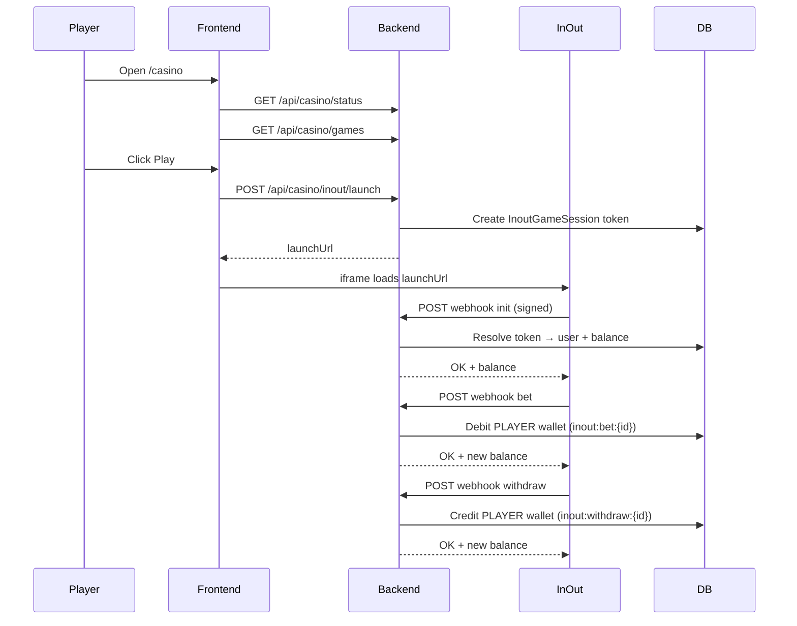

# InOut Games Integration — Sokasport

Complete reference for the **seamless-wallet** integration with [InOut Games](https://inout.games). Sokasport holds player balances; InOut calls our webhook for `init`, `bet`, `withdraw`, and `rollback`. Games launch in an iframe via InOut’s launch URL.

**Production callback URL:** `https://api.sokasport.com/api/integrations/inout/webhook`  
**Currency:** ETB (Ethiopian Birr)  
**Brand:** Sokasport / sokasport-prod  

> This document covers the **production** backend (`api.sokasport.com`). We use one backend for both InOut certification and live play — no separate staging stack on the VPS.

---

## Table of contents

1. [Architecture](#1-architecture)
2. [Implementation phases](#2-implementation-phases)
3. [Environment variables](#3-environment-variables)
4. [Database models](#4-database-models)
5. [API endpoints](#5-api-endpoints)
6. [Webhook contract](#6-webhook-contract)
7. [Wallet & ledger mapping](#7-wallet--ledger-mapping)
8. [Game catalog & lobby](#8-game-catalog--lobby)
9. [Admin panel](#9-admin-panel)
10. [Player frontend](#10-player-frontend)
11. [Deployment & operations](#11-deployment--operations)
12. [Testing](#12-testing)
13. [File inventory](#13-file-inventory)
14. [Modified existing files](#14-modified-existing-files)
15. [Full source code](#15-full-source-code)

---

## 1. Architecture



**Key design decisions:**

| Topic | Choice |
|--------|--------|
| Wallet model | Seamless — Sokasport debits/credits ETB on webhook |
| Security | HMAC-SHA256 on raw body via `X-REQUEST-SIGN` header |
| Idempotency | Unique `Transaction.reference` per InOut `transactionId` |
| Session | `InoutGameSession.token` = InOut `authToken` / webhook `token` |
| Catalog | Local `InoutGame` table synced from InOut `gameModesList` |
| Master switch | `CASINO_ENABLED` setting — blank screen when off |
| Body parsing | InOut routes mounted **before** `express.json()` |

**Sokasport wallet note:** Player wallets track `withdrawable` separately from `balance`. Casino ops use `walletBalance.js`: bets debit like sportsbook stakes (non-withdrawable first); wins credit with `withdrawable: true`; rollbacks credit balance only (`withdrawable: false`).

---

## 2. Implementation phases

### Phase A — Seamless wallet (webhooks)

1. Add InOut config (`backend/Config/inout.js`).
2. Implement HMAC signature verify (`lib/inoutSignature.js`, `middleware/inoutWebhook.js`).
3. Mount webhook route before JSON parser (`routes/inout.js`, `index.js`).
4. Implement wallet operations with idempotency (`services/inoutWallet.js`).
5. Handle webhook actions (`controllers/inoutWebhookController.js`).
6. Add `InoutGameSession` Prisma model for session tokens.
7. Add smoke test script and signature unit tests.

### Phase B — Game launch (authenticated players)

1. Launch controller creates session token + builds launch URL (`controllers/inoutLaunchController.js`).
2. Authenticated route `POST /api/casino/inout/launch` (`routes/casino.js`).
3. Include required launch params: `gameMode`, `operatorId`, `authToken`, `currency`, `lang`, **`userCountryCode`**, `adaptive`.

### Phase C — Game catalog & lobby

1. Add `InoutGame` model and sync job from InOut API.
2. Public routes: game list (Redis cached), demo launch, casino status.
3. Admin routes: list/patch games, sync catalog, master switch.
4. Player `/casino` page with game grid + iframe overlay.
5. Wire navigation (desktop + mobile) to `/casino`.

### Phase D — Reports & polish

1. Casino reports API (GGR from `inout:*` transactions).
2. Admin Reports tab on Casino page.
3. Remove RTP badge from player game cards (admin still sees RTP).

---

## 3. Environment variables

Set these in production `.env` (see `backend/.env.production.example`):

```env
# Required — from InOut onboarding
INOUT_OPERATOR_ID=6cbca09b-4e08-43bc-a1ff-c1ffb5eeea53
INOUT_SIGNATURE_KEY=<secret from InOut — never commit>

# Optional (defaults shown)
INOUT_LAUNCH_BASE_URL=https://api.inout.games/api/launch
INOUT_API_BASE_URL=https://api.inout.games/api
INOUT_DEMO_OPERATOR_ID=ee2013ed-e1f0-4d6e-97d2-f36619e2eb52
INOUT_DEFAULT_CURRENCY=ETB
INOUT_DEFAULT_COUNTRY=ET
INOUT_ALIAS=sokasport-prod

# Optional tuning
INOUT_API_TIMEOUT_MS=15000
INOUT_API_MAX_RETRIES=2
```

**Information sent to InOut during onboarding:**

| Field | Value |
|--------|--------|
| Production callback URL | `https://api.sokasport.com/api/integrations/inout/webhook` |
| Currencies | ETB |
| Brand name | Sokasport |
| Operator alias | sokasport-prod |

---

## 4. Database models

Added to `backend/prisma/schema.prisma`:

### `InoutGameSession`

Maps InOut `authToken` → Sokasport user for webhooks.

```prisma
model InoutGameSession {
  id         String    @id @default(uuid()) @map("_id")
  token      String    @unique
  user_id    String
  currency   String    @default("ETB")
  game_mode  String?
  created_at DateTime  @default(now())
  expires_at DateTime?

  @@index([user_id])
  @@map("inout_game_sessions")
}
```

### `InoutGame`

Local catalog; admin controls `enabled` and `sort_order`.

```prisma
model InoutGame {
  id          String   @id @default(uuid()) @map("_id")
  game_mode   String   @unique
  title       String
  description String?
  icon_url    String?
  multiplayer Boolean  @default(false)
  rtp         String?
  enabled     Boolean  @default(true)
  sort_order  Int      @default(0)
  raw         Json?
  created_at  DateTime @default(now())
  updated_at  DateTime @updatedAt

  @@index([enabled])
  @@map("inout_games")
}
```

### Platform setting

Master casino switch uses existing `Setting` model with key `CASINO_ENABLED` (`true` / `false`).

---

## 5. API endpoints

### Webhook (no auth — signature only)

| Method | Path | Description |
|--------|------|-------------|
| `POST` | `/api/integrations/inout/webhook` | InOut seamless-wallet callbacks |

### Public casino (no auth)

| Method | Path | Description |
|--------|------|-------------|
| `GET` | `/api/casino/status` | Master switch `{ enabled: boolean }` |
| `GET` | `/api/casino/games` | Enabled games (Redis cache, 5 min TTL) |
| `GET` | `/api/casino/inout/demo-launch?gameMode=&lang=` | Demo launch URL (`currency=DEMO`) |

### Authenticated player

| Method | Path | Auth | Description |
|--------|------|------|-------------|
| `POST` | `/api/casino/inout/launch` | Player JWT | Real-money launch URL |

Body: `{ gameMode, lang?, userCountryCode?, lobbyUrl? }`  
Response: `{ launchUrl }`

### Admin (`casino:read` / `casino:manage`)

| Method | Path | Permission | Description |
|--------|------|------------|-------------|
| `GET` | `/api/admin/casino/status` | `casino:read` | Master switch state |
| `PATCH` | `/api/admin/casino/status` | `casino:manage` | Toggle `{ enabled: boolean }` |
| `GET` | `/api/admin/casino/games` | `casino:read` | Full catalog |
| `PATCH` | `/api/admin/casino/games/:id` | `casino:manage` | `{ enabled?, sort_order? }` |
| `POST` | `/api/admin/casino/sync` | `casino:manage` | Re-sync from InOut |
| `GET` | `/api/admin/casino/reports?from=&to=` | `casino:read` | GGR & activity report |

---

## 6. Webhook contract

**Header:** `X-REQUEST-SIGN` = HMAC-SHA256 hex of **raw request body** using `INOUT_SIGNATURE_KEY`.

**Success:** HTTP `200` with `{ code: "OK", ... }`  
**Error:** Any non-200 with `{ code, message? }`

### Actions handled

| Action | Behavior |
|--------|----------|
| `init` | Return `userId`, `nickname`, `balance`, `currency`, `operator` |
| `bet` | Debit stake from PLAYER wallet |
| `withdraw` | Credit win/result (requires existing `debitId` bet) |
| `rollback` | Refund stake (requires existing `debitId` bet) |
| `bonus-complete` | Acknowledged (no ledger movement yet) |
| `bonus-expired-when-active` | Acknowledged (no ledger movement yet) |

### Error codes

| Code | HTTP | When |
|------|------|------|
| `INVALID_TOKEN` | 401 | Bad signature or unknown session token |
| `INSUFFICIENT_FUNDS` | 400 | Bet exceeds balance |
| `DEBIT_TRANSACTION_NOT_FOUND` | 404 | Withdraw/rollback for unknown `debitId` |
| `ACCOUNT_LOCKED` | 403 | User disabled |
| `ACCOUNT_INVALID` | 404 | No user/wallet |
| `CHECKS_FAIL` | 400 | Unsupported currency |
| `TEMPORARY_ERROR` | 503 | Server error (InOut will retry) |

### InOut certification note

InOut’s test guide expects the session token to come from **Plinko** (`game_mode: "plinko"`). The seed script defaults to this game mode.

---

## 7. Wallet & ledger mapping

All casino money flows through the existing `Transaction` table on the **PLAYER** wallet.

| InOut action | Transaction type | Reference pattern | Effect |
|--------------|------------------|-------------------|--------|
| `bet` | `BET` | `inout:bet:{transactionId}` | Debit stake |
| `withdraw` | `PAYOUT` | `inout:withdraw:{transactionId}` | Credit result |
| `rollback` | `PAYOUT` | `inout:rollback:{transactionId}` | Refund stake |

**GGR formula (reports):**

```
GGR = total_bets − total_wins − total_rollbacks
```

**Idempotency:** `reference` is `@unique` in Prisma. Replayed `withdraw`/`rollback` with the same `transactionId` returns the prior balance without double-crediting.

**Debit verification:** `withdraw` and `rollback` require `inout:bet:{debitId}` to exist, or they return `DEBIT_TRANSACTION_NOT_FOUND` (HTTP 404).

---

## 8. Game catalog & lobby

### Sync flow

1. `GET https://api.inout.games/api/gameModesList?operatorId={INOUT_OPERATOR_ID}`
2. Upsert each game by `game_mode`
3. Refresh provider fields: `title`, `description`, `icon_url`, `rtp`, `multiplayer`, `raw`
4. Preserve admin fields on re-sync: `enabled`, `sort_order`
5. Invalidate Redis key `inout:games:enabled`

### Launch URL (real money)

```
https://api.inout.games/api/launch?
  gameMode={mode}
  &operatorId={INOUT_OPERATOR_ID}
  &authToken={session_token}
  &currency=ETB
  &lang=en
  &userCountryCode=ET
  &adaptive=true
```

### Launch URL (demo)

Uses InOut’s demo operator with `currency=DEMO` and our operator as `themeId` for branded loading.

---

## 9. Admin panel

**Path:** Admin → **Casino Games** (`/casino`)

**Permissions:** `casino:read`, `casino:manage` (ADMIN / SUPER_ADMIN wildcard)

### Tabs

1. **Games** — catalog list, search/filter, enable/disable per game, sort order, sync from InOut
2. **Reports** — date range, summary cards (bets, volume, payouts, GGR), daily breakdown, top players

### Master switch

Toggles `CASINO_ENABLED` in platform settings. When off, the player `/casino` page renders a **blank black screen** (independent of InOut).

---

## 10. Player frontend

**Path:** `/casino`

### Behavior

1. Check `GET /api/casino/status` — if disabled, show black screen only
2. Load `GET /api/casino/games` — grid of enabled games
3. **Play** — requires login → `POST /api/casino/inout/launch` → full-screen iframe
4. **Demo** — no login → `GET /api/casino/inout/demo-launch` → iframe
5. Game cards: banner image, glass-effect Play/Demo overlay, title (RTP not shown to players)

### Navigation

- Desktop nav “GAMES” → `/casino` (`frontend/src/data/homepageData.js`)
- Mobile bottom bar “games” → `/casino` (`MobileBottomBar.jsx`)

### i18n

English and Amharic strings under `casino.*` in `frontend/src/i18n/coreTranslations.js`. Amharic maps to `en` for InOut launch (`lib/inoutLang.js`).

---

## 11. Deployment & operations

### Initial production deploy

```bash
cd ~/sokasport

# Rebuild + restart production stack
docker compose -f docker-compose.prod.yml up -d --build

# Apply schema (creates inout_games, inout_game_sessions)
docker compose -f docker-compose.prod.yml exec backend npx prisma db push

# Sync game catalog from InOut
docker compose -f docker-compose.prod.yml exec backend node scripts/syncInoutCatalog.mjs
```

### Verify

```bash
# Enabled games list
curl -s http://127.0.0.1:3001/api/casino/games | head -c 500

# Webhook reachable (401 without signature = middleware working)
curl -s -o /dev/null -w "%{http_code}\n" \
  -X POST https://api.sokasport.com/api/integrations/inout/webhook
```

### Re-sync catalog (admin UI or CLI)

```bash
docker compose -f docker-compose.prod.yml exec backend node scripts/syncInoutCatalog.mjs
```

### Admin frontend build

```bash
cd ~/sokasport/admin && npm run build
```

---

## 12. Testing

### Unit test — signature verification

```bash
cd backend && node --test tests/inoutSignature.test.js
```

Uses InOut’s documented HMAC vector from their integration guide.

### Seed test player + session token

```bash
docker compose -f docker-compose.prod.yml exec backend node scripts/seedInoutTestPlayer.mjs
```

Prints a ready-to-use `token` for webhook tests. Defaults: `game_mode=plinko`, balance `1000 ETB`.

Optional env: `INOUT_TEST_PHONE`, `INOUT_TEST_BALANCE`, `INOUT_TEST_GAME_MODE`.

### Webhook smoke test

```bash
cd ~/sokasport/backend

BASE_URL="https://api.sokasport.com" \
SECRET="<INOUT_SIGNATURE_KEY>" \
TOKEN="<token from seedInoutTestPlayer.mjs>" \
OPERATOR="6cbca09b-4e08-43bc-a1ff-c1ffb5eeea53" \
./scripts/inoutWebhookSmokeTest.sh
```

Tests: `init`, bad signature, `bet`, `withdraw`, withdraw replay (idempotency), `rollback`, rollback on non-existent debit (`DEBIT_TRANSACTION_NOT_FOUND`).

---

## 13. File inventory

### Backend — created

| File | Purpose |
|------|---------|
| `backend/Config/inout.js` | Env config, operator ID, signature key getters |
| `backend/lib/inoutSignature.js` | HMAC-SHA256 compute/verify |
| `backend/lib/inoutMoney.js` | Format ETB as 2-decimal string for InOut |
| `backend/lib/inoutLang.js` | Map UI lang → InOut-supported lang codes |
| `backend/lib/inoutCatalogCache.js` | Redis cache key + TTL for public game list |
| `backend/lib/casinoSettings.js` | `CASINO_ENABLED` master switch helper |
| `backend/middleware/inoutWebhook.js` | Raw body parser + signature middleware |
| `backend/services/inoutApiService.js` | Axios client for `gameModesList` |
| `backend/services/inoutWallet.js` | Bet debit, withdraw credit, rollback refund |
| `backend/controllers/inoutWebhookController.js` | Webhook action handlers |
| `backend/controllers/inoutLaunchController.js` | Session token + launch URL for players |
| `backend/controllers/casinoReportsController.js` | Admin GGR reports |
| `backend/routes/inout.js` | Webhook route mount |
| `backend/routes/casino.js` | Authenticated launch route |
| `backend/routes/casinoPublic.js` | Public games, demo launch, status |
| `backend/routes/casinoAdmin.js` | Admin catalog, sync, switch, reports |
| `backend/jobs/syncInoutCatalog.js` | Catalog upsert job |
| `backend/scripts/syncInoutCatalog.mjs` | CLI wrapper for sync job |
| `backend/scripts/seedInoutTestPlayer.mjs` | Test player + session token |
| `backend/scripts/inoutWebhookSmokeTest.sh` | curl webhook smoke test |
| `backend/tests/inoutSignature.test.js` | Signature unit tests |

### Frontend — created

| File | Purpose |
|------|---------|
| `frontend/src/pages/Casino.jsx` | Player casino lobby |
| `frontend/src/components/casino/GameFrame.jsx` | Full-screen iframe overlay |

### Admin — created

| File | Purpose |
|------|---------|
| `admin/src/pages/admin/CasinoPage.jsx` | Games + Reports tabs, master switch |
| `admin/src/hook/useCasinoGames.js` | React Query hooks for casino admin API |

---

## 14. Modified existing files

| File | Change |
|------|--------|
| `backend/prisma/schema.prisma` | Added `InoutGameSession`, `InoutGame` |
| `backend/index.js` | Mount inout (before JSON), casino public/admin routes |
| `backend/lib/permissions.js` | Documented `casino:read`, `casino:manage` |
| `backend/.env.production.example` | InOut env vars |
| `frontend/src/services/api.js` | `fetchCasinoStatus`, `fetchCasinoGames`, `fetchInoutLaunchUrl`, `fetchInoutDemoLaunchUrl` |
| `frontend/src/App.jsx` | Route `/casino` |
| `frontend/src/data/homepageData.js` | Nav path `/casino` for games |
| `frontend/src/components/layout/MobileBottomBar.jsx` | Mobile nav → `/casino` |
| `frontend/src/i18n/coreTranslations.js` | `casino.*` strings (en/am) |
| `admin/src/App.jsx` | Route `/casino` |
| `admin/src/components/layout/AdminShell.jsx` | Sidebar “Casino Games” |
| `admin/src/lib/permissions.js` | `casino:read`, `casino:manage` for ADMIN |

### `backend/index.js` mount order (critical)

```javascript
// BEFORE express.json() — preserves raw body for HMAC
app.use("/api/integrations/inout", inoutRoutes);

app.use(express.json());

// Public casino (no auth)
app.use("/api/casino", casinoPublicRoutes);

// Authenticated
app.use("/api/casino", authenticateToken, casinoRoutes);
app.use("/api/admin/casino", authenticateToken, casinoAdminRoutes);
```

---

## 15. Full source code

All InOut integration source lives in the repository at the paths below. This section lists each file in full as committed in the codebase.

---

### `backend/Config/inout.js`

```javascript
/**
 * InOut Games integration config.
 *
 * Values are read from the environment (see `.env` on the server). Secrets
 * (`INOUT_SIGNATURE_KEY`) must never be committed.
 *
 * @module Config/inout
 */

export const INOUT_DEFAULT_CURRENCY =
  process.env.INOUT_DEFAULT_CURRENCY || "ETB";

export const INOUT_DEFAULT_COUNTRY =
  (process.env.INOUT_DEFAULT_COUNTRY || "ET").toUpperCase();

export const INOUT_LAUNCH_BASE_URL =
  process.env.INOUT_LAUNCH_BASE_URL || "https://api.inout.games/api/launch";

export const INOUT_API_BASE_URL =
  process.env.INOUT_API_BASE_URL || "https://api.inout.games/api";

export const INOUT_DEMO_OPERATOR_ID =
  process.env.INOUT_DEMO_OPERATOR_ID || "ee2013ed-e1f0-4d6e-97d2-f36619e2eb52";

export const INOUT_ALIAS = process.env.INOUT_ALIAS || "";

export function getInoutOperatorId() {
  const v = process.env.INOUT_OPERATOR_ID;
  if (!v) throw new Error("INOUT_OPERATOR_ID is not set");
  return v;
}

export function getInoutSignatureKey() {
  const v = process.env.INOUT_SIGNATURE_KEY;
  if (!v) throw new Error("INOUT_SIGNATURE_KEY is not set");
  return v;
}

export function isInoutWebhookConfigured() {
  return Boolean(process.env.INOUT_SIGNATURE_KEY);
}

export function isInoutLaunchConfigured() {
  return Boolean(process.env.INOUT_OPERATOR_ID);
}
```

---

### `backend/lib/inoutSignature.js`

```javascript
import crypto from "node:crypto";

export function computeSignature(rawBody, key) {
  const buf = Buffer.isBuffer(rawBody)
    ? rawBody
    : Buffer.from(String(rawBody ?? ""), "utf8");
  return crypto.createHmac("sha256", key).update(buf).digest("hex");
}

export function verifySignature(rawBody, headerValue, key) {
  if (!headerValue || typeof headerValue !== "string" || !key) return false;
  const expected = computeSignature(rawBody, key);
  const a = Buffer.from(expected, "utf8");
  const b = Buffer.from(headerValue.trim().toLowerCase(), "utf8");
  if (a.length !== b.length) return false;
  return crypto.timingSafeEqual(a, b);
}
```

---

### `backend/lib/inoutMoney.js`

```javascript
import { toMoney } from "./moneyDecimal.js";

export function formatEtb(value) {
  return toMoney(value, 2).toFixed(2);
}
```

---

### `backend/lib/inoutLang.js`

```javascript
const SUPPORTED = new Set([
  "az", "bn", "bd", "en", "es", "hi", "id", "kk", "kz",
  "mx", "ch", "pe", "ec", "co", "pt", "br", "ru", "tr",
  "uk", "ua", "uz", "zh",
]);

export function normalizeLang(lang) {
  const l = String(lang || "").toLowerCase();
  return SUPPORTED.has(l) ? l : "en";
}
```

---

### `backend/lib/inoutCatalogCache.js`

```javascript
export const INOUT_GAMES_CACHE_KEY = "inout:games:enabled";
export const INOUT_GAMES_CACHE_TTL = 300;
```

---

### `backend/lib/casinoSettings.js`

```javascript
export const CASINO_ENABLED_SETTING_KEY = "CASINO_ENABLED";
export const DEFAULT_CASINO_ENABLED = true;

export async function resolveCasinoEnabled(prisma) {
  const row = await prisma.setting.findUnique({
    where: { key: CASINO_ENABLED_SETTING_KEY },
  });
  if (!row) return DEFAULT_CASINO_ENABLED;
  return row.value === "true" || row.value === "1";
}
```

---

### `backend/middleware/inoutWebhook.js`

```javascript
import express from "express";
import { verifySignature } from "../lib/inoutSignature.js";
import {
  getInoutSignatureKey,
  isInoutWebhookConfigured,
} from "../Config/inout.js";

export const inoutRawBodyParser = express.raw({
  type: "*/*",
  limit: "1mb",
});

export function verifyInoutWebhook(req, res, next) {
  if (!isInoutWebhookConfigured()) {
    return res.status(500).json({
      code: "TEMPORARY_ERROR",
      message: "Integration not configured",
    });
  }

  const raw = Buffer.isBuffer(req.body)
    ? req.body
    : Buffer.from(typeof req.body === "string" ? req.body : "", "utf8");

  const header = req.get("X-REQUEST-SIGN");

  let key;
  try {
    key = getInoutSignatureKey();
  } catch {
    return res.status(500).json({
      code: "TEMPORARY_ERROR",
      message: "Integration not configured",
    });
  }

  if (!verifySignature(raw, header, key)) {
    return res.status(401).json({
      code: "INVALID_TOKEN",
      message: "Signature verification failed",
    });
  }

  try {
    req.inoutBody = raw.length ? JSON.parse(raw.toString("utf8")) : {};
  } catch {
    return res.status(400).json({
      code: "UNKNOWN_ERROR",
      message: "Malformed JSON body",
    });
  }

  return next();
}
```

---

### `backend/routes/inout.js`

```javascript
import express from "express";
import {
  inoutRawBodyParser,
  verifyInoutWebhook,
} from "../middleware/inoutWebhook.js";
import { handleInoutWebhook } from "../controllers/inoutWebhookController.js";

const router = express.Router();

router.post("/webhook", inoutRawBodyParser, verifyInoutWebhook, handleInoutWebhook);

export default router;
```

---

### `backend/routes/casino.js`

```javascript
import express from "express";
import { createInoutLaunch } from "../controllers/inoutLaunchController.js";

const router = express.Router();
router.post("/inout/launch", createInoutLaunch);

export default router;
```

---

### `backend/services/inoutApiService.js`

See repository: `backend/services/inoutApiService.js` — axios client calling `GET /gameModesList?operatorId=...` with timeout and retries.

---

### `backend/services/inoutWallet.js`

See repository: `backend/services/inoutWallet.js` — exports:

- `betRef(transactionId)` → `inout:bet:{id}`
- `withdrawRef(transactionId)` → `inout:withdraw:{id}`
- `rollbackRef(transactionId)` → `inout:rollback:{id}`
- `debitForBet(userId, amount, transactionId)`
- `creditForWithdraw(userId, result, transactionId, debitId?)`
- `refundForRollback(userId, amount, transactionId, debitId?)`

All operations use `prisma.$transaction` and unique `reference` for idempotency.

---

### `backend/controllers/inoutWebhookController.js`

See repository: `backend/controllers/inoutWebhookController.js` — handles `init`, `bet`, `withdraw`, `rollback`, bonus ack actions.

---

### `backend/controllers/inoutLaunchController.js`

See repository: `backend/controllers/inoutLaunchController.js` — `POST` handler creates `InoutGameSession`, returns `{ launchUrl }`.

---

### `backend/controllers/casinoReportsController.js`

See repository: `backend/controllers/casinoReportsController.js` — aggregates `inout:*` transactions into summary, `byDay`, `topPlayers`.

---

### `backend/routes/casinoPublic.js`

See repository: `backend/routes/casinoPublic.js` — `GET /status`, `GET /games`, `GET /inout/demo-launch`.

---

### `backend/routes/casinoAdmin.js`

See repository: `backend/routes/casinoAdmin.js` — admin status, games CRUD, sync, reports.

---

### `backend/jobs/syncInoutCatalog.js`

See repository: `backend/jobs/syncInoutCatalog.js` — fetches and upserts InOut catalog.

---

### `backend/scripts/syncInoutCatalog.mjs`

```javascript
import { prisma } from "../Config/db.js";
import syncInoutCatalog from "../jobs/syncInoutCatalog.js";

syncInoutCatalog()
  .then((r) => {
    console.log(`Done. total=${r.total} created=${r.created} updated=${r.updated}`);
  })
  .catch((err) => {
    console.error(err);
    process.exitCode = 1;
  })
  .finally(async () => {
    await prisma.$disconnect();
  });
```

---

### `backend/scripts/seedInoutTestPlayer.mjs`

See repository: `backend/scripts/seedInoutTestPlayer.mjs` — creates test PLAYER with wallet + `InoutGameSession` token (default `game_mode=plinko`).

---

### `backend/scripts/inoutWebhookSmokeTest.sh`

See repository: `backend/scripts/inoutWebhookSmokeTest.sh` — signed curl sequence for init/bet/withdraw/rollback/idempotency/debit-not-found.

---

### `backend/tests/inoutSignature.test.js`

See repository: `backend/tests/inoutSignature.test.js` — validates against InOut documentation HMAC vector.

---

### `frontend/src/pages/Casino.jsx`

See repository: `frontend/src/pages/Casino.jsx` — lobby page with status check, game grid, Play/Demo handlers, `GameFrame` overlay.

---

### `frontend/src/components/casino/GameFrame.jsx`

See repository: `frontend/src/components/casino/GameFrame.jsx` — portal-based full-screen iframe with Escape to close.

---

### `frontend/src/services/api.js` (casino section)

```javascript
export async function fetchCasinoStatus(options = {}) { /* GET /api/casino/status */ }
export async function fetchCasinoGames(options = {}) { /* GET /api/casino/games */ }
export async function fetchInoutLaunchUrl(gameMode, opts = {}) { /* POST /api/casino/inout/launch */ }
export async function fetchInoutDemoLaunchUrl(gameMode, lang) { /* GET /api/casino/inout/demo-launch */ }
```

---

### `admin/src/hook/useCasinoGames.js`

See repository: `admin/src/hook/useCasinoGames.js` — React Query hooks:

- `useCasinoGamesQuery`
- `useUpdateCasinoGameMutation`
- `useCasinoStatusQuery`
- `useUpdateCasinoStatusMutation`
- `useSyncCasinoCatalogMutation`
- `useCasinoReportsQuery`

---

### `admin/src/pages/admin/CasinoPage.jsx`

See repository: `admin/src/pages/admin/CasinoPage.jsx` — tabbed UI:

- **Games tab:** stats, sync, search/filter, game table with enable toggle + sort order
- **Reports tab:** date presets, summary cards, daily table, top players
- **Master switch panel** at top

---

## Not included (out of scope / later)

| Item | Status |
|------|--------|
| InOut bonus API ledger | Webhooks acknowledged only |
| Per-game reports by `game_mode` | Reports are platform-wide (no game_mode on transactions yet) |
| Admin-editable RTP | RTP is provider-synced, display-only in admin |
| Separate staging VPS stack | Single production backend used for certification + live |

---

## Quick reference

```
Webhook:     POST https://api.sokasport.com/api/integrations/inout/webhook
Player lobby: https://sokasport.com/casino
Admin:       /casino (Games + Reports)
Ledger refs:  inout:bet:* | inout:withdraw:* | inout:rollback:*
GGR:         bets − wins − rollbacks
```
