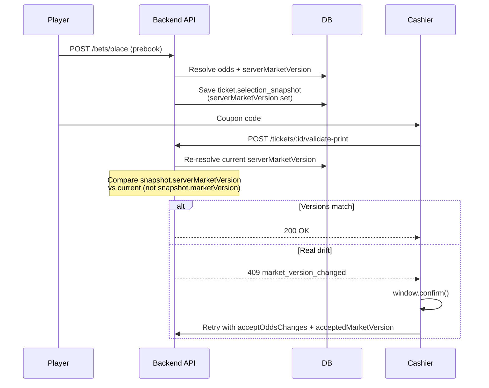

# Cashier print — false “Market data refreshed” confirmation fix

**Status:** Implemented (2026-06-01)  
**Last reviewed:** 2026-06-01

---

## Executive summary

Cashiers saw a browser confirmation on **every** ticket print:

> “Market data was refreshed. Click OK to accept the latest market and continue printing.”

The dialog is intentional when **market version drift** is detected before wallet debit / print confirm. The bug was not stale frontend cache — it was **print validation reading the wrong version field** from the ticket snapshot.

After the fix, the dialog appears only when market data has **actually changed** since the bet was booked (or when odds drift beyond tolerance).

---

## Symptom

| Observation | Detail |
|-------------|--------|
| When | Cashier clicks **Print** on an OPEN prebook ticket |
| UI | `window.confirm()` with “Market data was refreshed…” |
| Frequency | **Every** print attempt, even seconds after booking |
| Backend code | `market_version_changed` (HTTP 409) |
| Odds on screen | Often unchanged — same numbers as at booking |

---

## Intended behavior (why validation exists)

Betting flows usually separate **booking** (player creates coupon) from **cashier sale** (print + wallet debit). Between those steps, odds or market state can change. Before debiting the cashier wallet, the server re-validates selections against live DB odds.

Two drift types matter:

| Code | Meaning | User action |
|------|---------|-------------|
| `odds_changed` | Price moved beyond tolerance | Confirm new odds |
| `market_version_changed` | Server market version differs from submitted version (even if price matches) | Confirm latest market |

The cashier UI retries with `acceptOddsChanges: true` and updated `selections[]` after the user clicks OK.

This pattern is correct. The bug was **what version we treated as “submitted”** at print time.

---

## Root cause

### Two different version fields

At **booking** (prebook / place bet), the backend stores a snapshot on the ticket (`selection_snapshot`) with:

| Field | Source | Typical value |
|-------|--------|----------------|
| `marketVersion` | Client submission | Often `null` — player apps may not send it |
| `serverMarketVersion` | Server-computed hash at booking | Always set when odds resolve |

The server also persists `TicketSelection.market_version` (client) and `TicketSelection.server_market_version` (authoritative).

### What print validation did wrong

When normalizing the snapshot for print validation, code used:

```js
marketVersion: Number(entry?.marketVersion)
```

That compares:

- **Submitted:** client version (`null` → `NaN`, or sometimes `0`)
- **Current:** freshly computed `serverMarketVersion` from DB (FNV hash of fixture + market + selection + odd + bookmaker)

Since `normalizePlacementSelections` maps `marketVersion` → `submittedMarketVersion`, and `compareOddsDrift` only flags drift when **both** sides are finite numbers, a stored `0` vs a real hash always mismatched → **100% false positives**.

### Why this is not “stale frontend data”

The cashier UI does not need live market polling for this bug. The ticket snapshot **already contained** the correct server version in `serverMarketVersion`. Print validation simply ignored it and read the empty client field instead.

---

## Fix

### Rule (portable)

> When re-validating a **stored** ticket snapshot, always compare against the **server-authoritative version captured at booking**, not the client-submitted version.

Fallback chain:

```js
entry?.serverMarketVersion ?? entry?.marketVersion
```

Use the same chain anywhere snapshot rows are normalized for validation (validate-print, confirm-print, etc.).

### Files changed (this repo)

| File | Change |
|------|--------|
| [backend/services/ticketPrintValidation.js](../backend/services/ticketPrintValidation.js) | `normalizeSnapshotForPrintValidation()` — read `serverMarketVersion` first |
| [backend/controllers/ticketsController.js](../backend/controllers/ticketsController.js) | Inline snapshot normalization in confirm-print — same fallback |

**Before:**

```js
marketVersion: Number.isFinite(acceptedVersionsByIndex.get(index))
  ? acceptedVersionsByIndex.get(index)
  : Number(entry?.marketVersion),
```

**After:**

```js
marketVersion: Number.isFinite(acceptedVersionsByIndex.get(index))
  ? acceptedVersionsByIndex.get(index)
  : Number(entry?.serverMarketVersion ?? entry?.marketVersion),
```

Retry path (user clicked OK) is unchanged: `acceptedMarketVersion` from the request body still wins.

---

## How to apply in another project

Use this checklist when you have a similar **book → later confirm/print** flow with market versioning.

### 1. Map your data model

Identify where you store:

- Client-submitted version (may be missing)
- Server-resolved version at booking time
- Current server version at validation time

Names vary; the **roles** must be clear:

```
clientVersion      → optional, from device
bookedServerVersion → authoritative at lock/book time
liveServerVersion   → recomputed at confirm/print time
```

### 2. Audit every “read from snapshot” path

Search for code that rebuilds selection payloads from a stored snapshot before calling your odds/market validator. Common locations:

- Print / confirm endpoints
- Cashier sale completion
- Payment capture after async checkout
- Idempotent retry handlers

**Smell:** normalization uses only `marketVersion` / `version` without checking a `server*` field.

### 3. Align normalization with placement normalization

If placement uses:

```js
submittedMarketVersion: item?.acceptedMarketVersion ?? item?.marketVersion ?? item?.serverMarketVersion
```

then snapshot re-validation must supply the **same semantic** for the “submitted” side — typically `serverMarketVersion` from the snapshot when the client never sent a version.

### 4. Keep drift detection semantics explicit

Document two codes (or equivalent):

- **Price drift** — tolerance-based
- **Version drift** — version mismatch even when price matches (catches revert-to-same-number updates)

Do not conflate them in UX copy; cashiers care whether the **price** changed vs the **market feed** refreshed.

### 5. Test matrix

| Scenario | Expected |
|----------|----------|
| Print immediately after book, odds unchanged | No confirmation |
| Odds change in DB after book | `odds_changed` → confirm |
| Odds same, market version hash changes | `market_version_changed` → confirm |
| User accepts drift, retries with `acceptedMarketVersion` | Success |
| Legacy tickets missing `serverMarketVersion` | Fallback to `marketVersion`; may still prompt (acceptable for old data) |

### 6. Optional hardening (future)

- **At booking:** copy resolved `serverMarketVersion` into `marketVersion` on the snapshot so a single field is always authoritative.
- **At booking:** if client sends no version, set `marketVersion = serverMarketVersion` before persist.
- **Shared helper:** one `normalizeSnapshotForValidation(snapshot, requestBody)` used by all endpoints — avoid duplicated inline normalization (this repo had duplication between service and controller).

---

## Reference flow (this codebase)



---

## Related docs & code

| Resource | Purpose |
|----------|---------|
| [docs/market-versioning.md](../docs/market-versioning.md) | Version field definitions |
| [backend/services/odds-engine/compareOdds.js](../backend/services/odds-engine/compareOdds.js) | Drift detection |
| [backend/services/odds-engine/versioning.js](../backend/services/odds-engine/versioning.js) | Prematch version hash |
| [admin/src/pages/cashier/TicketsPage.jsx](../admin/src/pages/cashier/TicketsPage.jsx) | Cashier confirm + retry UI |
| [backend/tests/oddsEngineValidate.test.js](../backend/tests/oddsEngineValidate.test.js) | Version drift unit tests |

---

## Lessons for similar systems

1. **Never treat optional client fields as the source of truth** on a later server validation step if you already captured authoritative server state at commit time.
2. **Snapshot schemas should name fields by role** (`clientMarketVersion` vs `serverMarketVersion`) — ambiguous `marketVersion` caused this class of bug.
3. **Duplicate normalization logic** across endpoints increases fix miss risk; consolidate when touching this area again.
4. **False-positive confirm dialogs** erode operator trust and slow retail throughput — treat “always prompts” as a data wiring bug, not user training.
