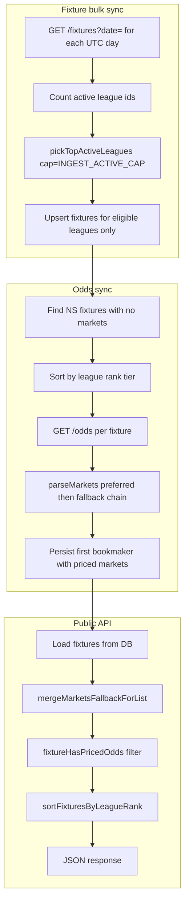

# League rank hierarchy + bookmaker fallback for lower-tier leagues

**Status:** Ported to sokasport (2026-07-10) from kizzabet/MichuBet implementation (2026-06-14)  
**Trigger:** Scale beyond a fixed allowlist while keeping API quota under control; fix Ethiopia Premier League fixtures missing on the sportsbook despite existing in API-Football.

---

## Executive summary

Two related changes shipped together:

1. **League rank hierarchy** — Replace a hard ingestion allowlist with a ranked catalogue (1,232 leagues). Each bulk fixture sync ingests only the **top N active leagues by rank** (default 200). The sidebar shows **active leagues only**, sorted by rank, with a pinned top section (ranks 1–8) and regional country tabs.

2. **Bookmaker fallback chain** — When the admin preferred bookmaker (typically Bet365) has no lines for a fixture, odds sync now tries a default chain (Marathonbet → 1xBet → Unibet → …) so lower-tier leagues (e.g. Ethiopia Premier League, API id `363`) still get priced markets and appear on public list endpoints.

Public fixture lists **only show fixtures with priced odds** (`fixtureHasPricedOdds`). Fixtures can exist in MongoDB but remain invisible until odds sync persists at least one market with lines.

---

## Problem 1 — Fixed allowlist does not scale

**Before:** `allowedLeagues.js` (~78 IDs) gated every fixture upsert in `syncFixtures.js`. Adding leagues required editing the allowlist and redeploying. API-Football returns fixtures for 200+ leagues on busy days; a static list either misses coverage or wastes quota on low-priority leagues.

**After:** A generated rank map (`leagueRanks.js`) assigns priority 1–1232. Bulk sync is two-phase:

1. Fetch all dates in the horizon and count which leagues have fixtures.
2. Upsert only leagues in `pickTopActiveLeagues(activeIds, INGEST_ACTIVE_CAP)`.

Ethiopia Premier League (`363`) is rank **9** (product priority), so it is always in the sidebar Top Leagues row when active and inside the top-200 ingest cap.

---

## Problem 2 — Ethiopia Premier League visible in sidebar but not in match list

**Symptom:** API-Football and third-party sites showed Ethiopia Premier League fixtures for “today”; the league appeared in `GET /api/football/sidebar-leagues` but `GET /api/football/fixtures?date=…` returned zero Ethiopia rows.

**Root cause (verified on production):**

| Layer | June 14 Ethiopia fixtures |
|-------|---------------------------|
| API-Football | 3 fixtures present, odds from 10+ bookmakers |
| MongoDB | 3 fixture rows present (`status: NS`) |
| MongoDB markets | **0** — odds sync stored nothing |
| Public list API | **Hidden** — `fixtureHasPricedOdds` filter |

Bet365 (typical preferred bookmaker) **did not** offer lines for those June 14 fixtures. June 15 fixtures **did** include Bet365, which is why some Ethiopia matches appeared under the next UTC day.

With only the preferred id in the parse chain and no `BOOKMAKER_FALLBACK_CHAIN` env, `parseMarkets()` returned empty → sync skipped persistence → list endpoints filtered the fixtures out.

**Fix:** When a preferred bookmaker is set but `BOOKMAKER_FALLBACK_CHAIN` is unset, append `DEFAULT_BOOKMAKER_FALLBACK_CHAIN` so sync tries Marathonbet (2), 1xBet (11), Unibet (16), etc., after Bet365.

---

## Architecture (after change)



---

## Files touched

### Backend — config & catalogue

| File | Change |
|------|--------|
| [backend/Config/allLeaguesList.js](../backend/Config/allLeaguesList.js) | **New.** Full API-Football catalogue (~1,232 `api_league_id` values). Generated once from `/v3/leagues`; not wired directly into ingestion — feeds rank generation. |
| [backend/scripts/generateAllLeaguesList.mjs](../backend/scripts/generateAllLeaguesList.mjs) | **New.** Script to regenerate `allLeaguesList.js` from API-Football (requires `API_FOOTBALL_KEY`). |
| [backend/Config/allowedLeagues.js](../backend/Config/allowedLeagues.js) | **Modified.** Reframed as **legacy seed** for ranks 1–78. `isAllowedLeague()` kept for scripts/backward compat. `PREFERRED_LEAGUE_IDS` (ranks 1–8) unchanged. |
| [backend/Config/leagueRanks.js](../backend/Config/leagueRanks.js) | **New (generated).** `LEAGUE_RANK_BY_ID` map, `getLeagueRank()`, `pickTopActiveLeagues()`, `getIngestActiveCap()`, `getSidebarActiveCap()`, `isTopLeague()`. |
| [backend/scripts/generateLeagueRanks.mjs](../backend/scripts/generateLeagueRanks.mjs) | **New.** Regenerates `leagueRanks.js` from `PREFERRED_LEAGUE_IDS` → legacy allowlist → remainder of `allLeaguesList.js`. No API key needed. |
| [backend/Config/leagueTiers.js](../backend/Config/leagueTiers.js) | **Modified.** `getLeagueTier()` uses `getLeagueRank()` when `LEAGUE_TIERS_JSON` is unset, so odds sync prioritizes elite leagues under caps. |
| [backend/Config/ingestionConfig.js](../backend/Config/ingestionConfig.js) | **Modified.** Added `DEFAULT_BOOKMAKER_FALLBACK_CHAIN` constant (Marathonbet, 1xBet, Unibet, Superbet, Betano, Betfair). |
| [backend/Config/oddsFilters.js](../backend/Config/oddsFilters.js) | **Modified.** `buildOddsParseOptions()` appends default fallback chain when preferred bookmaker is set and `BOOKMAKER_FALLBACK_CHAIN` env is empty. |
| [backend/.env.example](../backend/.env.example) | **Modified.** Documented `INGEST_ACTIVE_CAP`, `SIDEBAR_ACTIVE_CAP`, `API_SPORTS_DAILY_LIMIT=155000`, and `BOOKMAKER_FALLBACK_CHAIN` / default fallback behavior. |
| [backend/LIST_OF_LEAGUES.md](../backend/LIST_OF_LEAGUES.md) | **Modified.** Added “Rank model (runtime)” section describing catalogue, ranks, caps, and regenerate command. |

### Backend — jobs & routes

| File | Change |
|------|--------|
| [backend/jobs/syncFixtures.js](../backend/jobs/syncFixtures.js) | **Modified.** Two-phase bulk sync: buffer upstream payloads per date, aggregate active league ids, apply `pickTopActiveLeagues`, then upsert. Logs `rank gate – activeLeagues=… eligible=…`. Replaced `isAllowedLeague` gate. Cache invalidation patterns unchanged (`fixtures:by-date:*`, etc.). |
| [backend/routes/footballPublic.js](../backend/routes/footballPublic.js) | **Modified.** `GET /sidebar-leagues`: active leagues only, top section (ranks 1–8 when active) + regional cap via `SIDEBAR_ACTIVE_CAP`; returns `rank`, `section` (`top` \| `regional`). Fixture list endpoints sort by `sortFixturesByLeagueRank`. Cache keys bumped to `v2` (`sidebar-leagues:v2:…`, `fixtures:by-date:v2:…`, etc.). |

### Backend — diagnostics, tests

| File | Change |
|------|--------|
| [backend/scripts/diagnoseLeagueFixtures.mjs](../backend/scripts/diagnoseLeagueFixtures.mjs) | **New.** Compares API-Football vs MongoDB vs parse preview for one league + date. Use when a league has fixtures upstream but not on the site. |
| [backend/tests/leagueRanks.test.js](../backend/tests/leagueRanks.test.js) | **New.** Rank lookup, `pickTopActiveLeagues`, top-league threshold. |
| [backend/tests/sidebarLeagues.test.js](../backend/tests/sidebarLeagues.test.js) | **New.** Sidebar catalog shaping (top vs regional, rank sort). |
| [backend/tests/leagueTiersSort.test.js](../backend/tests/leagueTiersSort.test.js) | **Extended.** Odds ingest sort uses rank when tier JSON unset. |
| [backend/tests/oddsFilters.test.js](../backend/tests/oddsFilters.test.js) | **New.** Default fallback chain when preferred set and env chain empty. |

### Frontend

| File | Change |
|------|--------|
| [frontend/src/utils/buildLeagueSidebarGroups.js](../frontend/src/utils/buildLeagueSidebarGroups.js) | **Modified.** Reads `rank` and `section` from sidebar API; excludes `section: "top"` from country groups; sorts by rank then count. |
| [frontend/src/components/sections/TopLeaguesSidebar.jsx](../frontend/src/components/sections/TopLeaguesSidebar.jsx) | **Modified.** When API returns `section: "top"`, uses that for the pinned top block instead of client-only `topLeagues.js` matchers. |
| [frontend/src/pages/Home.jsx](../frontend/src/pages/Home.jsx) | **Modified.** Passes `catalogItems` from `useFootballSidebarCatalog()` into sidebar builders. |
| [frontend/src/pages/Live.jsx](../frontend/src/pages/Live.jsx) | **Modified.** Same `catalogItems` wiring as Home. |
| [frontend/src/services/api.js](../frontend/src/services/api.js) | **Unchanged logic** (already had `fetchSidebarLeagues`); comment/doc references `sidebar-leagues` response shape. |
| [frontend/src/hooks/useFootballSidebarCatalog.js](../frontend/src/hooks/useFootballSidebarCatalog.js) | **Existing hook** — loads `GET /api/football/sidebar-leagues`; no structural change required if already present. |

### Not part of this update (do not confuse)

These appeared in the same git working tree but belong to **other work** (cashier tickets / betting limits):

- `admin/src/hook/useCashierTickets.js`
- `admin/src/pages/SettingsPage.jsx`
- `admin/src/pages/cashier/TicketsPage.jsx`
- `backend/controllers/settingsController.js`
- `backend/controllers/ticketsController.js`
- `backend/lib/bettingLimits.js`
- `backend/prisma/schema.prisma`
- `backend/routes/tickets.js`

---

## Environment variables (production)

Set on VPS / worker after deploy:

```env
INGEST_ACTIVE_CAP=200
SIDEBAR_ACTIVE_CAP=200
API_SPORTS_DAILY_LIMIT=155000

# Optional explicit override; if unset, code uses DEFAULT_BOOKMAKER_FALLBACK_CHAIN
BOOKMAKER_FALLBACK_CHAIN=2,11,16,34,32,3

# Keep false so list endpoints show fixtures priced by fallback bookmakers
PUBLIC_FIXTURES_STRICT_BOOKMAKER=false
```

---

## How to port to a similar project

Assumes the same stack: Node backend, Prisma/Mongo, API-Football ingestion, BullMQ worker, React sportsbook frontend.

### Step 1 — Full league catalogue

1. Copy or generate `allLeaguesList.js` (run `generateAllLeaguesList.mjs` once with a valid `API_FOOTBALL_KEY`).
2. Keep your existing product allowlist as `allowedLeagues.js` — it becomes the **seed** for ranks 9–78 (or whatever size you use).

### Step 2 — Rank map

1. Copy `generateLeagueRanks.mjs` and run:

   ```bash
   node backend/scripts/generateLeagueRanks.mjs
   ```

2. Adjust seed order in the script if your “preferred top 8” differ (`PREFERRED_LEAGUE_IDS` in `allowedLeagues.js`).
3. Pin your local product leagues high in the seed list (Ethiopia `363` is rank 31 in this repo).

### Step 3 — Fixture ingestion

1. In `syncFixtures.js`, replace static allowlist checks with the two-phase pattern:
   - Fetch all dates → build `leagueActivity` map.
   - `ingestEligible = pickTopActiveLeagues(leagueActivity.keys(), getIngestActiveCap())`.
   - Skip upsert when `!ingestEligible.has(apiLeagueId)`.
2. Import from `leagueRanks.js`, not `isAllowedLeague`.

### Step 4 — Odds priority

1. In `leagueTiers.js`, when `LEAGUE_TIERS_JSON` is empty, return `getLeagueRank(apiLeagueId)` as the tier so capped odds sync favors high-rank leagues.

### Step 5 — Bookmaker fallback (critical for lower-tier leagues)

1. Add `DEFAULT_BOOKMAKER_FALLBACK_CHAIN` to `ingestionConfig.js`.
2. In `buildOddsParseOptions()`, after pushing the preferred id, push env chain **or** default chain when env is empty.
3. Confirm `parseMarkets()` in `oddsParser.js` already walks `orderedBookmakerApiIds` and picks the **first** bookmaker with non-empty markets (no change needed if you share this codebase).
4. Ensure `PUBLIC_FIXTURES_STRICT_BOOKMAKER` is not `true` unless you intentionally hide fallback-priced fixtures.

### Step 6 — Public API

1. Rewrite or extend `GET /sidebar-leagues`:
   - Query fixtures in odds horizon (+ live) → derive **active** `api_league_id` set.
   - Top section: active leagues where `isTopLeague(id)` (ranks 1–8 / preferred set).
   - Regional: `pickTopActiveLeagues(regionalCandidates, SIDEBAR_ACTIVE_CAP)`.
   - Return `{ horizonDays, sidebarCap, items: [{ id, apiLeagueId, rank, section, … }] }`.
2. Bump Redis cache keys (e.g. `v2`) so old cached empty catalogs are not served.
3. Add `sortFixturesByLeagueRank()` to `/fixtures`, `/fixtures/today`, `/fixtures/upcoming`.

### Step 7 — Frontend

1. Load sidebar catalog from API (`useFootballSidebarCatalog` or equivalent).
2. Pass `catalogItems` into `buildLeagueSidebarGroups` and `TopLeaguesSidebar`.
3. Use API `section: "top"` for pinned leagues when present; keep client matchers as fallback.

### Step 8 — Tests & docs

1. Port the four test files listed above.
2. Document rank model in your league list doc.
3. Add `diagnoseLeagueFixtures.mjs` for on-call debugging.

---

## Verification checklist

### After deploy (rank hierarchy)

```bash
# Worker should log rank gate on each bulk sync
docker compose -f docker-compose.prod.yml logs worker --tail=200 | grep "rank gate"

# Sidebar returns ranked active leagues
curl -sS "https://YOUR_API/api/football/sidebar-leagues" | jq '.items[] | select(.apiLeagueId == 363)'
```

Expect Ethiopia entry with `"rank": 31`, `"section": "regional"` when it has fixtures in horizon.

### After deploy (bookmaker fallback)

```bash
# Diagnose one league + date (inside backend container)
docker compose -f docker-compose.prod.yml exec backend \
  node scripts/diagnoseLeagueFixtures.mjs 363 2026-06-14
```

Expect `Sync preview: would persist bk=2` (or similar) when Bet365 is missing but Marathonbet has lines.

```bash
# Worker odds sync should show expanded chain
docker compose -f docker-compose.prod.yml logs worker --tail=300 | grep syncOdds
```

Look for: `bookmaker priority=8>2>11>16>…` and increasing `upserts=`.

```bash
# Public list should include Ethiopia when markets exist
curl -sS "https://YOUR_API/api/football/fixtures?date=YYYY-MM-DD" \
  | jq '[.[] | select(.league.api_league_id == 363)] | length'
```

### Run tests locally

```bash
cd backend
node --test tests/leagueRanks.test.js tests/sidebarLeagues.test.js tests/leagueTiersSort.test.js tests/oddsFilters.test.js
```

---

## Operational notes

### When fixtures still do not appear

Work through this order:

1. **Ingestion** — Is the league inside the rank cap when active? Check worker `[syncFixtures] rank gate` logs.
2. **DB row** — Does `/api/football/odds/:apiFixtureId` return the fixture?
3. **Markets** — Does that response have `markets.length > 0`?
4. **List filter** — Public lists require priced odds; empty markets = hidden.
5. **Kickoff buffer** — For UTC “today”, fixtures that already started are removed by `filterUpcomingByStartBuffer` (5-minute buffer).
6. **Date model** — List endpoints use **UTC calendar dates**. A fixture on “tomorrow UTC” appears under the Tomorrow tab even if it is “today” in local time (e.g. Ethiopia UTC+3).

### Regenerating ranks after catalogue changes

```bash
# Refresh full catalogue (occasional, uses API quota)
node backend/scripts/generateAllLeaguesList.mjs

# Rebuild ranks (no API key)
node backend/scripts/generateLeagueRanks.mjs
```

Commit both generated files. Redeploy backend + worker. Existing fixture rows in Mongo are **not** deleted; new sync ticks apply the rank gate going forward.

### Logs

```bash
docker compose -f docker-compose.prod.yml logs -f worker   # syncFixtures, syncOdds
docker compose -f docker-compose.prod.yml logs -f backend  # API, bootstrap
```

Useful grep: `syncFixtures|syncOdds|rank gate|bootstrap`.

### Post-deploy backfill

After first deploy with fallback chain, wait for the next odds sync tick or enqueue a manual `sync-odds` job. Fixtures that previously got a `no_odds` negative cache retry after ~5 minutes (`NO_ODDS_NEGATIVE_CACHE_TTL=300`). Clearing Redis keys matching `odds:fixture:*:no_odds` speeds up backfill if needed.

---

## Follow-up: product priority + home-page rank sorting (2026-06-14)

### Problem

1. Ethiopian competitions should outrank generic regional leagues and appear in the **Top Leagues** sidebar row.
2. Home page listed Finland above World Cup because the frontend ignored backend ranks (`useMatches` sorted by `apiFixtureId`; `MatchesTable` used regex pins from `topLeagues.js`).

### Backend changes

| File | Change |
|------|--------|
| [backend/Config/allowedLeagues.js](../backend/Config/allowedLeagues.js) | Added `PRODUCT_PRIORITY_LEAGUE_IDS` (`363`, `1228`). |
| [backend/scripts/generateLeagueRanks.mjs](../backend/scripts/generateLeagueRanks.mjs) | Seed order: preferred → **product priority** → legacy allowlist → catalogue remainder. Fixed remainder filter so product ids are not duplicated. |
| [backend/Config/leagueRanks.js](../backend/Config/leagueRanks.js) | Regenerated: Ethiopia Premier **rank 9**, Ethiopia Cup **rank 10**; `isTopLeague()` includes product priority set. |
| [backend/jobs/syncFixtures.js](../backend/jobs/syncFixtures.js) | Union `PRODUCT_PRIORITY_LEAGUE_IDS` into `ingestEligible` when active upstream. |
| [backend/routes/footballPublic.js](../backend/routes/footballPublic.js) | `attachLeagueRank()` on list/live responses; fixture cache keys **`v3`**; live cache `live:fixtures:current:v3`. |

### Frontend changes

| File | Change |
|------|--------|
| [frontend/src/services/fixtureMapper.js](../frontend/src/services/fixtureMapper.js) | Map `apiLeagueId`, `leagueRank` from `fixture.league`. |
| [frontend/src/hooks/useMatches.js](../frontend/src/hooks/useMatches.js) | Sort matches by `leagueRank` then `kickoffAt` (not `apiFixtureId`). |
| [frontend/src/components/sections/MatchesTable.jsx](../frontend/src/components/sections/MatchesTable.jsx) | Group sort by `leagueRank`; within-group sort by kickoff. |
| [frontend/src/utils/topLeagues.js](../frontend/src/utils/topLeagues.js) | Ethiopia Cup fallback matcher (offline sidebar fallback only). |

### Porting hook

Edit **`PRODUCT_PRIORITY_LEAGUE_IDS`** in `allowedLeagues.js`, run `generateLeagueRanks.mjs`, redeploy backend + worker + frontend.

### Verify

- World Cup (`rank 54`) appears above Finland Veikkausliiga (`rank 487`) on Home.
- Ethiopia leagues in sidebar with `"section": "top"` when active.
- Fixture JSON includes `league.rank`.

---

## Design decisions (for similar products)

| Decision | Rationale |
|----------|-----------|
| Top-200 active ingest cap | API budget ~155k/day; bulk-by-date returns all leagues but storage/odds scale with league count. |
| Rank from seed allowlist, not live API popularity | Predictable product priority (Ethiopia stays high for this sportsbook). |
| Single bookmaker persisted per fixture | Reduces Mongo write volume; fallback chain picks first usable book. |
| `fixtureHasPricedOdds` on list endpoints | Sportsbook should not show unpriceable matches; side effect is missing fallbacks look like “no fixtures”. |
| Sidebar active-only | Avoid empty country tabs for 1,000+ league catalogue. |
| Cache key `v3` bump | Fixture list/live responses include `league.rank`; invalidates stale v2 caches. |

---

## Related code references

- Ingestion gate: `pickTopActiveLeagues` in [backend/Config/leagueRanks.js](../backend/Config/leagueRanks.js)
- List odds filter: `fixtureHasPricedOdds` in [backend/routes/footballPublic.js](../backend/routes/footballPublic.js)
- Parser fallback walk: `parseMarkets` in [backend/utils/oddsParser.js](../backend/utils/oddsParser.js)
- Deployment logs: [deploy/BACKEND-VPS-DEPLOYMENT.md](../deploy/BACKEND-VPS-DEPLOYMENT.md) §9.3 and §11
